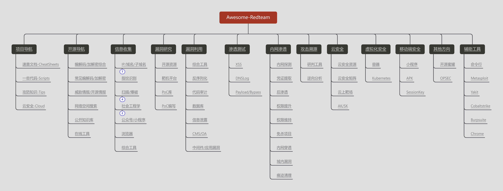
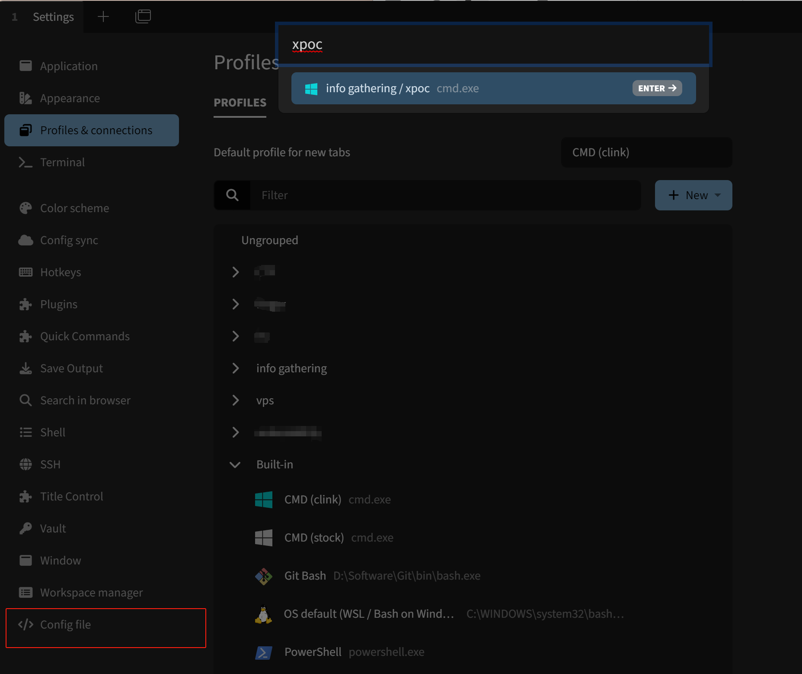

# Awesome-Redteam

**【免责声明】本项目所涉及的技术、思路和工具仅供学习，任何人不得将其用于非法用途和盈利，不得将其用于非授权渗透测试，否则后果自行承担，与本项目无关。使用本项目前请先阅读 [法律法规](https://github.com/Threekiii/Awesome-Laws)。**

## Roadmap


## 目录

- [Roadmap](#roadmap)
- [项目导航](#%E9%A1%B9%E7%9B%AE%E5%AF%BC%E8%88%AA)
	- [速查文档-CheatSheets](#%E9%80%9F%E6%9F%A5%E6%96%87%E6%A1%A3-cheatsheets)
	- [一些代码-Scripts](#%E4%B8%80%E4%BA%9B%E4%BB%A3%E7%A0%81-scripts)
	- [攻防知识-Tips](#%E6%94%BB%E9%98%B2%E7%9F%A5%E8%AF%86-tips)
	- [云安全-Cloud](#%E4%BA%91%E5%AE%89%E5%85%A8-cloud)
- [开源导航](#%E5%BC%80%E6%BA%90%E5%AF%BC%E8%88%AA)
	- [编解码/加解密综合](#%E7%BC%96%E8%A7%A3%E7%A0%81%E5%8A%A0%E8%A7%A3%E5%AF%86%E7%BB%BC%E5%90%88)
	- [常见编解码/加解密](#%E5%B8%B8%E8%A7%81%E7%BC%96%E8%A7%A3%E7%A0%81%E5%8A%A0%E8%A7%A3%E5%AF%86)
	- [威胁情报/开源情报](#%E5%A8%81%E8%83%81%E6%83%85%E6%8A%A5%E5%BC%80%E6%BA%90%E6%83%85%E6%8A%A5)
	- [网络空间搜索](#%E7%BD%91%E7%BB%9C%E7%A9%BA%E9%97%B4%E6%90%9C%E7%B4%A2)
	- [公开知识库](#%E5%85%AC%E5%BC%80%E7%9F%A5%E8%AF%86%E5%BA%93)
	- [在线工具](#%E5%9C%A8%E7%BA%BF%E5%B7%A5%E5%85%B7)
- [信息收集](#%E4%BF%A1%E6%81%AF%E6%94%B6%E9%9B%86)
	- [IP/域名/子域名](#ip%E5%9F%9F%E5%90%8D%E5%AD%90%E5%9F%9F%E5%90%8D)
		- [确认真实IP地址](#%E7%A1%AE%E8%AE%A4%E7%9C%9F%E5%AE%9Eip%E5%9C%B0%E5%9D%80)
		- [多个地点Ping服务器](#%E5%A4%9A%E4%B8%AA%E5%9C%B0%E7%82%B9ping%E6%9C%8D%E5%8A%A1%E5%99%A8)
		- [IP反查域名](#ip%E5%8F%8D%E6%9F%A5%E5%9F%9F%E5%90%8D)
		- [Whois注册信息反查](#whois%E6%B3%A8%E5%86%8C%E4%BF%A1%E6%81%AF%E5%8F%8D%E6%9F%A5)
		- [DNS数据聚合查询](#dns%E6%95%B0%E6%8D%AE%E8%81%9A%E5%90%88%E6%9F%A5%E8%AF%A2)
		- [TLS证书信息查询](#tls%E8%AF%81%E4%B9%A6%E4%BF%A1%E6%81%AF%E6%9F%A5%E8%AF%A2)
		- [IP地址段收集](#ip%E5%9C%B0%E5%9D%80%E6%AE%B5%E6%94%B6%E9%9B%86)
	- [指纹识别](#%E6%8C%87%E7%BA%B9%E8%AF%86%E5%88%AB)
	- [扫描/爆破](#%E6%89%AB%E6%8F%8F%E7%88%86%E7%A0%B4)
		- [扫描/爆破工具](#%E6%89%AB%E6%8F%8F%E7%88%86%E7%A0%B4%E5%B7%A5%E5%85%B7)
		- [扫描/爆破字典](#%E6%89%AB%E6%8F%8F%E7%88%86%E7%A0%B4%E5%AD%97%E5%85%B8)
		- [字典生成](#%E5%AD%97%E5%85%B8%E7%94%9F%E6%88%90)
		- [默认口令查询](#%E9%BB%98%E8%AE%A4%E5%8F%A3%E4%BB%A4%E6%9F%A5%E8%AF%A2)
	- [社会工程学](#%E7%A4%BE%E4%BC%9A%E5%B7%A5%E7%A8%8B%E5%AD%A6)
		- [邮箱](#%E9%82%AE%E7%AE%B1)
		- [钓鱼](#%E9%92%93%E9%B1%BC)
	- [公众号/小程序](#%E5%85%AC%E4%BC%97%E5%8F%B7%E5%B0%8F%E7%A8%8B%E5%BA%8F)
	- [浏览器](#%E6%B5%8F%E8%A7%88%E5%99%A8)
	- [综合工具](#%E7%BB%BC%E5%90%88%E5%B7%A5%E5%85%B7)
- [漏洞研究](#%E6%BC%8F%E6%B4%9E%E7%A0%94%E7%A9%B6)
	- [开源资源](#%E5%BC%80%E6%BA%90%E8%B5%84%E6%BA%90)
	- [靶机平台](#%E9%9D%B6%E6%9C%BA%E5%B9%B3%E5%8F%B0)
	- [PoC库](#poc%E5%BA%93)
	- [PoC编写](#poc%E7%BC%96%E5%86%99)
- [漏洞利用](#%E6%BC%8F%E6%B4%9E%E5%88%A9%E7%94%A8)
	- [综合工具](#%E7%BB%BC%E5%90%88%E5%B7%A5%E5%85%B7)
	- [反序列化](#%E5%8F%8D%E5%BA%8F%E5%88%97%E5%8C%96)
	- [代码审计](#%E4%BB%A3%E7%A0%81%E5%AE%A1%E8%AE%A1)
	- [数据库](#%E6%95%B0%E6%8D%AE%E5%BA%93)
	- [信息泄露](#%E4%BF%A1%E6%81%AF%E6%B3%84%E9%9C%B2)
	- [CMS/OA](#cmsoa)
	- [中间件/应用漏洞](#%E4%B8%AD%E9%97%B4%E4%BB%B6%E5%BA%94%E7%94%A8%E6%BC%8F%E6%B4%9E)
- [渗透测试](#%E6%B8%97%E9%80%8F%E6%B5%8B%E8%AF%95)
	- [XSS](#xss)
	- [DNSLog](#dnslog)
	- [Payload/Bypass](#payloadbypass)
- [内网渗透](#%E5%86%85%E7%BD%91%E6%B8%97%E9%80%8F)
	- [内网探测](#%E5%86%85%E7%BD%91%E6%8E%A2%E6%B5%8B)
	- [凭证提取](#%E5%87%AD%E8%AF%81%E6%8F%90%E5%8F%96)
	- [后渗透](#%E5%90%8E%E6%B8%97%E9%80%8F)
	- [权限提升](#%E6%9D%83%E9%99%90%E6%8F%90%E5%8D%87)
	- [权限维持](#%E6%9D%83%E9%99%90%E7%BB%B4%E6%8C%81)
	- [免杀项目](#%E5%85%8D%E6%9D%80%E9%A1%B9%E7%9B%AE)
	- [内网穿透](#%E5%86%85%E7%BD%91%E7%A9%BF%E9%80%8F)
	- [域内漏洞](#%E5%9F%9F%E5%86%85%E6%BC%8F%E6%B4%9E)
	- [痕迹清理](#%E7%97%95%E8%BF%B9%E6%B8%85%E7%90%86)
- [攻击溯源](#%E6%94%BB%E5%87%BB%E6%BA%AF%E6%BA%90)
	- [研判工具](#%E7%A0%94%E5%88%A4%E5%B7%A5%E5%85%B7)
	- [逆向分析](#%E9%80%86%E5%90%91%E5%88%86%E6%9E%90)
- [云安全](#%E4%BA%91%E5%AE%89%E5%85%A8)
	- [云安全资源](#%E4%BA%91%E5%AE%89%E5%85%A8%E8%B5%84%E6%BA%90)
	- [云安全矩阵](#%E4%BA%91%E5%AE%89%E5%85%A8%E7%9F%A9%E9%98%B5)
	- [云上靶场](#%E4%BA%91%E4%B8%8A%E9%9D%B6%E5%9C%BA)
	- [AK/SK](#aksk)
- [虚拟化安全](#%E8%99%9A%E6%8B%9F%E5%8C%96%E5%AE%89%E5%85%A8)
	- [容器](#%E5%AE%B9%E5%99%A8)
	- [Kubernetes](#kubernetes)
- [移动端安全](#%E7%A7%BB%E5%8A%A8%E7%AB%AF%E5%AE%89%E5%85%A8)
	- [小程序](#%E5%B0%8F%E7%A8%8B%E5%BA%8F)
	- [APK](#apk)
	- [SessionKey](#sessionkey)
- [其他方向](#%E5%85%B6%E4%BB%96%E6%96%B9%E5%90%91)
	- [开源蜜罐](#%E5%BC%80%E6%BA%90%E8%9C%9C%E7%BD%90)
	- [OPSEC](#opsec)
- [辅助工具](#%E8%BE%85%E5%8A%A9%E5%B7%A5%E5%85%B7)
	- [命令行](#%E5%91%BD%E4%BB%A4%E8%A1%8C)
	- [Metasploit](#metasploit)
	- [Yakit](#yakit)
	- [Cobaltstrike](#cobaltstrike)
	- [Burpsuite](#burpsuite)
	- [Chrome](#chrome)
- [其他优秀项目](#%E5%85%B6%E4%BB%96%E4%BC%98%E7%A7%80%E9%A1%B9%E7%9B%AE)
- [先mark待测试项目](#%E5%85%88mark%E5%BE%85%E6%B5%8B%E8%AF%95%E9%A1%B9%E7%9B%AE)
- [提高生产力的使用姿势](#%E6%8F%90%E9%AB%98%E7%94%9F%E4%BA%A7%E5%8A%9B%E7%9A%84%E4%BD%BF%E7%94%A8%E5%A7%BF%E5%8A%BF)
	- [如何通过.bat使用alias](#%E5%A6%82%E4%BD%95%E9%80%9A%E8%BF%87bat%E4%BD%BF%E7%94%A8alias)
	- [如何通过.bat激活conda并运行py](#%E5%A6%82%E4%BD%95%E9%80%9A%E8%BF%87bat%E6%BF%80%E6%B4%BBconda%E5%B9%B6%E8%BF%90%E8%A1%8Cpy)
	- [如何配合tabby实现高效操作](#%E5%A6%82%E4%BD%95%E9%85%8D%E5%90%88tabby%E5%AE%9E%E7%8E%B0%E9%AB%98%E6%95%88%E6%93%8D%E4%BD%9C)
	- [如何解决cmd中文乱码](#%E5%A6%82%E4%BD%95%E8%A7%A3%E5%86%B3cmd%E4%B8%AD%E6%96%87%E4%B9%B1%E7%A0%81)

## 项目导航

### 速查文档-CheatSheets

- 攻防渗透常用命令速查：[Click Here](https://github.com/Threekiii/Awesome-Redteam/blob/master/cheatsheets/%E6%94%BB%E9%98%B2%E6%B8%97%E9%80%8F%E5%B8%B8%E7%94%A8%E5%91%BD%E4%BB%A4%E9%80%9F%E6%9F%A5.md)
- 常见WAF拦截页面速查：[Click Here](https://github.com/Threekiii/Awesome-Redteam/blob/master/cheatsheets/%E5%B8%B8%E8%A7%81WAF%E6%8B%A6%E6%88%AA%E9%A1%B5%E9%9D%A2%E9%80%9F%E6%9F%A5.md)
- 反弹shell命令速查：[Click Here](https://github.com/Threekiii/Awesome-Redteam/blob/master/cheatsheets/%E5%8F%8D%E5%BC%B9shell%E5%91%BD%E4%BB%A4%E9%80%9F%E6%9F%A5.md)
- 默认口令/弱口令速查：[Click Here](https://github.com/Threekiii/Awesome-Redteam/blob/master/cheatsheets/)
- 重要端口及服务速查：[Click Here](https://github.com/Threekiii/Awesome-Redteam/blob/master/cheatsheets/%E9%87%8D%E8%A6%81%E7%AB%AF%E5%8F%A3%E5%8F%8A%E6%9C%8D%E5%8A%A1%E9%80%9F%E6%9F%A5.md)
- HTTP状态码速查：[Click Here](https://github.com/Threekiii/Awesome-Redteam/blob/master/cheatsheets/HTTP%E7%8A%B6%E6%80%81%E7%A0%81%E9%80%9F%E6%9F%A5.md)
- 安全厂商及官网链接速查：[Click Here](https://github.com/Threekiii/Awesome-Redteam/blob/master/cheatsheets/%E5%AE%89%E5%85%A8%E5%8E%82%E5%95%86%E5%8F%8A%E5%AE%98%E7%BD%91%E9%93%BE%E6%8E%A5%E9%80%9F%E6%9F%A5.txt)
- Apache项目及漏洞指纹速查：[Click Here](https://github.com/Threekiii/Awesome-Redteam/blob/master/cheatsheets/Apache%E9%A1%B9%E7%9B%AE%E5%8F%8A%E6%BC%8F%E6%B4%9E%E6%8C%87%E7%BA%B9%E9%80%9F%E6%9F%A5.md) 
- OWASP TOP10 2017/2021：[Click Here](https://github.com/Threekiii/Awesome-Redteam/blob/master/cheatsheets/OWASP%20TOP10.md) 

### 一些代码-Scripts 

戳这里 [Click Here](https://github.com/Threekiii/Awesome-Redteam/blob/master/scripts/)

- ShellcodeWrapper：Shellcode加密
- AntivirusScanner：杀软进程检测脚本
- runtime-exec-payloads.html：java.lang.Runtime.exec() Payloads生成 
- Ascii2Char：ASCII码和字符互相转换脚本 修改webshell文件名密码 
- Weakpass_Generator：在线弱密码生成工具 汉化版
- Godzilla_Decryptor：哥斯拉流量解密
- Behinder4_Key_Bruteforce：冰蝎4密钥爆破
- Flask_Session_Decryptor：Flask session注入解密

### 攻防知识-Tips

戳这里 [Click Here](https://github.com/Threekiii/Awesome-Redteam/blob/master/tips/)

- 内网渗透-免杀
- 内网渗透-隐藏
- 信息收集-敏感信息收集
- 逆向分析-微信小程序反编译
- 社会工程学-钓鱼邮件主题汇总
- 服务搭建-DNS Log平台搭建
- 红队中易被攻击的一些重点系统漏洞整理（来源：棱角安全团队）
- 网络攻击与防御图谱
- Webshell流量分析
- CobaltStrike流量分析

### 云安全-Cloud

戳这里 [Click Here](https://github.com/Threekiii/Awesome-Redteam/blob/master/cloud/)

- 云安全攻防概述
- 云安全攻防矩阵
- 云原生安全
- K8s集群命令速查

## 开源导航

### 编解码/加解密综合

- CyberChef：编解码及加密，可本地部署 https://github.com/gchq/CyberChef
- OK Tools在线工具：https://github.com/wangyiwy/oktools
- CTF在线工具：http://www.hiencode.com/
- XSSEE：在线综合编解码工具 https://evilcos.me/lab/xssee/
- MeTools：在线综合编解码工具 http://www.metools.info/code/quotedprintable231.html

### 常见编解码/加解密

- MD5 Hash：https://www.somd5.com/
- CMD5：https://www.cmd5.com/
- GB2312：http://code.mcdvisa.com/
- Unicode字符表：https://www.52unicode.com/enclosed-alphanumerics-zifu
- Unicode：https://www.compart.com/en/unicode/
- UUencode：http://web.chacuo.net/charsetuuencode
- Escape/Unescape：https://tool.chinaz.com/tools/escape.aspx
- HTML实体编码：https://zh.rakko.tools/tools/21/

### 威胁情报/开源情报

- Virustotal：https://www.virustotal.com/
- 腾讯哈勃分析系统：https://habo.qq.com/tool/index
- 微步在线威胁情报：https://x.threatbook.cn/
- 奇安信威胁情报：https://ti.qianxin.com/
- 360威胁情报：https://ti.360.net/#/homepage
- 安恒威胁情报：https://ti.dbappsecurity.com.cn/
- 火线安全平台：https://www.huoxian.cn
- 知道创宇漏洞平台：https://www.seebug.org/
- 知道创宇黑客新闻流：https://hackernews.cc/
- Hacking8安全信息流：https://i.hacking8.com/
- SecWiki安全信息流：https://www.sec-wiki.com/
- 网络安全威胁信息共享平台：https://share.anva.org.cn/web/publicity/listPhishing
- 国家互联网应急中心：https://www.cert.org.cn/
- OSINT Resource List：https://start.me/p/rx6Qj8/nixintel-s-osint-resource-list
- OSINT Framework：https://osintframework.com/

### 网络空间搜索

- Fofa：https://fofa.info/
- Shodan：https://www.shodan.io/
- ZoomEye：https://www.zoomeye.org/
- 鹰图：https://hunter.qianxin.com/
- 谛听：https://www.ditecting.com/
- 360网络空间测绘：https://quake.360.cn/quake/#/index
- Google Hacking：
	- https://www.exploit-db.com/google-hacking-database
	- https://pentest-tools.com/information-gathering/google-hacking
- Google Dork：https://cxsecurity.com/dorks/
- GitDorker：https://github.com/obheda12/GitDorker
- Wayback Machine：网页历史缓存 https://archive.org/web

### 公开知识库

- 棱角社区工具集整理：https://forum.ywhack.com/bountytips.php?tools
- ffffffff0x 团队安全知识框架：https://github.com/ffffffff0x/1earn
- 先知社区：https://xz.aliyun.com/
- 狼组公开知识库：https://wiki.wgpsec.org/
- 零组文库：零组已停运，非官方 https://0-wiki.com/
- 404星链计划：知道创宇 404 实验室 https://github.com/knownsec/404StarLink

#### Only available in English

- Hacking articles： https://www.hackingarticles.in/
- PostSwigger blog： https://portswigger.net/blog
- InGuardians Labs blog： https://www.inguardians.com/
- Mitre ATT&CK：
	- matics： https://attack.mitre.org/matrices/enterprise
	- techniques： http://attack.mitre.org/techniques/enterprise/ 
- Red teaming and offensive security： https://www.ired.team/ 
- Convention material： https://infocon.org/
- Evasion techniques： https://evasions.checkpoint.com/
- Pentest Workflow： https://pentest.mxhx.org/ 
- Pentest cheatsheet： https://pentestbook.six2dez.com/ 

### 在线工具

- 反弹Shell生成：
  - 本地部署项目 https://github.com/0dayCTF/reverse-shell-generator
  - 棱角安全在线 https://forum.ywhack.com/reverse-shell/
- 文件下载命令：
  - 本地部署项目 https://github.com/r0eXpeR/File-Download-Generator
- 棱角安全在线 https://forum.ywhack.com/bountytips.php?tools
- 在线正则表达式：https://c.runoob.com/front-end/854/
- 在线代码格式标准化：http://web.chacuo.net/formatsh
- 接收手机验证码：https://www.supercloudsms.com/en/ 
- 临时邮箱：http://24mail.chacuo.net/
- 短链接生成：https://a.f8x.io/

## 信息收集

### IP/域名/子域名

#### 确认真实IP地址

- IP精准定位：https://www.ipuu.net/#/home
- IP 138：https://site.ip138.com/
- Security Trails：https://securitytrails.com/

#### 多个地点Ping服务器

- Chinaz：https://ping.chinaz.com/
- Host Tracker：https://www.host-tracker.com/
- Webpage Test：https://www.webpagetest.org/
- DNS Check：https://dnscheck.pingdom.com/

#### IP反查域名

- IP138 https://site.ip138.com/
- 微步在线  https://x.threatbook.cn/
- VirusTotal https://www.virustotal.com/

#### Whois注册信息反查

- 站长之家 Whois：https://whois.chinaz.com/
- 中国万网 Whois：https://whois.aliyun.com/
- 国际 Whois：https://who.is/

#### DNS数据聚合查询

- Hacker Target：https://hackertarget.com/find-dns-host-records
- DNS Dumpster：https://dnsdumpster.com
- DNS DB：https://dnsdb.io/zh-cn

#### TLS证书信息查询

- Censys：https://censys.io
- Certificate Search：https://crt.sh
- 证书透明度监控：https://developers.facebook.com/tools/ct

#### IP地址段收集

- CNNIC中国互联网信息中心：http://ipwhois.cnnic.net.cn

### 指纹识别

- Wapplyzer：Chrome插件 跨平台网站分析工具 https://github.com/AliasIO/Wappalyzer
- Finger：一款红队在大量的资产中存活探测与重点攻击系统指纹探测工具 https://github.com/EASY233/Finger
- EHole：红队重点攻击系统指纹探测工具 https://github.com/EdgeSecurityTeam/EHole
- ObserverWard：web 指纹识别 https://github.com/0x727/ObserverWard
- TideFinger：提取了多个开源指纹识别工具的规则库并进行了规则重组 https://github.com/TideSec/TideFinger
- fingerprint：各种工具指纹收集分享 https://github.com/r0eXpeR/fingerprint
- Dismap：tcp/udp/tls 协议指纹和 4500+ Web 指纹规则 https://github.com/zhzyker/dismap
- 御剑web指纹识别程序：https://www.webshell.cc/4697.html
- 云悉指纹识别：http://www.yunsee.cn/
- identYwaf：WAF识别工具 https://github.com/stamparm/identYwaf


### 扫描/爆破

#### 扫描/爆破工具

- jwt_tool：JSON Web Token Toolkit https://github.com/ticarpi/jwt_tool
- jwt.secrets.list：公开已知密钥列表 https://github.com/wallarm/jwt-secrets/blob/master/jwt.secrets.list
- c-jwt-cracker：JSON Web Token Cracker https://github.com/brendan-rius/c-jwt-cracker
- dirsearch：目录扫描/爆破 https://github.com/maurosoria/dirsearch
- dirmap：目录扫描/爆破 https://github.com/H4ckForJob/dirmap
- ffuf：高速web fuzz工具 https://github.com/ffuf/ffuf
- Arjun：HTTP参数扫描器 https://github.com/s0md3v/Arjun
- URLFinder：JS与URL快速提取检测 https://github.com/pingc0y/URLFinder
- ksubdomain：子域名爆破 https://github.com/knownsec/ksubdomain
- Gobuster：URI/DNS/WEB爆破 https://github.com/OJ/gobuster
- Hydra：弱密码爆破 https://github.com/vanhauser-thc/thc-hydra
- John the Ripper：https://github.com/openwall/john

#### 扫描/爆破字典

- SecLists：46.4k star 项目 https://github.com/danielmiessler/SecLists
- SecDictionary：配合fuff使用 https://github.com/SexyBeast233/SecDictionary
- Dictionary-Of-Pentesting：渗透测试、SRC漏洞挖掘、爆破、Fuzzing等常用字典 https://github.com/insightglacier/Dictionary-Of-Pentesting
- fuzzDicts：Web渗透Fuzz字典 https://github.com/TheKingOfDuck/fuzzDicts
- Web-Fuzzing-Box：Web 模糊测试字典与Payloads https://github.com/gh0stkey/Web-Fuzzing-Box
- PentesterSpecialDict：渗透测试工程师精简化字典 https://github.com/ppbibo/PentesterSpecialDict
- fuzz：https://github.com/Bo0oM/fuzz.txt
- top25-parameter：top25参数字典 https://github.com/lutfumertceylan/top25-parameter
- wordlists：high quality wordlists for content and subdomain discovery https://github.com/assetnote/wordlists

#### 字典生成

- 在线弱密码生成：https://weakpass.com/generate
- 在线子域名生成：https://weakpass.com/generate/domains
- Weakpass：在线弱密码生成工具部署 https://github.com/zzzteph/weakpass
- Weakpass：在线子域名生成工具部署 https://github.com/zzzteph/probable_subdomains
- pydictor：一个强大实用的黑客暴力破解字典建立工具 https://github.com/LandGrey/pydictor/
- 汉字转拼音：https://www.aies.cn/pinyin.htm
- crunch
	- Kali/Linux：https://sourceforge.net/projects/crunch-wordlist
	- Windows：https://github.com/shadwork/Windows-Crunch

#### 默认口令查询

- Default Credentials Cheat Sheet：3468个默认密码 https://github.com/ihebski/DefaultCreds-cheat-sheet
- datarecovery：在线默认口令查询 https://datarecovery.com/rd/default-passwords/
- cirt.net：在线默认口令查询 https://cirt.net/passwords
- 在线路由器密码查询：

  -  https://www.routerpasswords.com/
  - https://portforward.com/router-password/
  - https://www.cleancss.com/router-default/
  - https://www.toolmao.com/baiduapp/routerpwd/
  -  https://datarecovery.com/rd/default-passwords/

### 社会工程学

#### 邮箱

- Snov.io：https://app.snov.io
- Phonebook：also works on subdomains and urls https://phonebook.cz 
- Skymem：https://www.skymem.info
- Hunter：https://hunter.io
- email-format：https://www.email-format.com/i/search/
- 搜邮箱：https://souyouxiang.com/find-contact/
- theHarvester：also works on subdomains https://github.com/laramies/theHarvester

#### 钓鱼

- gophish：钓鱼邮件 https://github.com/gophish/gophish
- SpoofWeb：一键部署 https 钓鱼网站 https://github.com/5icorgi/SpoofWeb

### 公众号/小程序

- 小蓝本：https://www.xiaolanben.com/

### 浏览器

- HackBrowserData：浏览器数据导出工具 https://github.com/moonD4rk/HackBrowserData

### 综合工具

- AlliN：https://github.com/P1-Team/AlliN
- Kunyu：https://github.com/knownsec/Kunyu
- OneForAll：https://github.com/shmilylty/OneForAll
- ShuiZe：https://github.com/0x727/ShuiZe_0x727
- FofaX：https://github.com/xiecat/fofax
- Fofa Viewer：https://github.com/wgpsec/fofa_viewer
- Fofa GUI：https://github.com/bewhale/FOFA_GUI
- kscan：综合扫描 https://github.com/lcvvvv/kscan
- fscan：内网综合扫描工具 https://github.com/shadow1ng/fscan
- hping3：端口扫描 高速 发包量少 结果准确无蜜罐 https://github.com/antirez/hping
- ENScan_GO：国内企业信息收集 https://github.com/wgpsec/ENScan_GO
- Ladon：用于大型网络渗透的多线程插件化综合扫描工具 https://github.com/k8gege/Ladon

## 漏洞研究

### 开源资源

- HackerOne：https://www.hackerone.com/
- Sploitus：Exploits 搜索引擎 https://sploitus.com/
- Exploit Database：Exploits 搜索引擎 https://www.exploit-db.com/ kali中可以配合命令 `searchsploit <keywords>` 使用
- cve：收录了几乎所有公开的CVE https://github.com/trickest/cve
- Vulhub：基于Docker的漏洞复现环境 https://vulhub.org/
- PeiQi：面向网络安全从业者的知识文库 http://wiki.peiqi.tech/
- Vulnerability：棱角社区公布漏洞 https://github.com/EdgeSecurityTeam/Vulnerability
- 乌云镜像：http://wooyun.2xss.cc/
- 未授权访问漏洞总结：http://luckyzmj.cn/posts/15dff4d3.html

### 靶机平台

- DVWA：https://github.com/digininja/DVWA
- HackTheBox：https://www.hackthebox.com/
- OWASP Top10：https://owasp.org/www-project-juice-shop/
- WebGoat：https://github.com/WebGoat/WebGoat
- Sqli-labs：SQL注入 https://github.com/Audi-1/sqli-labs
- Xss-labs：XSS注入 https://github.com/do0dl3/xss-labs
- Upload-labs：上传漏洞 https://github.com/c0ny1/upload-labs
- Vulstudy：docker快速搭建共17个漏洞靶场 https://github.com/c0ny1/vulstudy
- Vulfocus：漏洞集成平台 https://github.com/fofapro/vulfocus
-  IoT-vulhub： IoT 版固件漏洞复现环境 https://github.com/firmianay/IoT-vulhub

### PoC库

> Be careful Malware，POC 库最新的 CVE 可能存在投毒风险。

- Exploit Database：https://www.exploit-db.com/
- POChouse：https://github.com/DawnFlame/POChouse
- Some-PoC-oR-ExP：各种漏洞PoC、ExP的收集或编写 https://github.com/coffeehb/Some-PoC-oR-ExP
- Library-POC：基于Pocsuite3、goby编写的漏洞poc&exp存档 https://github.com/luck-ying/Library-POC
- Penetration_Testing_POC：https://github.com/Mr-xn/Penetration_Testing_POC
- PoC-in-GitHub：https://github.com/nomi-sec/PoC-in-GitHub
- 0day：https://github.com/helloexp/0day

### PoC编写

- POC 辅助生成：在线  https://poc.xray.cool/
- POC 辅助生成：本地 https://github.com/zeoxisca/gamma-gui

## 漏洞利用

### 综合工具

- xpoc：供应链漏洞扫描 https://github.com/chaitin/xpoc
- Xray：安全评估工具 https://github.com/chaitin/xray
- Super Xray：Xray GUI启动器 https://github.com/4ra1n/super-xray
- Vulmap：漏洞扫描和验证工具 https://github.com/zhzyker/vulmap
- Artillery：插件化 JAVA 漏洞扫描器 https://github.com/Weik1/Artillery
- Aazhen-v3.1：JavaFX图形化漏洞扫描工具 https://github.com/zangcc/Aazhen-v3.1

### 反序列化

- ysoserial：Java反序列化 https://github.com/frohoff/ysoserial
- JYso：jndi注入 反溯源 https://github.com/qi4L/JYso
- JNDI-Injection-Exploit：https://github.com/welk1n/JNDI-Injection-Exploit
- JNDIExploit：功能更强 冰蝎内存马 https://github.com/WhiteHSBG/JNDIExploit

### 代码审计

- tabby：https://github.com/wh1t3p1g/tabby

### 数据库

- RedisStudio：Redis 未授权 https://github.com/cinience/RedisStudio
- redis-rogue-server：Redis 未授权 https://github.com/n0b0dyCN/redis-rogue-server
- redis-rce：Redis 未授权 https://github.com/Ridter/redis-rce
- mysql-fake-server：MySQL JDBC 客户端 Java 反序列化漏洞利用 https://github.com/4ra1n/mysql-fake-server

### 信息泄露

- GitHack：.git泄露利用脚本 https://github.com/lijiejie/GitHack python3 有时无法恢复.git目录，推荐python2版本
- GitHack：.git泄露利用脚本https://github.com/BugScanTeam/GitHack python2
- dvcs-ripper：.svn、.hg、.cvs泄露利用脚本 https://github.com/kost/dvcs-ripper
- ds_store_exp：.DS_Store 文件泄漏利用脚本 https://github.com/lijiejie/ds_store_exp
- Hawkeye：GitHub 泄露监控系统 https://github.com/0xbug/Hawkeye 

### CMS/OA

- CMS-Hunter：CMS漏洞测试用例集合 https://github.com/SecWiki/CMS-Hunter
- 若依CMS https://github.com/thelostworldFree/Ruoyi-All
- 通达OA：https://github.com/Fu5r0dah/TongdaScan_go
- MYExploit：https://github.com/achuna33/MYExploit

### 中间件/应用漏洞

#### Druid

- DruidCrack：Druid密文解密工具 https://github.com/rabbitmask/DruidCrack
- druid_sessions：Druid sessions利用工具 https://github.com/yuyan-sec/druid_sessions

#### Etcd

- etcd：etcdctl https://github.com/etcd-io/etcd

#### Nacos

- NacosRce：Nacos Hessian 反序列化 https://github.com/c0olw/NacosRce/
- nacosleak：获取nacos中配置文件信息 https://github.com/a1phaboy/nacosleak
- nacosScan：jwt硬编码、api未授权添加用户、配置读取 https://github.com/Whoopsunix/nacosScan

#### Nps

- nps-auth-bypass：nps认证绕过利用工具 https://github.com/carr0t2/nps-auth-bypass

#### Java

- jdwp-shellifier：python2 https://github.com/IOActive/jdwp-shellifier
- jdwp-shellifier：https://github.com/Lz1y/jdwp-shellifier
- attackRmi：https://github.com/A-D-Team/attackRmi


#### Shiro

- Shiro rememberMe 在线解密：https://vulsee.com/tools/shiroDe/shiroDecrypt.html
- shiro_attack：https://github.com/j1anFen/shiro_attack
- shiro_rce_tool：https://github.com/wyzxxz/shiro_rce_tool
- ShiroExploit：https://github.com/feihong-cs/ShiroExploit-Deprecated
- ShiroExp：https://github.com/safe6Sec/ShiroExp
- shiro_key：shiro key 收集 目前 1k+ https://github.com/yanm1e/shiro_key

#### Struts

- Struts2VulsTools：https://github.com/shack2/Struts2VulsTools

#### Spring

- SpringBoot-Scan：https://github.com/AabyssZG/SpringBoot-Scan
- Spring_All_Reachable：Spring Cloud Gateway命令执行 CVE-2022-22947、Spring Cloud Function SpEL 远程代码执行 CVE-2022-22963 https://github.com/savior-only/Spring_All_Reachable
- SpringBootVulExploit：https://github.com/LandGrey/SpringBootVulExploit
- Spring-cloud-function-SpEL-RCE：CVE-2022-22963 https://github.com/mamba-2021/EXP-POC/tree/main/Spring-cloud-function-SpEL-RCE
- swagger-exp：Swagger REST API 信息泄露利用工具 https://github.com/lijiejie/swagger-exp
- heapdump_tool：heapdump敏感信息查询工具 https://github.com/wyzxxz/heapdump_tool 
- JDumpSpider：HeapDump敏感信息提取工具 https://github.com/whwlsfb/JDumpSpider
- Memory Analyzer：HeapDump分析工具 https://www.eclipse.org/mat/previousReleases.php

#### Tomcat

- CVE-2020-1938：https://github.com/YDHCUI/CNVD-2020-10487-Tomcat-Ajp-lfi
- ClassHound：https://github.com/LandGrey/ClassHound

#### Thinkphp

- ThinkphpGUI：https://github.com/Lotus6/ThinkphpGUI
- thinkphp_gui_tools：https://github.com/bewhale/thinkphp_gui_tools

#### Weblogic

- WeblogicTool：https://github.com/KimJun1010/WeblogicTool
- WeblogicScan：https://github.com/dr0op/WeblogicScan
- weblogicScanner：https://github.com/0xn0ne/weblogicScanner
- weblogic-framework：https://github.com/sv3nbeast/weblogic-framework

#### WebSocket

- -wscat：https://github.com/websockets/wscat

#### vSphere

- VcenterKiller：针对Vcenter的综合利用工具 https://github.com/Schira4396/VcenterKiller
- VcenterKit：Vcenter综合渗透利用工具包 https://github.com/W01fh4cker/VcenterKit

#### Zookeeper

- ZooInspector：ZooKeeper 客户端监控软件 https://issues.apache.org/jira/secure/attachment/12436620/ZooInspector.zip
- apache-zookeeper：zkCli.sh 客户端命令连接 https://archive.apache.org/dist/zookeeper/zookeeper-3.5.6/


## 渗透测试

### XSS

- XSS Chop：https://xsschop.chaitin.cn/demo/
- XSS/CSRF编码转换：https://evilcos.me/lab/xssor/
- HTML5 Security Cheatsheet：XSS攻击向量学习/参考 https://html5sec.org/

### DNSLog

- Ceye DNS：在线Dnslog http://ceye.io/
- Dnslog：在线Dnslog http://dnslog.cn/
- Fuzz.Red：在线Dnslog https://github.com/AlphabugX/Alphalog
- DNS重绑定：https://lock.cmpxchg8b.com/rebinder.html
- DNSLog-GO：自建私有平台 https://github.com/lanyi1998/DNSlog-GO

### Payload/Bypass

- 403bypasser：https://github.com/yunemse48/403bypasser
- byp4xx：https://github.com/lobuhi/byp4xx
- 4-ZERO-3：403/401绕过 https://github.com/Dheerajmadhukar/4-ZERO-3
- PayloadsAllTheThings：https://github.com/swisskyrepo/PayloadsAllTheThings
- java.lang.Runtime.exec() Payload：java Payload在线生成 https://www.bugku.net/runtime-exec-payloads/
- PHP Generic Gadget Chains：PHP反序列化Payload https://github.com/ambionics/phpggc
- PHPFuck：https://github.com/splitline/PHPFuck
- JSFuck：http://www.jsfuck.com/
- Gopherus：SSRF 生成gopher链接 https://github.com/tarunkant/Gopherus python2
- CVE-2021-44228-PoC-log4j-bypass-words：https://github.com/Puliczek/CVE-2021-44228-PoC-log4j-bypass-words


## 内网渗透

### 内网探测

- netspy：快速探测内网可达网段 https://github.com/shmilylty/netspy
- BloodHound：域内信息收集分析 https://github.com/SpecterOps/BloodHound
- SharpHound：配合 BloodHound 使用 https://github.com/BloodHoundAD/SharpHound
- Adinfo：域内信息收集 https://github.com/lzzbb/Adinfo

### 凭证提取 

- 密码猜解：猜测目标可能使用的密码 https://www.hacked.com.cn/pass.html
- Responder：获取NTLM Hash https://github.com/SpiderLabs/Responder
- LaZagne：本地计算机密码 https://github.com/AlessandroZ/LaZagne
- BrowserGhost：抓取浏览器密码 https://github.com/QAX-A-Team/BrowserGhost
- HackBrowserData：浏览器数据导出工具 https://github.com/moonD4rk/HackBrowserData
- Sunflower_get_Password：针对向日葵的识别码和验证码提取工具 https://github.com/wafinfo/Sunflower_get_Password
- how-does-Xmanager-encrypt-password：Xmanager 密码解密 https://github.com/HyperSine/how-does-Xmanager-encrypt-password
- SharpXDecrypt：Xshell全版本密码恢复 https://github.com/JDArmy/SharpXDecrypt
- navicat_password_decrypt：Navicat 密码恢复 注册表 or .ncx https://github.com/Zhuoyuan1/navicat_password_decrypt
- firefox_decrypt：Firefox 密码提取 https://github.com/unode/firefox_decrypt

### 后渗透

- CrackMapExec：后渗透工具 https://github.com/byt3bl33d3r/CrackMapExec
- Impacket：https://github.com/SecureAuthCorp/impacket
- PsTools：https://docs.microsoft.com/en-us/sysinternals/downloads/pstools
- LOLBAS：Windows二进制文件库 https://github.com/LOLBAS-Project/LOLBAS
- GTFOBins：Unix二进制文件库 https://gtfobins.github.io/

### 权限提升

- Windows-Exploit-Suggester：https://github.com/AonCyberLabs/Windows-Exploit-Suggester
- Linux_Exploit_Suggester：https://github.com/The-Z-Labs/linux-exploit-suggester
- Linux_Exploit_Suggester：https://github.com/InteliSecureLabs/Linux_Exploit_Suggester
- windows-kernel-exploits：提权漏洞集合 https://github.com/SecWiki/windows-kernel-exploits
- Windows Elevation：https://github.com/Al1ex/WindowsElevation
- Databasetools：数据库自动化提权工具 https://github.com/Hel10-Web/Databasetools
- 在线windows辅助提权：https://i.hacking8.com/tiquan/

### 权限维持

- Webshell收集项目：https://github.com/tennc/webshell
- TomcatMemShell：Tomcat内存马 https://github.com/ce-automne/TomcatMemShell
- wsMemShell：WebSocket 内存马 https://github.com/veo/wsMemShell
- RMI_Inj_MemShell：LDAP无效时的RMI内存马 配合wscat使用 https://github.com/novysodope/RMI_Inj_MemShell
- Behinder 冰蝎：https://github.com/rebeyond/Behinder
  - Behinder4已经发布
  - Behinder3：`kali + java 11.0.14` 或 `windows10 + java 1.8.0_91`，注意，该环境下Behinder2无法正常运行，Behinder3代理经测试php无法成功穿透，jsp可以成功穿透
  - Behinder2：windows10 + java 1.8.0_91
- Godzilla 哥斯拉：https://github.com/BeichenDream/Godzilla
- Skyscorpion：https://github.com/shack2/skyscorpion

### 免杀项目

- bypassAV：免杀shellcode加载器 过火绒不过360 https://github.com/pureqh/bypassAV
- GolangBypassAV：https://github.com/safe6Sec/GolangBypassAV
- BypassAntiVirus：远控免杀系列文章及配套工具 https://github.com/TideSec/BypassAntiVirus 
  - BypassAntiVirus2022年部分免杀复现：[Threekiii/Awesome-Redteam](https://github.com/Threekiii/Awesome-Redteam/blob/master/tips/%E5%86%85%E7%BD%91%E6%B8%97%E9%80%8F-%E5%85%8D%E6%9D%80.md)
- AV_Evasion_Tool：掩日 - 适用于红队的综合免杀工具 https://github.com/1y0n/AV_Evasion_Tool
- shellcodeloader：Windows平台的shellcode免杀加载器 https://github.com/knownsec/shellcodeloader
- 杀软比对1：tasklist/systeminfo https://www.shentoushi.top/av/av.php
- 杀软比对2：### tasklist /svc && ps -aux https://tasklist.ffffffff0x.com/
- 在线免杀：免杀方式为原生webshell随机字符修改、Java反射、垃圾字符填充、函数名称变形 http://bypass.tidesec.com/web/

### 内网穿透

- NPS：通过web端管理，无需配置文件 https://github.com/ehang-io/nps
- FRP：55k star项目 https://github.com/fatedier/frp
- Neo-reGeorg：tunnel快速部署 https://github.com/L-codes/Neo-reGeorg
- rakshasa：多级代理内网穿透工具 https://github.com/Mob2003/rakshasa
- Stowaway：多级代理 https://github.com/ph4ntonn/Stowaway
- Viper：图形化内网渗透 https://github.com/FunnyWolf/Viper
- Proxifier：windows代理工具 https://www.proxifier.com/
- Proxychains：kali代理工具 https://github.com/haad/proxychains
- iodine：dns隧道 https://github.com/yarrick/iodine
- dnscat2：dns隧道 https://github.com/iagox86/dnscat2
- icmpsh：icmp隧道 https://github.com/bdamele/icmpsh

### 域内漏洞

- noPac：CVE-2021-42278 / CVE-2021-42287 https://github.com/Ridter/noPac
- PetitPotam：NTLM Relay https://github.com/topotam/PetitPotam
- zerologon-Shot：https://github.com/XiaoliChan/zerologon-Shot

### 痕迹清理

- Privacy.sexy：Scripts for Windows/macOS/Linux https://privacy.sexy/

## 攻击溯源

### 研判工具

- Webshell Chop：https://webshellchop.chaitin.cn/demo/
- WebShell 查杀：https://n.shellpub.com/
- CobaltStrike流量解密脚本： https://github.com/5ime/CS_Decrypt
- BlueTeamTools：综合工具 https://github.com/abc123info/BlueTeamTools
- IP Logger：使用生成的短网址获取访问者IP地址 https://iplogger.org/

### 逆向分析

- OpenArk：Anti-Rootkit（对抗恶意程序）工具集 https://github.com/BlackINT3/OpenArk
- 逆向分析工具集：https://pythonarsenal.com/
- jadx：https://github.com/skylot/jadx
- JEB：https://www.pnfsoftware.com/
- GDA：https://github.com/charles2gan/GDA-android-reversing-Tool
- PEiD：查壳工具 https://www.aldeid.com/wiki/PEiD
- Py2exe：Python打包工具 https://www.py2exe.org/
- PyInstaller：Python打包工具 https://github.com/pyinstaller/pyinstaller

## 云安全

### 云安全资源

- TeamsSix 云安全资源：https://github.com/teamssix/awesome-cloud-security
- 云安全知识文库：https://wiki.teamssix.com/
- lzCloudSecurity：云安全攻防入门
  - Github：https://github.com/EvilAnne/lzCloudSecurity 
  - Gitbook：https://lzcloudsecurity.gitbook.io/yun-an-quan-gong-fang-ru-men/
- Awesome-CloudSec-Labs：云原生安全 https://github.com/iknowjason/Awesome-CloudSec-Labs
- 阿里云OpenAPI：https://next.api.aliyun.com/api/
- 云原生全景图：https://landscape.cncf.io/
- 云服务漏洞库：https://www.cloudvulndb.org/

### 云安全矩阵

- ATT&CK Cloud Matrix：https://attack.mitre.org/matrices/enterprise/cloud/
- 火线安全-云服务攻防矩阵 https://cloudsec.huoxian.cn/
- 腾讯云鼎实验室-云安全攻防矩阵 https://cloudsec.tencent.com/home/

### 云上靶场

- Metarget：https://github.com/Metarget/metarget
- Attack Defense：付费 https://attackdefense.pentesteracademy.com/listing?labtype=cloud-services&subtype=cloud-services-amazon-s3
- AWSGoat：https://github.com/ine-labs/AWSGoat
- TerraformGoat：火线云环境攻防靶场 https://github.com/HuoCorp/TerraformGoat
- Kubernetes Goat：https://github.com/madhuakula/kubernetes-goat
- CloudGoat：https://github.com/RhinoSecurityLabs/cloudgoat

### AK/SK

- CF：云环境利用框架 https://github.com/teamssix/cf
- aksk_tool：三大云厂商+ucloud、AWS、京东云、七牛云 https://github.com/wyzxxz/aksk_tool
- cloudTools：云资产管理工具，三大云厂商+ucloud https://github.com/dark-kingA/cloudTools
- kodo-browser：七牛云对象存储官方客户端 https://github.com/qiniu/kodo-browser
- XstorBrowser：天翼云对象存储官方客户端 https://www.ctyun.cn/document/10306929/10132519
- oss-browser：阿里云OSS官方客户端 https://github.com/aliyun/oss-browser
- cosbrowser：腾讯云COS官方客户端 https://github.com/TencentCloud/cosbrowser
- cloudSec：云平台AK/SK-WEB利用工具，三大云厂商（阿里云接管k8s）、AWS、七牛云 https://github.com/libaibaia/cloudSec
- aliyun-accesskey-Tools：阿里云 GUI https://github.com/mrknow001/aliyun-accesskey-Tools
- alicloud-tools：阿里云 命令行 https://github.com/iiiusky/alicloud-tools
- 行云管家：云存储图形化管理平台 https://yun.cloudbility.com/

## 虚拟化安全

### 容器

- CDK：容器渗透 https://github.com/cdk-team/CDK
- veinmind-tools：容器安全工具集 https://github.com/chaitin/veinmind-tools
- Awesome Container Escape：容器逃逸 https://github.com/brant-ruan/awesome-container-escape

### Kubernetes

- KubeHound：识别 Kubernetes 集群攻击路径 https://github.com/DataDog/KubeHound


## 移动端安全

### 小程序

- wxappUnpacker：小程序解包 https://github.com/xuedingmiaojun/wxappUnpacker
- CrackMinApp：反编译微信小程序 https://github.com/Cherrison/CrackMinApp  

### APK

- AppInfoScanner：移动端信息收集 https://github.com/kelvinBen/AppInfoScanner
- Apktool：Android apk逆向 https://github.com/iBotPeaches/Apktool

### SessionKey

- wx_sessionkey_decrypt：wechat SessionKey加解密 https://github.com/mrknow001/wx_sessionkey_decrypt
- BurpAppletPentester：SessionKey解密插件 https://github.com/mrknow001/BurpAppletPentester

## 其他方向
### 开源蜜罐

- awesome-honeypots：开源蜜罐列表 https://github.com/paralax/awesome-honeypots
- HFish：一款安全、简单可信赖的跨平台蜜罐软件，允许商业和个人用户免费使用 https://github.com/hacklcx/HFish
- conpot：ICS（工业控制系统）蜜罐 https://github.com/mushorg/conpot
- MysqlHoneypot：MySQL蜜罐 获取wechat ID https://github.com/qigpig/MysqlHoneypot

### OPSEC

- OPSEC-Tradecraft：https://github.com/WesleyWong420/OPSEC-Tradecraft

## 辅助工具

### 命令行

- oh my zsh：命令行工具集 https://github.com/ohmyzsh/ohmyzsh
- clink：cmd.exe 加强版补全、历史记录和行编辑 https://github.com/chrisant996/clink
- tabby：高度可配置终端 https://github.com/Eugeny/tabby
- anew：命令行工具 文件合并去重 https://github.com/tomnomnom/anew
- Platypus：反弹shell管理  https://github.com/WangYihang/Platypus
- The art of command line：快速掌握命令行 https://github.com/jlevy/the-art-of-command-line
- Linux命令行提示工具：
	- https://github.com/jaywcjlove/linux-command online版
	- https://github.com/chenjiandongx/pls golang版
	- https://github.com/chenjiandongx/how python版
- Explain Shell：Shell命令解析 https://explainshell.com/
- ripgrep：大文本快速检索 https://github.com/BurntSushi/ripgrep

### Metasploit

- Metasploit：https://github.com/rapid7/metasploit-framework

### Yakit

- Yakit：网络安全单兵工具 对标Burpsuite https://github.com/yaklang/yakit

### Cobaltstrike

- Awesome CobaltStrike：CobaltStrike知识库 https://github.com/zer0yu/Awesome-CobaltStrike
- Erebus：后渗透测试插件 https://github.com/DeEpinGh0st/Erebus
- LSTAR：综合后渗透插件 https://github.com/lintstar/LSTAR
- ElevateKit：提权插件 https://github.com/rsmudge/ElevateKit
- C2ReverseProxy：不出网上线 https://github.com/Daybr4ak/C2ReverseProxy
- pystinger：不出网上线 https://github.com/FunnyWolf/pystinger

### Burpsuite

- HaE：高亮标记与信息提取辅助型插件 https://github.com/gh0stkey/HaE
- Log4j2Scan：Log4j主动扫描插件 https://github.com/whwlsfb/Log4j2Scan
- RouteVulScan：检测脆弱路径插件 https://github.com/F6JO/RouteVulScan
- BurpCrypto：硬编码快乐渗透插件 https://github.com/whwlsfb/BurpCrypto

### Chrome

- Proxy SwitchyOmega：快速切换代理 https://github.com/FelisCatus/SwitchyOmega
- serp-analyzer：识别域名/IP信息 https://leadscloud.github.io/serp-analyzer/
- FindSomething：在网页的源代码或js中寻找有用信息 https://github.com/ResidualLaugh/FindSomething
- Hack Bar：渗透神器No.1 https://github.com/0140454/hackbar
- Wappalyzer：识别网站技术/框架/语言 https://www.wappalyzer.com/
- EditThisCookie：修改Cookie https://www.editthiscookie.com/
- Disable JavaScript：禁用JavaScript绕过弹窗 https://github.com/dpacassi/disable-javascript
- Heimdallr：被动监听的谷歌插件，用于高危指纹识别、蜜罐特征告警和拦截、机器特征对抗 https://github.com/graynjo/Heimdallr
- anti-honeypot：蜜罐识别 https://github.com/cnrstar/anti-honeypot
- immersive-translate：翻译插件 https://github.com/immersive-translate/immersive-translate/
- json-formatter：Json格式化插件 https://github.com/callumlocke/json-formatter
- markdown-viewer：在浏览器查看markdown文档 https://github.com/simov/markdown-viewer

## 其他优秀项目

- PySimpleGUI：https://github.com/PySimpleGUI/PySimpleGUI
- f8x：红/蓝队环境自动化部署工具 https://github.com/ffffffff0x/f8x
- cloudreve：私有云盘部署 https://github.com/cloudreve/Cloudreve

## 先mark待测试项目

- changeme：https://github.com/ztgrace/changeme
- RouterSploit：https://github.com/threat9/routersploit
- JNDInjector：高度可定制化的JNDI和Java反序列化利用工具 https://github.com/rebeyond/JNDInjector
- IDOR_detect_tool：SaaS-API越权漏洞检测系统 https://github.com/y1nglamore/IDOR_detect_tool
- AsamF：集成多个网络资产测绘平台的一站式企业信息资产收集工具 https://github.com/Kento-Sec/AsamF
- FastjsonScan：Fastjson扫描器，可识别版本、依赖库、autoType状态等 https://github.com/a1phaboy/FastjsonScan
- OA-EXPTOOL：OA综合利用工具 https://github.com/LittleBear4/OA-EXPTOOL
- SharpHostInfo：快速探测内网主机信息工具 https://github.com/shmilylty/SharpHostInfo
- QueryTools：信息收集 IP/域名资产验证 https://github.com/z-bool/QueryTools

## 提高生产力的使用姿势

### 如何通过.bat使用alias

- 创建alias.bat，实现查看md文档、运行exe程序、激活conda环境等功能。文件内容示例：

```
@echo off
::Tips
@DOSKEY httpcode=type "D:\HackTools\Tips\http_status_code.md"

::Software
@DOSKEY ida64=activate base$t"D:\Software\CTFTools\Cracking\IDA_7.7\ida64.exe"

::Tools
@DOSKEY fscan=cd /d D:\Software\HackTools\fscan$tactivate security$tdir
```

- 注册表打开`计算机\HKEY_CURRENT_USER\Software\Microsoft\Command Processor`。
- 创建字符串值`autorun`，赋值为alias.bat所在位置，例如`D:\Software\alias.bat`。
- 双击alias.bat运行，重启cmd。

### 如何通过.bat激活conda并运行py

- run.bat

```
call D:\YOUR_PATH\Anaconda\Scripts\activate.bat D:\YOUR_PATH\Anaconda\
call conda activate YOUR_ENV
cd D:\YOUR_WORKDIR
python YOUR_PYTHON_FILE.py
pause
```

### 如何配合tabby实现高效操作

- 安装tabby：https://github.com/Eugeny/tabby

- 可以通过tabby实现自定义shell配置，包括但不限于：
	- vps ssh/ftp/sftp
	- 自动补全命令（clink）
	- 快速打开工作区
	- 存储输出日志
	- ...



### 如何解决cmd中文乱码

- 注册表打开`计算机\HKEY_LOCAL_MACHINE\SOFTWARE\Microsoft\Command Processor`。
- 创建字符串值`autorun`，赋值为`chcp 65001`。
