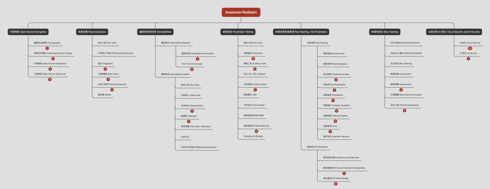

# Awesome-Redteam

**❗【免责声明】本项目所涉及的技术、思路和工具仅供学习，任何人不得将其用于非法用途和盈利，不得将其用于非授权渗透测试，否则后果自行承担，与本项目无关。 使用本项目前请先阅读 [法律法规](https://github.com/Threekiii/Awesome-Laws)。**

_Disclaimer: The technologies, concepts, and tools provided in this Git repository are intended for educational and research purposes only. Any use for illegal activities, unauthorized penetration testing, or commercial purposes is strictly prohibited. Please read the [Awesome-Laws](https://github.com/Threekiii/Awesome-Laws) before using this repository._

📖 一个攻防知识库。_A knowledge base for red teaming and offensive security._

👍 means recommand 推荐使用

> _to be continued..._

## _Roadmap_



## 目录 _Contents_

- [_Roadmap_](#roadmap)
- [目录 _Contents_](#%E7%9B%AE%E5%BD%95-contents)
- [项目导航 _Project Navigation_](#%E9%A1%B9%E7%9B%AE%E5%AF%BC%E8%88%AA-project-navigation)
	- [速查文档 _CheatSheets_](#%E9%80%9F%E6%9F%A5%E6%96%87%E6%A1%A3-cheatsheets)
	- [一些代码 _Scripts_](#%E4%B8%80%E4%BA%9B%E4%BB%A3%E7%A0%81-scripts)
	- [攻防知识 _Tips_](#%E6%94%BB%E9%98%B2%E7%9F%A5%E8%AF%86-tips)
- [开源导航 _Open-Source Navigation_](#%E5%BC%80%E6%BA%90%E5%AF%BC%E8%88%AA-open-source-navigation)
	- [编解码/加解密 _Cryptography_](#%E7%BC%96%E8%A7%A3%E7%A0%81%E5%8A%A0%E8%A7%A3%E5%AF%86-cryptography)
		- [在线工具 _Online Tools_](#%E5%9C%A8%E7%BA%BF%E5%B7%A5%E5%85%B7-online-tools)
		- [离线工具 _Offline Tools_](#%E7%A6%BB%E7%BA%BF%E5%B7%A5%E5%85%B7-offline-tools)
		- [编码/解码 _Encode/Decode_](#%E7%BC%96%E7%A0%81%E8%A7%A3%E7%A0%81-encodedecode)
		- [正则表达式 _Regular Expressions_](#%E6%AD%A3%E5%88%99%E8%A1%A8%E8%BE%BE%E5%BC%8F-regular-expressions)
		- [哈希算法 _Hash Crack_](#%E5%93%88%E5%B8%8C%E7%AE%97%E6%B3%95-hash-crack)
		- [公钥密码算法 _RSA_](#%E5%85%AC%E9%92%A5%E5%AF%86%E7%A0%81%E7%AE%97%E6%B3%95-rsa)
		- [国密算法 _SM_](#%E5%9B%BD%E5%AF%86%E7%AE%97%E6%B3%95-sm)
	- [网络空间测绘 _Cyberspace Search Engine_](#%E7%BD%91%E7%BB%9C%E7%A9%BA%E9%97%B4%E6%B5%8B%E7%BB%98-cyberspace-search-engine)
		- [综合工具 _Nice Tools_](#%E7%BB%BC%E5%90%88%E5%B7%A5%E5%85%B7-nice-tools)
		- [网页/端口 _Web/Ports_](#%E7%BD%91%E9%A1%B5%E7%AB%AF%E5%8F%A3-webports)
		- [谷歌搜索 _Google Hacking_](#%E8%B0%B7%E6%AD%8C%E6%90%9C%E7%B4%A2-google-hacking)
		- [Github 搜索 _Github Dork_](#github-%E6%90%9C%E7%B4%A2-github-dork)
	- [开源情报 _Open-Source Intelligence_](#%E5%BC%80%E6%BA%90%E6%83%85%E6%8A%A5-open-source-intelligence)
		- [综合工具 _Nice Tools_](#%E7%BB%BC%E5%90%88%E5%B7%A5%E5%85%B7-nice-tools)
		- [威胁情报 _Threat Intelligence_](#%E5%A8%81%E8%83%81%E6%83%85%E6%8A%A5-threat-intelligence)
		- [漏洞披露 _Disclosed Vulnerabilities_](#%E6%BC%8F%E6%B4%9E%E6%8A%AB%E9%9C%B2-disclosed%C2%A0vulnerabilities)
		- [接口检索 _API Search_](#%E6%8E%A5%E5%8F%A3%E6%A3%80%E7%B4%A2-api-search)
		- [源代码检索 _Source Code Search_](#%E6%BA%90%E4%BB%A3%E7%A0%81%E6%A3%80%E7%B4%A2-source-code-search)
	- [开源资源 _Open-Source Resources_](#%E5%BC%80%E6%BA%90%E8%B5%84%E6%BA%90-open-source-resources)
		- [社区/知识库 _Communities/Knowledge Base_](#%E7%A4%BE%E5%8C%BA%E7%9F%A5%E8%AF%86%E5%BA%93-communitiesknowledge-base)
		- [思维导图/备忘录 Mindmap/Cheat Sheets](#%E6%80%9D%E7%BB%B4%E5%AF%BC%E5%9B%BE%E5%A4%87%E5%BF%98%E5%BD%95-mindmapcheat-sheets)
		- [进攻性安全 _Red Teaming and Offensive Security_](#%E8%BF%9B%E6%94%BB%E6%80%A7%E5%AE%89%E5%85%A8-red-teaming-and-offensive-security)
		- [防御性安全 _Blue Teaming and Defensive Security_](#%E9%98%B2%E5%BE%A1%E6%80%A7%E5%AE%89%E5%85%A8-blue-teaming-and-defensive-security)
		- [操作安全 _Operation Security_](#%E6%93%8D%E4%BD%9C%E5%AE%89%E5%85%A8-operation-security)
		- [实战平台 _Learning and Practice Platforms_](#%E5%AE%9E%E6%88%98%E5%B9%B3%E5%8F%B0-learning-and-practice-platforms)
- [信息收集 _Reconnaissance_](#%E4%BF%A1%E6%81%AF%E6%94%B6%E9%9B%86-reconnaissance)
	- [综合工具 _Nice Tools_](#%E7%BB%BC%E5%90%88%E5%B7%A5%E5%85%B7-nice-tools)
	- [IP/域名/子域名 _IP/Domain/Subdomain_](#ip%E5%9F%9F%E5%90%8D%E5%AD%90%E5%9F%9F%E5%90%8D-ipdomainsubdomain)
	- [指纹 _Fingerprint_](#%E6%8C%87%E7%BA%B9-fingerprint)
		- [指纹库 _Fingerprint Collection_](#%E6%8C%87%E7%BA%B9%E5%BA%93-fingerprint-collection)
		- [指纹识别 _Fingerprint Reconnaissance_](#%E6%8C%87%E7%BA%B9%E8%AF%86%E5%88%AB-fingerprint-reconnaissance)
		- [WAF 识别 _Waf Checks_](#waf-%E8%AF%86%E5%88%AB-waf-checks)
	- [扫描/爆破 _Brute Force_](#%E6%89%AB%E6%8F%8F%E7%88%86%E7%A0%B4-brute-force)
		- [扫描/爆破工具 _Brute Force Tools_](#%E6%89%AB%E6%8F%8F%E7%88%86%E7%A0%B4%E5%B7%A5%E5%85%B7-brute-force-tools)
		- [扫描/爆破字典 _Brute Force Dictionaries_](#%E6%89%AB%E6%8F%8F%E7%88%86%E7%A0%B4%E5%AD%97%E5%85%B8-brute-force-dictionaries)
		- [字典生成 _Generate a Custom Dictionary_](#%E5%AD%97%E5%85%B8%E7%94%9F%E6%88%90-generate-a-custom-dictionary)
		- [默认口令查询 _Default Credentials_](#%E9%BB%98%E8%AE%A4%E5%8F%A3%E4%BB%A4%E6%9F%A5%E8%AF%A2-default-credentials)
	- [社会工程学 _Social Engineering_](#%E7%A4%BE%E4%BC%9A%E5%B7%A5%E7%A8%8B%E5%AD%A6-social%C2%A0engineering)
		- [凭据泄露 _Leaked Credentials_](#%E5%87%AD%E6%8D%AE%E6%B3%84%E9%9C%B2-leaked-credentials)
		- [邮箱 _Email_](#%E9%82%AE%E7%AE%B1-email)
		- [短信 _SMS Online_](#%E7%9F%AD%E4%BF%A1-sms-online)
		- [钓鱼 _Phishing_](#%E9%92%93%E9%B1%BC-phishing)
	- [移动端 _Mobile_](#%E7%A7%BB%E5%8A%A8%E7%AB%AF-mobile)
- [漏洞研究 _Vulnerability Research_](#%E6%BC%8F%E6%B4%9E%E7%A0%94%E7%A9%B6-vulnerability-research)
	- [漏洞环境 _Vulnerable Environments_](#%E6%BC%8F%E6%B4%9E%E7%8E%AF%E5%A2%83-vulnerable-environments)
		- [基础漏洞 _Basic Vulnerabilities_](#%E5%9F%BA%E7%A1%80%E6%BC%8F%E6%B4%9E-basic-vulnerabilities)
		- [综合漏洞 _Comprehensive Vulnerabilities_](#%E7%BB%BC%E5%90%88%E6%BC%8F%E6%B4%9E-comprehensive-vulnerabilities)
		- [工控环境 _Vulnerable IoT Environment_](#%E5%B7%A5%E6%8E%A7%E7%8E%AF%E5%A2%83-vulnerable-iot-environment)
		- [域环境 _Vulnerable Active Directory Environment_](#%E5%9F%9F%E7%8E%AF%E5%A2%83-vulnerable-active-directory-environment)
	- [PoC _Proof of Concept_](#poc-proof-of-concept)
		- [PoC/ExP](#pocexp)
		- [PoC Templates](#poc-templates)
- [漏洞利用 _Vulnerability Exploits_](#%E6%BC%8F%E6%B4%9E%E5%88%A9%E7%94%A8-vulnerability-exploits)
	- [综合工具 _Nice Tools_](#%E7%BB%BC%E5%90%88%E5%B7%A5%E5%85%B7-nice-tools)
	- [代码审计 _Code Audit_](#%E4%BB%A3%E7%A0%81%E5%AE%A1%E8%AE%A1-code-audit)
	- [反序列化 _Deserialization_](#%E5%8F%8D%E5%BA%8F%E5%88%97%E5%8C%96-deserialization)
		- [Java](#java)
		- [PHP](#php)
	- [数据库 _Database_](#%E6%95%B0%E6%8D%AE%E5%BA%93-database)
		- [Redis](#redis)
		- [MySQL](#mysql)
		- [Oracle](#oracle)
		- [MSSQL](#mssql)
	- [信息泄露 _Information Disclosure_](#%E4%BF%A1%E6%81%AF%E6%B3%84%E9%9C%B2-information-disclosure)
	- [_CMS/OA_](#cmsoa)
	- [中间件/应用层 _Middleware/Application_](#%E4%B8%AD%E9%97%B4%E4%BB%B6%E5%BA%94%E7%94%A8%E5%B1%82-middlewareapplication)
- [渗透测试 _Penetration Testing_](#%E6%B8%97%E9%80%8F%E6%B5%8B%E8%AF%95-penetration-testing)
	- [综合工具 _Nice Tools_](#%E7%BB%BC%E5%90%88%E5%B7%A5%E5%85%B7-nice-tools)
	- [渗透插件 _Extensions_](#%E6%B8%97%E9%80%8F%E6%8F%92%E4%BB%B6-extensions)
		- [Chrome](#chrome)
		- [Burpsuite](#burpsuite)
		- [Yakit](#yakit)
	- [辅助工具 _Auxiliary Tools_](#%E8%BE%85%E5%8A%A9%E5%B7%A5%E5%85%B7-auxiliary-tools)
		- [工具集 _Open-Source Toolkit_](#%E5%B7%A5%E5%85%B7%E9%9B%86-open-source-toolkit)
		- [带外通道 _DNSLog_](#%E5%B8%A6%E5%A4%96%E9%80%9A%E9%81%93-dnslog)
		- [终端优化 _Command Line_](#%E7%BB%88%E7%AB%AF%E4%BC%98%E5%8C%96-command-line)
		- [代码美化 _Beautifier_](#%E4%BB%A3%E7%A0%81%E7%BE%8E%E5%8C%96-beautifier)
		- [生成器 _Generator_](#%E7%94%9F%E6%88%90%E5%99%A8-generator)
	- [SQL 注入 _SQL Injection_](#sql-%E6%B3%A8%E5%85%A5-sql-injection)
	- [访问控制 _Access Control_](#%E8%AE%BF%E9%97%AE%E6%8E%A7%E5%88%B6-access-control)
		- [403 绕过 _Bypass 40X errors_](#403-%E7%BB%95%E8%BF%87-bypass-40x-errors)
	- [跨站脚本 _XSS_](#%E8%B7%A8%E7%AB%99%E8%84%9A%E6%9C%AC-xss)
	- [文件包含 _File Inclusion_](#%E6%96%87%E4%BB%B6%E5%8C%85%E5%90%AB-file-inclusion)
	- [服务端请求伪造 _SSRF_](#%E6%9C%8D%E5%8A%A1%E7%AB%AF%E8%AF%B7%E6%B1%82%E4%BC%AA%E9%80%A0-ssrf)
	- [移动端安全 _Mobile Security_](#%E7%A7%BB%E5%8A%A8%E7%AB%AF%E5%AE%89%E5%85%A8-mobile-security)
		- [小程序 _Mini Program_](#%E5%B0%8F%E7%A8%8B%E5%BA%8F-mini-program)
		- [应用程序 _APK_](#%E5%BA%94%E7%94%A8%E7%A8%8B%E5%BA%8F-apk)
		- [_SessionKey_](#sessionkey)
	- [_Payload and Bypass_](#payload-and-bypass)
- [内网渗透 _Red Teaming and Offensive Security_](#%E5%86%85%E7%BD%91%E6%B8%97%E9%80%8F-red-teaming-and-offensive-security)
	- [基础设施 _Infrastructure_](#%E5%9F%BA%E7%A1%80%E8%AE%BE%E6%96%BD-infrastructure)
	- [信息收集 _Reconnaissance_](#%E4%BF%A1%E6%81%AF%E6%94%B6%E9%9B%86-reconnaissance)
	- [凭证获取 _Credential Access_](#%E5%87%AD%E8%AF%81%E8%8E%B7%E5%8F%96-credential-access)
		- [凭证转储 _Credential Dumping_](#%E5%87%AD%E8%AF%81%E8%BD%AC%E5%82%A8-credential-dumping)
		- [本地枚举 _Local Enumeration_](#%E6%9C%AC%E5%9C%B0%E6%9E%9A%E4%B8%BE-local-enumeration)
		- [哈希破解 _NTLM Cracking_](#%E5%93%88%E5%B8%8C%E7%A0%B4%E8%A7%A3-ntlm-cracking)
	- [后渗透 _Post Exploitation_](#%E5%90%8E%E6%B8%97%E9%80%8F-post-exploitation)
		- [综合工具 _Nice Tools_](#%E7%BB%BC%E5%90%88%E5%B7%A5%E5%85%B7-nice-tools)
		- [二进制库 _Binaries and Libraries_](#%E4%BA%8C%E8%BF%9B%E5%88%B6%E5%BA%93-binaries-and-libraries)
	- [权限维持 _Persistence_](#%E6%9D%83%E9%99%90%E7%BB%B4%E6%8C%81-persistence)
		- [内存马 _Webshell Collection_](#%E5%86%85%E5%AD%98%E9%A9%AC-webshell-collection)
		- [Webshell 管理 _Webshell Management_](#webshell-%E7%AE%A1%E7%90%86-webshell-management)
		- [Webshell 免杀 _Webshell Bypass_](#webshell-%E5%85%8D%E6%9D%80-webshell-bypass)
		- [反弹 Shell 管理 _Reverse Shell Management_](#%E5%8F%8D%E5%BC%B9-shell-%E7%AE%A1%E7%90%86-reverse-shell-management)
	- [权限提升 _Privilege Escalation_](#%E6%9D%83%E9%99%90%E6%8F%90%E5%8D%87-privilege-escalation)
		- [Linux 本地枚举 _Linux Local Enumeration_](#linux-%E6%9C%AC%E5%9C%B0%E6%9E%9A%E4%B8%BE-linux-local-enumeration)
		- [Windows 本地枚举 _Windows Local Enumeration_](#windows-%E6%9C%AC%E5%9C%B0%E6%9E%9A%E4%B8%BE-windows-local-enumeration)
		- [Windows 提权 _Windows Exploits_](#windows-%E6%8F%90%E6%9D%83-windows-exploits)
		- [Linux 提权 _Linux Exploits_](#linux-%E6%8F%90%E6%9D%83-linux-exploits)
		- [数据库提权 _Database Exploits_](#%E6%95%B0%E6%8D%AE%E5%BA%93%E6%8F%90%E6%9D%83-database-exploits)
	- [防御规避 _Defense Evasion_](#%E9%98%B2%E5%BE%A1%E8%A7%84%E9%81%BF-defense-evasion)
		- [Linux 防御规避 _Linux Defense Evasion_](#linux-%E9%98%B2%E5%BE%A1%E8%A7%84%E9%81%BF-linux-defense-evasion)
		- [Windows 防御规避 _Windows Defense Evasion_](#windows-%E9%98%B2%E5%BE%A1%E8%A7%84%E9%81%BF-windows-defense-evasion)
	- [内网穿透 _Proxy_](#%E5%86%85%E7%BD%91%E7%A9%BF%E9%80%8F-proxy)
		- [代理客户端 _Proxy Client_](#%E4%BB%A3%E7%90%86%E5%AE%A2%E6%88%B7%E7%AB%AF-proxy-client)
		- [反向代理 _Reverse Proxy_](#%E5%8F%8D%E5%90%91%E4%BB%A3%E7%90%86-reverse-proxy)
		- [DNS 隧道 _DNS Tunnel_](#dns-%E9%9A%A7%E9%81%93-dns-tunnel)
		- [ICMP 隧道 _ICMP Tunnel_](#icmp-%E9%9A%A7%E9%81%93-icmp-tunnel)
		- [端口转发 _Port Forwarding_](#%E7%AB%AF%E5%8F%A3%E8%BD%AC%E5%8F%91-port-forwarding)
	- [操作安全 _Operation Security_](#%E6%93%8D%E4%BD%9C%E5%AE%89%E5%85%A8-operation-security)
- [域渗透 _Active Directory Penetration_](#%E5%9F%9F%E6%B8%97%E9%80%8F-active-directory-penetration)
	- [域内信息收集 _Collection and Discovery_](#%E5%9F%9F%E5%86%85%E4%BF%A1%E6%81%AF%E6%94%B6%E9%9B%86-collection-and-discovery)
	- [域内权限提升 _Privilege Escalation_](#%E5%9F%9F%E5%86%85%E6%9D%83%E9%99%90%E6%8F%90%E5%8D%87-privilege-escalation)
	- [域内漏洞利用 _Known Exploited Vulnerabilities_](#%E5%9F%9F%E5%86%85%E6%BC%8F%E6%B4%9E%E5%88%A9%E7%94%A8-known-exploited-vulnerabilities)
		- [noPac](#nopac)
		- [Zerologon](#zerologon)
		- [ProxyLogon/ProxyShell](#proxylogonproxyshell)
		- [Printnightmare](#printnightmare)
	- [域内渗透方式 _Methodology_](#%E5%9F%9F%E5%86%85%E6%B8%97%E9%80%8F%E6%96%B9%E5%BC%8F-methodology)
		- [Kerbrute](#kerbrute)
		- [DCSync](#dcsync)
		- [NTLM Relay](#ntlm-relay)
		- [ADCS](#adcs)
- [防御性安全 _Blue Teaming and Defensive Security_](#%E9%98%B2%E5%BE%A1%E6%80%A7%E5%AE%89%E5%85%A8-blue-teaming-and-defensive-security)
	- [内存马查杀 _Memshell Detection_](#%E5%86%85%E5%AD%98%E9%A9%AC%E6%9F%A5%E6%9D%80-memshell-detection)
	- [Webshell 查杀 _Webshell Detection_](#webshell-%E6%9F%A5%E6%9D%80-webshell-detection)
	- [攻击研判 _Blue Teaming_](#%E6%94%BB%E5%87%BB%E7%A0%94%E5%88%A4-blue-teaming)
	- [基线加固 _Enforcement_](#%E5%9F%BA%E7%BA%BF%E5%8A%A0%E5%9B%BA-enforcement)
	- [勒索病毒 _Ransomware_](#%E5%8B%92%E7%B4%A2%E7%97%85%E6%AF%92-ransomware)
		- [搜索引擎 _Search Engine_](#%E6%90%9C%E7%B4%A2%E5%BC%95%E6%93%8E-search-engine)
		- [解密工具 _Decryption Tools_](#%E8%A7%A3%E5%AF%86%E5%B7%A5%E5%85%B7-decryption-tools)
	- [开源蜜罐 _Open-Source Honeypot_](#%E5%BC%80%E6%BA%90%E8%9C%9C%E7%BD%90-open-source-honeypot)
	- [逆向工程 _Reverse Engineering_](#%E9%80%86%E5%90%91%E5%B7%A5%E7%A8%8B-reverse-engineering)
		- [综合工具 _Nice Tools_](#%E7%BB%BC%E5%90%88%E5%B7%A5%E5%85%B7-nice-tools)
		- [ELF/EXE](#elfexe)
		- [Java](#java)
		- [Python](#python)
		- [Rust/Go/.NET](#rustgonet)
- [云安全 _Cloud Security_](#%E4%BA%91%E5%AE%89%E5%85%A8-cloud-security)
	- [开源资源 _Resources_](#%E5%BC%80%E6%BA%90%E8%B5%84%E6%BA%90-resources)
	- [云安全矩阵 _Cloud Threat Matrix_](#%E4%BA%91%E5%AE%89%E5%85%A8%E7%9F%A9%E9%98%B5-cloud-threat-matrix)
	- [云漏洞环境 _Vulnerable Cloud Environments_](#%E4%BA%91%E6%BC%8F%E6%B4%9E%E7%8E%AF%E5%A2%83-vulnerable-cloud-environments)
	- [云服务 _Cloud Services_](#%E4%BA%91%E6%9C%8D%E5%8A%A1-cloud-services)
		- [云管平台 _Management Tools_](#%E4%BA%91%E7%AE%A1%E5%B9%B3%E5%8F%B0-management-tools)
		- [AK/SK 利用 _AK/SK Exploit_](#aksk-%E5%88%A9%E7%94%A8-aksk-exploit)
	- [云原生 _Cloud Native_](#%E4%BA%91%E5%8E%9F%E7%94%9F-cloud-native)
		- [综合工具 _Nice Tools_](#%E7%BB%BC%E5%90%88%E5%B7%A5%E5%85%B7-nice-tools)
		- [容器 _Docker_](#%E5%AE%B9%E5%99%A8-docker)
		- [集群 _Kubernetes_](#%E9%9B%86%E7%BE%A4-kubernetes)
- [AI 安全 _AI Security_](#ai-%E5%AE%89%E5%85%A8-ai-security)
	- [AI 安全矩阵 _AI Threat Matrix_](#ai-%E5%AE%89%E5%85%A8%E7%9F%A9%E9%98%B5-ai-threat-matrix)
- [提高生产力的辅助工具](#%E6%8F%90%E9%AB%98%E7%94%9F%E4%BA%A7%E5%8A%9B%E7%9A%84%E8%BE%85%E5%8A%A9%E5%B7%A5%E5%85%B7)
	- [_LLM_](#llm)
		- [开源资源 _Open-Source Resources_](#%E5%BC%80%E6%BA%90%E8%B5%84%E6%BA%90-open-source-resources)
		- [编排框架 _orchestration framework_](#%E7%BC%96%E6%8E%92%E6%A1%86%E6%9E%B6-orchestration%C2%A0framework)
		- [提示词 _Prompts_](#%E6%8F%90%E7%A4%BA%E8%AF%8D-prompts)
		- [部署 _Deployment_](#%E9%83%A8%E7%BD%B2-deployment)
- [提高生产力的使用姿势](#%E6%8F%90%E9%AB%98%E7%94%9F%E4%BA%A7%E5%8A%9B%E7%9A%84%E4%BD%BF%E7%94%A8%E5%A7%BF%E5%8A%BF)
	- [如何快速使用 alias](#%E5%A6%82%E4%BD%95%E5%BF%AB%E9%80%9F%E4%BD%BF%E7%94%A8-alias)
	- [如何优化原生终端](#%E5%A6%82%E4%BD%95%E4%BC%98%E5%8C%96%E5%8E%9F%E7%94%9F%E7%BB%88%E7%AB%AF)
	- [如何解决终端中文乱码](#%E5%A6%82%E4%BD%95%E8%A7%A3%E5%86%B3%E7%BB%88%E7%AB%AF%E4%B8%AD%E6%96%87%E4%B9%B1%E7%A0%81)

## 项目导航 _Project Navigation_

### 速查文档 _CheatSheets_

戳这里 [Click Here](https://github.com/Threekiii/Awesome-Redteam/blob/master/cheatsheets/)

```
DefaultCreds-Cheat-Sheet.csv
Huawei-iBMC-DefaultCreds.csv
Huawei-Product-Cheat-Sheet.csv
WeakPassword-Cheat-Sheet.csv
安全厂商及官网链接速查.txt
```

### 一些代码 _Scripts_

戳这里 [Click Here](https://github.com/Threekiii/Awesome-Redteam/blob/master/scripts/)

```
ShellcodeWrapper: Shellcode加密
AntivirusScanner: 杀软进程检测脚本
runtime-exec-payloads.html: java.lang.Runtime.exec() Payloads生成 
Ascii2Char: ASCII码和字符互相转换脚本 修改webshell文件名密码 
Weakpass_Generator: 在线弱密码生成工具 汉化版
Godzilla_Decryptor: 哥斯拉流量解密
Behinder4_Key_Bruteforce: 冰蝎4密钥爆破
Flask_Session_Decryptor: Flask session注入解密
```

### 攻防知识 _Tips_

戳这里 [Click Here](https://github.com/Threekiii/Awesome-Redteam/blob/master/tips/)

```
信息收集-敏感信息收集
内网渗透-免杀
内网渗透-隐藏
内网渗透-Pentesting AD Mindmap
安全架构-网络攻击与防御图谱
平台搭建-DNS Log
流量分析-CobaltStrike
流量分析-Webshell
社会工程学-钓鱼邮件主题汇总
逆向分析-微信小程序反编译
```

## 开源导航 _Open-Source Navigation_

### 编解码/加解密 _Cryptography_

#### 在线工具 _Online Tools_

- http://www.ip33.com/
- http://www.metools.info/
- https://www.107000.com/
- http://www.hiencode.com/
- http://www.atoolbox.net/
- https://www.sojson.com/
- https://the-x.cn/

#### 离线工具 _Offline Tools_

- https://github.com/wangyiwy/oktools
- https://github.com/Ciphey/Ciphey
- https://github.com/gchq/CyberChef 👍
- http://1o1o.xyz/bo_ctfcode.html
- https://github.com/guyoung/CaptfEncoder

#### 编码/解码 _Encode/Decode_

- http://code.mcdvisa.com/ Chinese Commercial Code 标准中文电码
- https://www.compart.com/en/unicode/ Unicode
- http://web.chacuo.net/charsetuuencode UUencode
- https://tool.chinaz.com/tools/escape.aspx Escape/Unescape
- https://zh.rakko.tools/tools/21/ HTML Entity Encode

#### 正则表达式 _Regular Expressions_

- https://regex101.com/
- https://github.com/VincentSit/ChinaMobilePhoneNumberRegex
- https://github.com/any86/any-rule

#### 哈希算法 _Hash Crack_

- https://www.cmd5.org/
- https://www.somd5.com/
- https://www.onlinehashcrack.com/
- https://crackstation.net/
- https://crack.sh/
- https://passwordrecovery.io/
- https://md5decrypt.net/en/Sha256/
- https://hashes.com/en/decrypt/hash

#### 公钥密码算法 _RSA_

- https://www.ssleye.com/ssltool/
- https://www.lddgo.net/en/encrypt/rsa works with .pem

#### 国密算法 _SM_

- hutool-crypto: https://github.com/dromara/hutool hutool-crypto 模块，提供对称、非对称和摘要算法封装
- GmSSL: https://github.com/guanzhi/GmSSL SM2/SM3/SM4/SM9/SSL
- gmssl-python: https://github.com/gongxian-ding/gmssl-python SM2/SM3/SM4/SM9

### 网络空间测绘 _Cyberspace Search Engine_

#### 综合工具 _Nice Tools_

- Fofa: https://fofa.info/
- Shodan: https://www.shodan.io/
- ZoomEye: https://www.zoomeye.org/
- Hunter: https://hunter.qianxin.com/
- Ditecting: https://www.ditecting.com/
- Quake: https://quake.360.cn/quake/
- Censys: https://search.censys.io/
- Netlas: https://app.netlas.io/domains/

#### 网页/端口 _Web/Ports_

- Wayback Machine: https://web.archive.org/ web pages saved over time
- VisualPing: https://visualping.io/ website changes monitor
- Dark Web Exposure: https://www.immuniweb.com/darkweb/
- SG TCP/IP: https://www.speedguide.net/ports.php ports database

#### 谷歌搜索 _Google Hacking_

- https://www.exploit-db.com/google-hacking-database Google Hacking Database
- https://github.com/cipher387/Dorks-collections-list Google Hacking Database
- https://cxsecurity.com/dorks/ Google Hacking Database
- https://dorks.faisalahmed.me/ Google Hacking Online
- https://pentest-tools.com/information-gathering/google-hacking Google Hacking Online
- http://advangle.com/ Google Hacking Online
- https://0iq.me/gip/ Google Hacking Online
- https://github.com/obheda12/GitDorker Google Hacking Cli
- https://github.com/six2dez/dorks_hunter Google Hacking Cli

#### Github 搜索 _Github Dork_

- https://github.com/search/advanced Github Dork
- https://github.com/obheda12/GitDorker Github Dork
- https://github.com/damit5/gitdorks_go Github Dork

### 开源情报 _Open-Source Intelligence_

#### 综合工具 _Nice Tools_

- OSINT Resource List: https://start.me/p/rx6Qj8/nixintel-s-osint-resource-list
- OSINT Framework: https://osintframework.com/
- OSINT Handbook: https://i-intelligence.eu/uploads/public-documents/OSINT_Handbook_2020.pdf

#### 威胁情报 _Threat Intelligence_

- Virustotal: https://www.virustotal.com/
- 腾讯哈勃分析系统: https://habo.qq.com/tool/index
- 微步在线威胁情报: https://x.threatbook.com/
- 奇安信威胁情报: https://ti.qianxin.com/
- 360 威胁情报: https://ti.360.net/
- 网络安全威胁信息共享平台: https://share.anva.org.cn/web/publicity/listPhishing
- 安恒威胁情报: https://ti.dbappsecurity.com.cn/
- 火线安全平台: https://www.huoxian.cn
- 知道创宇黑客新闻流: https://hackernews.cc/
- SecWiki 安全信息流: https://www.sec-wiki.com/

#### 漏洞披露 _Disclosed Vulnerabilities_

- 国家信息安全漏洞库: https://www.cnnvd.org.cn/
- 国家互联网应急中心: https://www.cert.org.cn/
- 360 网络安全响应中心: https://cert.360.cn/
- 知道创宇漏洞库: https://www.seebug.org/
- 长亭漏洞库: https://stack.chaitin.com/vuldb/
- 阿里云漏洞库: https://avd.aliyun.com/high-risk/list
- PeiQi 漏洞库: https://peiqi.wgpsec.org/
- Hackerone: https://www.hackerone.com/
- CVE: https://cve.mitre.org/
- National Vulnerability Database: https://nvd.nist.gov/
- Vulnerability & Exploit Database: https://www.rapid7.com/db/
- Packet Storm's file archive: https://packetstormsecurity.com/files/tags/exploit
- Shodan: https://cvedb.shodan.io/cves stay updated with CVEs `curl https://cvedb.shodan.io/cves | jq '[.cves[] | select(.cvss > 8)]'`
- CVEShield: https://www.cveshield.com/ latest trending vulnerabilities

#### 接口检索 _API Search_

- https://www.postman.com/explore/ public API
- https://rapidapi.com/ public API
- https://serene-agnesi-57a014.netlify.app/ discover secret API keys:

#### 源代码检索 _Source Code Search_

- https://publicwww.com/
- https://searchcode.com/

### 开源资源 _Open-Source Resources_

#### 社区/知识库 _Communities/Knowledge Base_

- 先知社区: https://xz.aliyun.com/
- Infocon: https://infocon.org/
- ffffffff0x 安全知识框架: https://github.com/ffffffff0x/1earn
- 狼组公开知识库: https://wiki.wgpsec.org/
- Mitre ATT&CK matrices: https://attack.mitre.org/matrices/enterprise
- Mitre ATT&CK techniques: http://attack.mitre.org/techniques/enterprise/
- Hacking Articles: https://www.hackingarticles.in/
- PostSwigger Blog: https://portswigger.net/blog
- InGuardians Labs Blog: https://www.inguardians.com/
- Pentest Workflow: https://pentest.mxhx.org/
- Pentest Cheatsheet: https://pentestbook.six2dez.com/

#### 思维导图/备忘录 Mindmap/Cheat Sheets

- https://cheatsheets.zip/ Cheat Sheets for Developers
- https://learnxinyminutes.com/ Programming/Toolkit/Command/OS/Shortcuts cheat sheet
- https://github.com/Ignitetechnologies/Mindmap/ Cyber Security Mindmap
- https://html5sec.org/ HTML5 Security Cheatsheet
- https://orange-cyberdefense.github.io/ocd-mindmaps/img/mindmap_ad_dark_classic_2025.03.excalidraw.svg AD attack&defense mindmaps
- https://github.com/WADComs/WADComs.github.io Windows/AD cheat sheet 👍

#### 进攻性安全 _Red Teaming and Offensive Security_

- https://www.ired.team/
- https://www.thehacker.recipes/
- https://ppn.snovvcrash.rocks/
- https://book.hacktricks.xyz/
- https://blog.harmj0y.net/
- https://hausec.com/domain-penetration-testing/
- https://dirkjanm.io/
- https://casvancooten.com/
- https://evasions.checkpoint.com/
- https://redteam.guide/docs/definitions
- https://github.com/HadessCS/Red-team-Interview-Questions

#### 防御性安全 _Blue Teaming and Defensive Security_

- https://github.com/Purp1eW0lf/Blue-Team-Notes

#### 操作安全 _Operation Security_

- https://github.com/WesleyWong420/OPSEC-Tradecraft

#### 实战平台 _Learning and Practice Platforms_

- Cybrary: https://www.cybrary.it/
- HacktheBox: https://www.hackthebox.com/
- TryHackMe: https://tryhackme.com/
- Try2Hack: https://try2hack.me/
- Vulnmachines: https://www.vulnmachines.com/
- RangeForce: https://www.rangeforce.com/
- Root Me: https://www.root-me.org/
- ichunqiu: https://yunjing.ichunqiu.com/
- echoCTF: https://github.com/echoCTF/echoCTF.RED for CTF
- Vulnhub: https://www.vulnhub.com/
- LabEx: https://labex.io/

Mac M1 使用 Vulnhub 等 ova 格式镜像，需要将 ova 格式转为 qcow2，再通过 UTM 运行：

- https://github.com/qemu/qemu
- https://github.com/utmapp/UTM

## 信息收集 _Reconnaissance_

### 综合工具 _Nice Tools_

- AlliN: https://github.com/P1-Team/AlliN
- fscan: https://github.com/shadow1ng/fscan
- TscanPlus: https://github.com/TideSec/TscanPlus
- kscan: https://github.com/lcvvvv/kscan
- Kunyu: https://github.com/knownsec/Kunyu
- OneForAll: https://github.com/shmilylty/OneForAll
- ShuiZe: https://github.com/0x727/ShuiZe_0x727
- FofaX: https://github.com/xiecat/fofax
- Fofa Viewer: https://github.com/wgpsec/fofa_viewer
- ENScan_GO: https://github.com/wgpsec/ENScan_GO
- Amass: https://github.com/owasp-amass/amass
- ApolloScanner: https://github.com/b0bac/ApolloScanner

### IP/域名/子域名 _IP/Domain/Subdomain_

- IP:
	- https://www.ipuu.net/
	- https://site.ip138.com/
	- https://myip.ms/
	- https://ipwhois.cnnic.net.cn
- Multi Ping:
	- https://ping.chinaz.com/
	- https://www.host-tracker.com/
	- https://www.webpagetest.org/
	- https://dnscheck.pingdom.com/
- IP to Domain:
	- https://site.ip138.com/
	- https://x.threatbook.cn/
	- https://www.virustotal.com/
- Whois:
	- https://whois.chinaz.com/
	- https://whois.aliyun.com/
	- https://who.is/
	- https://www.whoxy.com/
- DNS:
	- https://hackertarget.com/find-dns-host-records
	- https://dnsdumpster.com
	- https://dnsdb.io/zh-cn
	- https://centralops.net/co/
	- https://viewdns.info/
	- https://dnsdumpster.com/
	- https://rapiddns.io/
- ASN:
	- https://wq.apnic.net/
	- https://bgp.he.net/
	- https://bgpview.io/
- TLS/SSL Certificat :
	- https://censys.io
	- https://crt.sh

### 指纹 _Fingerprint_

#### 指纹库 _Fingerprint Collection_

- https://github.com/r0eXpeR/fingerprint
- https://github.com/0x727/FingerprintHub

#### 指纹识别 _Fingerprint Reconnaissance_

- https://github.com/EASY233/Finger
- https://github.com/EdgeSecurityTeam/EHole
- https://github.com/0x727/ObserverWard
- https://github.com/TideSec/TideFinger_Go
- https://github.com/zhzyker/dismap
- https://www.webshell.cc/4697.html
- http://www.yunsee.cn/ online

#### WAF 识别 _Waf Checks_

- https://github.com/stamparm/identYwaf
- https://github.com/EnableSecurity/wafw00f
- https://github.com/MISP/misp-warninglists

### 扫描/爆破 _Brute Force_

#### 扫描/爆破工具 _Brute Force Tools_

- Port:
	- https://github.com/antirez/hping
- Subdomain:
	- https://github.com/projectdiscovery/subfinder
	- https://github.com/knownsec/ksubdomain
- Web:
	- https://github.com/pingc0y/URLFinder
	- https://github.com/s0md3v/Arjun
	- https://github.com/OJ/gobuster
	- https://github.com/jaeles-project/gospider
	- https://github.com/xmendez/wfuzz
- Directory:
	- https://github.com/maurosoria/dirsearch
	- https://github.com/H4ckForJob/dirmap
	- https://github.com/ffuf/ffuf
- Password:
	- https://github.com/vanhauser-thc/thc-hydra
	- https://github.com/galkan/crowbar supports sshkey and openvpn
	- https://github.com/evilsocket/legba/
- Hash Cracking:
	- https://github.com/openwall/john
	- https://github.com/hashcat/hashcat
	- https://hashcat.net/wiki/doku.php?id=example_hashes hashcat examples
	- https://github.com/HashPals/Name-That-Hash hash identifier
	- https://github.com/noraj/haiti hash identifier
- Json web token (JWT):
	- https://jwt.io/
	- https://github.com/Sjord/jwtcrack
	- https://github.com/ticarpi/jwt_tool
	- https://github.com/mazen160/jwt-pwn
	- https://github.com/brendan-rius/c-jwt-cracker
	- https://github.com/wallarm/jwt-secrets/blob/master/jwt.secrets.list

#### 扫描/爆破字典 _Brute Force Dictionaries_

- Wordlists for All:
	- https://github.com/danielmiessler/SecLists 46.4k star
	- https://github.com/SexyBeast233/SecDictionary + ffuf
	- https://github.com/insightglacier/Dictionary-Of-Pentesting
	- https://github.com/TheKingOfDuck/fuzzDicts
	- https://github.com/gh0stkey/Web-Fuzzing-Box
	- https://github.com/a3vilc0de/PentesterSpecialDict
	- https://github.com/Bo0oM/fuzz.txt
	- https://github.com/assetnote/wordlists
	- https://github.com/rapid7/metasploit-framework/tree/master/data/wordlists
- Web Fuzz Wordlists:
	- https://github.com/xmendez/wfuzz/tree/master/wordlist
	- https://github.com/lutfumertceylan/top25-parameter
- Others (not frequently used):
	- https://github.com/danielmiessler/SecLists/tree/master/Discovery/Web-Content
	- https://github.com/assetnote/commonspeak2-wordlists/tree/master/wordswithext
	- https://github.com/random-robbie/bruteforce-lists
	- https://github.com/google/fuzzing/tree/master/dictionaries
	- https://github.com/six2dez/OneListForAll

#### 字典生成 _Generate a Custom Dictionary_

- Online:
	- Generate wordlists: https://weakpass.com/generate
	- Generate subdomains and wordlists: https://weakpass.com/generate/domains
	- 汉字转拼音: https://www.aies.cn/pinyin.htm
	- 密码猜解: https://www.hacked.com.cn/pass.html
- Private Deployment:
	- Generate wordlists(offline): https://github.com/zzzteph/weakpass
	- Generate subdomains and wordlists(offline): https://github.com/zzzteph/probable_subdomains
- Offline:
	- pydictor: https://github.com/LandGrey/pydictor/
	- crunch:
		- Kali/Linux: https://sourceforge.net/projects/crunch-wordlist
		- Windows: https://github.com/shadwork/Windows-Crunch

#### 默认口令查询 _Default Credentials_

- Default Credentials Cheat Sheet: https://github.com/ihebski/DefaultCreds-cheat-sheet 3468 default creds
- datarecovery: https://datarecovery.com/rd/default-passwords/ online
- cirt.net: https://cirt.net/passwords online
- Online Router Passwords:
  - https://www.routerpasswords.com/
  - https://portforward.com/router-password/
  - https://www.cleancss.com/router-default/
  - https://www.toolmao.com/baiduapp/routerpwd/
  - https://datarecovery.com/rd/default-passwords/

### 社会工程学 _Social Engineering_

#### 凭据泄露 _Leaked Credentials_

- https://have-ibeenpwned.com/
- https://breachdirectory.org/

#### 邮箱 _Email_

- Temporary Email:
	- http://24mail.chacuo.net/
	- https://www.guerrillamail.com/
	- https://rootsh.com/
- Snov.io: https://app.snov.io
- Phonebook: also works on subdomains and urls https://phonebook.cz
- Skymem: https://www.skymem.info
- Hunter: https://hunter.io
- email-format: https://www.email-format.com/i/search/
- 搜邮箱: https://souyouxiang.com/find-contact/
- theHarvester: also works on subdomains https://github.com/laramies/theHarvester
- Verify emails: https://tools.emailhippo.com/
- Accounts registered by email: https://emailrep.io/

#### 短信 _SMS Online_

- https://sms-activate.io 👍 more than 180 countries for sale
- https://www.supercloudsms.com/en/
- https://getfreesmsnumber.com/
- https://www.zusms.com/
- https://yunduanxin.net/
- https://www.free-sms-receive.com/
- https://receive-sms.cc/#google_vignette
- https://bestsms.xyz/
- https://smscodeonline.com/

#### 钓鱼 _Phishing_

- gophish: https://github.com/gophish/gophish open-source phishing toolkit
- SpoofWeb: https://github.com/5icorgi/SpoofWeb deploy phishing website

### 移动端 _Mobile_

- https://www.xiaolanben.com/
- https://www.qimai.cn/

## 漏洞研究 _Vulnerability Research_

### 漏洞环境 _Vulnerable Environments_

#### 基础漏洞 _Basic Vulnerabilities_

- Sqli-labs: https://github.com/Audi-1/sqli-labs
- Upload-labs: https://github.com/c0ny1/upload-labs
- Xss-labs: https://github.com/do0dl3/xss-labs
- DVWA: https://github.com/digininja/DVWA
- WebGoat: https://github.com/WebGoat/WebGoat
- encrypt-labs: https://github.com/SwagXz/encrypt-labs AES/DES/RSA

#### 综合漏洞 _Comprehensive Vulnerabilities_

- Vulhub: https://vulhub.org/
- PortSwigger Web Security Academy: https://portswigger.net/web-security
- OWASP Top10: https://owasp.org/www-project-juice-shop/
- Vulstudy: https://github.com/c0ny1/vulstudy 17 platform based on docker
- Vulfocus: https://github.com/fofapro/vulfocus
- FastJsonParty: https://github.com/lemono0/FastJsonParty

#### 工控环境 _Vulnerable IoT Environment_

- IoT-vulhub: https://github.com/firmianay/IoT-vulhub

#### 域环境 _Vulnerable Active Directory Environment_

- Game of active directory: https://github.com/Orange-Cyberdefense/GOAD
- BadBlood: https://github.com/davidprowe/BadBlood create your own example Active Directory environment

#### 云环境 _Vulnerable Cloud Environments_

- Awesome-CloudSec-Labs: https://github.com/iknowjason/Awesome-CloudSec-Labs
- K8s Lan Party: https://www.k8slanparty.com/
- Metarget: https://github.com/Metarget/metarget
- TerraformGoat: https://github.com/HXSecurity/TerraformGoat
- Kubernetes Goat: https://github.com/madhuakula/kubernetes-goat
- Attack Defense: https://attackdefense.pentesteracademy.com/listing?labtype=cloud-services&subtype=cloud-services-amazon-s3
- AWSGoat: https://github.com/ine-labs/AWSGoat
- CloudGoat: https://github.com/RhinoSecurityLabs/cloudgoat

#### AI 环境 _Vulnerable AI Environments_

- AI prompt injection challenge: https://gandalf.lakera.ai/baseline

### PoC _Proof of Concept_

> Be careful Malware，POC 库最新的 CVE 可能存在投毒风险。

#### PoC/ExP

- https://github.com/wy876/POC
- https://github.com/lal0ne/vulnerability
- https://github.com/DawnFlame/POChouse
- https://github.com/coffeehb/Some-PoC-oR-ExP
- https://github.com/luck-ying/Library-POC
- https://github.com/Mr-xn/Penetration_Testing_POC
- https://github.com/nomi-sec/PoC-in-GitHub
- https://github.com/ycdxsb/PocOrExp_in_Github
- https://github.com/helloexp/0day
- https://github.com/trickest/cve
- https://sploitus.com/ exploits of the week
- https://www.exploit-db.com/ works with `searchsploit <keywords>`

#### PoC Templates

- https://poc.xray.cool/ online
- https://github.com/zeoxisca/gamma-gui offline
- https://github.com/projectdiscovery/nuclei-templates/

## 漏洞利用 _Vulnerability Exploits_

### 综合工具 _Nice Tools_

- https://github.com/chaitin/xpoc
- https://github.com/chaitin/xray
- https://github.com/zhzyker/vulmap
- https://github.com/zan8in/afrog
- https://github.com/projectdiscovery/nuclei

### 代码审计 _Code Audit_

- tabby: https://github.com/wh1t3p1g/tabby

### 反序列化 _Deserialization_

#### Java

- https://github.com/frohoff/ysoserial
- https://github.com/Y4er/ysoserial
- https://github.com/wh1t3p1g/ysomap
- https://github.com/mbechler/marshalsec
- https://github.com/qi4L/JYso
- https://github.com/vulhub/JNDIExploit
- https://github.com/welk1n/JNDI-Injection-Exploit
- https://github.com/WhiteHSBG/JNDIExploit
- https://github.com/rebeyond/JNDInjector
- https://github.com/A-D-Team/attackRmi
- https://github.com/Java-Chains/web-chains

#### PHP

- https://github.com/ambionics/phpggc PHP unserialize() payloads

### 数据库 _Database_

#### Redis

- https://github.com/cinience/RedisStudio
- https://github.com/qishibo/AnotherRedisDesktopManager
- https://github.com/n0b0dyCN/redis-rogue-server
- https://github.com/Ridter/redis-rce
- https://github.com/yuyan-sec/RedisEXP
- https://github.com/r35tart/RedisWriteFile

#### MySQL

- https://github.com/SafeGroceryStore/MDUT multiple database utilization tools
- https://github.com/4ra1n/mysql-fake-server
- https://github.com/dushixiang/evil-mysql-server
- https://github.com/fnmsd/MySQL_Fake_Server

#### Oracle

- odat: https://github.com/quentinhardy/odat RCE
- sqlplus: https://www.oracle.com/database/technologies/instant-client/linux-x86-64-downloads.html xxx as sysdba

#### MSSQL

- https://github.com/uknowsec/SharpSQLTools
- https://github.com/Ridter/PySQLTools

### 信息泄露 _Information Disclosure_

- trufflehog: https://github.com/trufflesecurity/trufflehog find, verify, and analyze leaked credentials
- git-dumper: https://github.com/arthaud/git-dumper
- gitleaks: https://github.com/gitleaks/gitleaks
- dvcs-ripper: https://github.com/kost/dvcs-ripper .svn、.hg、.cvs disclosure
- ds_store_exp: https://github.com/lijiejie/ds_store_exp .DS_Store disclosure
- Hawkeye: https://github.com/0xbug/Hawkeye gitHub sensitive information leakage monitor Spider

### _CMS/OA_

- TongdaScan_go https://github.com/Fu5r0dah/TongdaScan_go
- Apt_t00ls: https://github.com/White-hua/Apt_t00ls
- OA-EXPTOOL: https://github.com/LittleBear4/OA-EXPTOOL
- DecryptTools: https://github.com/wafinfo/DecryptTools 22 种加解密
- ncDecode: https://github.com/1amfine2333/ncDecode 用友 NC 解密
- PassDecode-jar: https://github.com/Rvn0xsy/PassDecode-jar 帆软/致远解密
- ezOFFICE_Decrypt: https://github.com/wafinfo/ezOFFICE_Decrypt 万户解密
- LandrayDES: https://github.com/zhutougg/LandrayDES 蓝凌 OA 解密

### 中间件/应用层 _Middleware/Application_

**Confluence**

- ConfluenceMemshell: https://github.com/Lotus6/ConfluenceMemshell
- CVE-2022-26134 Memshell: https://github.com/BeichenDream/CVE-2022-26134-Godzilla-MEMSHELL
- CVE-2023-22527 Memshell: https://github.com/Boogipop/CVE-2023-22527-Godzilla-MEMSHELL

**Druid**

- DruidCrack: https://github.com/rabbitmask/DruidCrack
- druid_sessions: https://github.com/yuyan-sec/druid_sessions

**Fastjson**

- fastjson-exp: https://github.com/amaz1ngday/fastjson-exp

**GitLab**

- CVE-2021-22205: https://github.com/Al1ex/CVE-2021-22205/

**Nacos**

- NacosRce: https://github.com/c0olw/NacosRce/
- nacosleak: https://github.com/a1phaboy/nacosleak
- nacosScan:https://github.com/Whoopsunix/nacosScan
- NacosExploitGUI: https://github.com/charonlight/NacosExploitGUI

**Nps**

- nps-auth-bypass: https://github.com/carr0t2/nps-auth-bypass

**Java**

- jdwp-shellifier: python2 https://github.com/IOActive/jdwp-shellifier
- jdwp-shellifier: https://github.com/Lz1y/jdwp-shellifier

**Shiro**

- Shiro rememberMe Decrypt: https://vulsee.com/tools/shiroDe/shiroDecrypt.html
- shiro_attack: https://github.com/j1anFen/shiro_attack
- shiro_rce_tool: https://github.com/wyzxxz/shiro_rce_tool
- ShiroExploit: https://github.com/feihong-cs/ShiroExploit-Deprecated
- ShiroExp: https://github.com/safe6Sec/ShiroExp
- shiro_key: https://github.com/yanm1e/shiro_key 1k+

**Struts**

- Struts2VulsTools: https://github.com/shack2/Struts2VulsTools

Spring **Boot**

- SpringBoot-Scan: https://github.com/AabyssZG/SpringBoot-Scan
- SpringBootVulExploit: https://github.com/LandGrey/SpringBootVulExploit
- CVE-2022-22963 https://github.com/mamba-2021/EXP-POC/tree/main/Spring-cloud-function-SpEL-RCE
- CVE-2022-22947/CVE-2022-22963: https://github.com/savior-only/Spring_All_Reachable
- swagger-exp: https://github.com/lijiejie/swagger-exp
- jasypt decrypt: https://www.devglan.com/online-tools/jasypt-online-encryption-decryption
- heapdump_tool: https://github.com/wyzxxz/heapdump_tool
- Memory Analyzer: https://eclipse.dev/mat/download/
- JDumpSpider:https://github.com/whwlsfb/JDumpSpider

**Tomcat**

- CVE-2020-1938: https://github.com/YDHCUI/CNVD-2020-10487-Tomcat-Ajp-lfi
- ClassHound: https://github.com/LandGrey/ClassHound

**Thinkphp**

- ThinkphpGUI: https://github.com/Lotus6/ThinkphpGUI
- thinkphp_gui_tools: https://github.com/bewhale/thinkphp_gui_tools

**Weblogic**

- WeblogicTool: https://github.com/KimJun1010/WeblogicTool
- WeblogicScan: https://github.com/dr0op/WeblogicScan
- WeblogicScan: https://github.com/rabbitmask/WeblogicScan
- weblogicScanner: https://github.com/0xn0ne/weblogicScanner
- weblogic-framework: https://github.com/sv3nbeast/weblogic-framework
- CVE-2020-14882: https://github.com/zhzyker/exphub/blob/master/weblogic/cve-2020-14882_rce.py

**WebSocket**

- wscat: https://github.com/websockets/wscat

**vCenter**

- VcenterKiller: https://github.com/Schira4396/VcenterKiller
- VcenterKit:https://github.com/W01fh4cker/VcenterKit

**Zookeeper**

- ZooInspector: https://issues.apache.org/jira/secure/attachment/12436620/ZooInspector.zip
- apache-zookeeper: https://archive.apache.org/dist/zookeeper/zookeeper-3.5.6/ zkCli.sh

## 渗透测试 _Penetration Testing_

### 综合工具 _Nice Tools_

- Yakit: https://github.com/yaklang/yakit
- Burpsuite: https://portswigger.net/burp

### 渗透插件 _Extensions_

#### Chrome

- ZeroOmega: https://github.com/zero-peak/ZeroOmega proxy switchyOmega for manifest v3
- serp-analyzer: https://leadscloud.github.io/serp-analyzer/ show domain/IP
- FindSomething: https://github.com/ResidualLaugh/FindSomething find something in source code or javascript
- Hack Bar:https://github.com/0140454/hackbar
- Wappalyzer: https://www.wappalyzer.com/ identify technologies on websites
- EditThisCookie:https://www.editthiscookie.com/
- Cookie-Editor:https://github.com/Moustachauve/cookie-editor
- Disable JavaScript: https://github.com/dpacassi/disable-javascript
- Heimdallr: https://github.com/Ghr07h/Heimdallr for honeypot
- anti-honeypot:https://github.com/cnrstar/anti-honeypot for honeypot
- immersive-translate: https://github.com/immersive-translate/immersive-translate/ translator
- relingo: https://cn.relingo.net/en/ translator
- json-formatter: https://github.com/callumlocke/json-formatter
- markdown-viewer: https://github.com/simov/markdown-viewer

#### Burpsuite

- HaE: https://github.com/gh0stkey/HaE highlighter and extractor
- Log4j2Scan: https://github.com/whwlsfb/Log4j2Scan for Log4j
- RouteVulScan: https://github.com/F6JO/RouteVulScan route vulnerable scanning
- BurpCrypto: https://github.com/whwlsfb/BurpCrypto support AES/RSA/DES/ExecJs
- domain hunter: https://github.com/bit4woo/domain_hunter_pro domain hunter
- BurpAppletPentester: https://github.com/mrknow001/BurpAppletPentester sessionkey decryptor

#### Yakit

- HaeToYakit: https://github.com/youmulijiang/HaeToYakit

### 辅助工具 _Auxiliary Tools_

#### 工具集 _Open-Source Toolkit_

- https://forum.ywhack.com/bountytips.php?tools
- https://github.com/knownsec/404StarLink
- https://pentest-tools.com/

#### 带外通道 _DNSLog_

- dig.pm: https://dig.pm/
- ceye.io: http://ceye.io/
- dnslog.cn: http://dnslog.cn/
- Alphalog: dns/http/rmi/ldap https://github.com/AlphabugX/Alphalog
- DNS rebinding: https://lock.cmpxchg8b.com/rebinder.html
- DNSLog-GO: https://github.com/lanyi1998/DNSlog-GO

#### 终端优化 _Command Line_

- https://github.com/ohmyzsh/ohmyzsh command line enhancement for zsh
- https://github.com/chrisant996/clink command line enhancement for cmd.exe
- https://github.com/hanslub42/rlwrap a readline wrapper
- https://github.com/Eugeny/tabby for Windows
- https://github.com/warpdotdev/Warp for Mac
- https://github.com/tomnomnom/anew tool for adding new lines to files, skipping duplicates
- https://github.com/jlevy/the-art-of-command-line
- Linux command line:
	- https://github.com/jaywcjlove/linux-command online
	- https://github.com/chenjiandongx/pls go ver.
	- https://github.com/chenjiandongx/how python ver.
- https://explainshell.com/ explain shell command
- https://github.com/BurntSushi/ripgrep a line-oriented search tool(faster)

#### 代码美化 _Beautifier_

- http://web.chacuo.net/formatsh
- https://beautifier.io/
- http://jsnice.org/

#### 生成器 _Generator_

- revshells: https://www.revshells.com/
- reverse-shell: https://forum.ywhack.com/reverse-shell/
- reverse-shell-generator: https://tex2e.github.io/reverse-shell-generator/index.html
- reverse-shell-generator: https://github.com/0dayCTF/reverse-shell-generator
- File-Download-Generator: https://github.com/r0eXpeR/File-Download-Generator

### SQL 注入 _SQL Injection_

- https://github.com/sqlmapproject/sqlmap
- https://github.com/payloadbox/sql-injection-payload-list

### 访问控制 _Access Control_

#### 403 绕过 _Bypass 40X errors_

- https://github.com/yunemse48/403bypasser
- https://github.com/lobuhi/byp4xx
- https://github.com/Dheerajmadhukar/4-ZERO-3
- https://github.com/devploit/nomore403

### 跨站脚本 _XSS_

- XSS Chop: https://xsschop.chaitin.cn/demo/
- XSS/CSRF: https://evilcos.me/lab/xssor/

### 文件包含 _File Inclusion_

- https://github.com/hansmach1ne/lfimap
- https://github.com/mzfr/liffy

### 服务端请求伪造 _SSRF_

- https://portswigger.net/web-security/ssrf/url-validation-bypass-cheat-sheet
- https://github.com/tarunkant/Gopherus Gopherus for py2
- https://github.com/Esonhugh/Gopherus3 Gopherus for py3

### 移动端安全 _Mobile Security_

#### 小程序 _Mini Program_

- ~~[wxappUnpacker: https://github.com/xuedingmiaojun/wxappUnpacker]~~
- https://github.com/Cherrison/CrackMinApp
- https://github.com/mrknow001/API-Explorer ak/sk for X
- https://github.com/eeeeeeeeee-code/e0e1-wx
- https://github.com/wux1an/wxapkg

#### 应用程序 _APK_

- https://github.com/kelvinBen/AppInfoScanner
- https://github.com/iBotPeaches/Apktool

#### _SessionKey_

- https://github.com/mrknow001/wx_sessionkey_decrypt

### _Payload and Bypass_

- PayloadsAllTheThings: https://github.com/swisskyrepo/PayloadsAllTheThings
- java.lang.Runtime.exec() Payload: https://payloads.net/Runtime.exec/
- PHPFuck: https://github.com/splitline/PHPFuck
- JSFuck: http://www.jsfuck.com/
- JavaScript Deobfuscator and Unpacker: https://lelinhtinh.github.io/de4js/
- CVE-2021-44228-PoC-log4j-bypass-words: https://github.com/Puliczek/CVE-2021-44228-PoC-log4j-bypass-words

## 内网渗透 _Red Teaming and Offensive Security_

### 基础设施 _Infrastructure_

- f8x: https://github.com/ffffffff0x/f8x red/blue team environment automation deployment tool
- openvpn-install: https://github.com/hwdsl2/openvpn-install OpenVPN server installer for x
- cloudreve: https://github.com/cloudreve/Cloudreve self-hosted file management system with muilt-cloud support
- updog: https://github.com/sc0tfree/updog uploading and downloading via HTTP/S
- mattermost: https://github.com/mattermost/mattermost
- rocketchat: https://github.com/RocketChat/Rocket.Chat
- codimd: https://github.com/hackmdio/codimd
- hedgedoc: https://github.com/hedgedoc/hedgedoc

### 信息收集 _Reconnaissance_

- SharpHunter: https://github.com/lintstar/SharpHunter Automated Hosting Information Hunting Tool
- netspy: https://github.com/shmilylty/netspy intranet segment spy
- SharpHostInfo: https://github.com/shmilylty/SharpHostInfo
- SharpScan: https://github.com/INotGreen/SharpScan
- smbmap: https://github.com/ShawnDEvans/smbmap SMB enumeration

### 凭证获取 _Credential Access_

#### 凭证转储 _Credential Dumping_

- LaZagne: https://github.com/AlessandroZ/LaZagne
- WirelessKeyView: https://www.nirsoft.net/utils/wireless_key.html
- Windows credential manager: https://www.nirsoft.net/utils/credentials_file_view.html
- Pillager: https://github.com/qwqdanchun/Pillager/
- searchall: https://github.com/Naturehi666/searchall
- pypykatz: https://github.com/skelsec/pypykatz mimikatz implementation in pure python
- regsecrets & dpapidump: https://github.com/fortra/impacket/pull/1898 tested on windows 11 and server 2022 without issue
- DonPAPI: https://github.com/login-securite/DonPAPI
- SharpDPAPI: https://github.com/GhostPack/SharpDPAPI
- dploot: https://github.com/zblurx/dploot DPAPI
- PPLdump: https://github.com/itm4n/PPLdump LSASS as protected process
- lsassy: https://github.com/login-securite/lsassy

#### 本地枚举 _Local Enumeration_

- HackBrowserData: https://github.com/moonD4rk/HackBrowserData
- BrowserGhost: https://github.com/QAX-A-Team/BrowserGhost
- chrome: http://www.nirsoft.net/utils/chromepass.html
- firefox: https://github.com/unode/firefox_decrypt
- foxmail: https://securityxploded.com/foxmail-password-decryptor.php
- mobaxterm: https://github.com/HyperSine/how-does-MobaXterm-encrypt-password
- navicat: https://github.com/Zhuoyuan1/navicat_password_decrypt
- navicat: https://github.com/HyperSine/how-does-navicat-encrypt-password
- sunflower: https://github.com/wafinfo/Sunflower_get_Password
- FindToDeskPass: https://github.com/yangliukk/FindToDeskPass
- sundeskQ: sunflower & todesk https://github.com/milu001/sundeskQ
- securreCRT: https://github.com/depau/shcrt
- xshell:
	- https://github.com/HyperSine/how-does-Xmanager-encrypt-password version<7.0
	- https://github.com/RowTeam/SharpDecryptPwd decrypt locally
	- https://github.com/JDArmy/SharpXDecrypt

#### 哈希破解 _NTLM Cracking_

- NetNTLMv1: https://ntlmv1.com/ online
- LM + NTLM hashes and corresponding plaintext passwords:
	- https://openwall.info/wiki/_media/john/pw-fake-nt.gz 3107
	- https://openwall.info/wiki/_media/john/pw-fake-nt100k.gz 100k

### 后渗透 _Post Exploitation_

#### 综合工具 _Nice Tools_

- https://github.com/rapid7/metasploit-framework
- https://github.com/byt3bl33d3r/CrackMapExec 👍
- https://github.com/Pennyw0rth/NetExec
- https://github.com/fortra/impacket 👍
- https://github.com/ghost-ng/slinger An impacket-lite cli tool that combines many useful impacket functions using a single session.
- https://github.com/XiaoliChan/wmiexec-Pro AV Evasion based on wmiexec.py
- https://docs.microsoft.com/en-us/sysinternals/downloads/pstools
- https://github.com/GhostPack/Rubeus
- https://github.com/Kevin-Robertson/Powermad
- https://github.com/PowerShellMafia/PowerSploit
- https://github.com/k8gege/Ladon
- https://github.com/samratashok/nishang for powershell
- Cobaltstrike Extensions:
	- Awesome CobaltStrike: https://github.com/zer0yu/Awesome-CobaltStrike
	- Erebus: https://github.com/DeEpinGh0st/Erebus
	- LSTAR: https://github.com/lintstar/LSTAR
	- ElevateKit: https://github.com/rsmudge/ElevateKit
	- C2ReverseProxy: https://github.com/Daybr4ak/C2ReverseProxy
	- pystinger: https://github.com/FunnyWolf/pystinger

#### 二进制库 _Binaries and Libraries_

- LOLBAS: https://github.com/LOLBAS-Project/LOLBAS-Project.github.io binaries and scripts for Windows
- GTFOBins: https://github.com/GTFOBins/GTFOBins.github.io binaries for Unix

### 权限维持 _Persistence_

#### 内存马 _MemShell _

- https://github.com/pen4uin/java-memshell-generator 👍
- https://github.com/BeichenDream/GodzillaMemoryShellProject
- https://github.com/1ucky7/jmg-for-Godzilla
- https://github.com/tennc/webshell
- https://github.com/novysodope/RMI_Inj_MemShell
- https://github.com/ce-automne/TomcatMemShell
- https://github.com/veo/wsMemShell

#### Webshell 管理 _Webshell Management_

- https://github.com/rebeyond/Behinder
- https://github.com/BeichenDream/Godzilla
- https://github.com/shack2/skyscorpion

#### Webshell 免杀 _Webshell Bypass_

- https://github.com/AabyssZG/WebShell-Bypass-Guide
- http://bypass.tidesec.com/web/
- https://github.com/cseroad/Webshell_Generate

#### 反弹 Shell 管理 _Reverse Shell Management_

- https://github.com/WangYihang/Platypus
- https://github.com/calebstewart/pwncat python 3.9+

### 权限提升 _Privilege Escalation_

#### Linux 本地枚举 _Linux Local Enumeration_

- https://github.com/carlospolop/privilege-escalation-awesome-scripts-suite
- https://github.com/mostaphabahadou/postenum
- https://github.com/rebootuser/LinEnum
- https://github.com/carlospolop/PEASS-ng/releases/latest/download/linpeas.sh
- https://github.com/DominicBreuker/pspy Monitor linux processes without root permission

#### Windows 本地枚举 _Windows Local Enumeration_

- https://github.com/S3cur3Th1sSh1t/WinPwn
- https://github.com/carlospolop/PEASS-ng/blob/master/winPEAS/winPEASbat/winPEAS.bat
- https://github.com/S3cur3Th1sSh1t/PowerSharpPack
- https://github.com/Flangvik/SharpCollection
- https://github.com/PowerShellMafia/PowerSploit/blob/dev/Recon/PowerView.ps1
- https://github.com/dafthack/DomainPasswordSpray
- https://github.com/dafthack/MailSniper

#### Windows 提权 _Windows Exploits_

- https://github.com/bitsadmin/wesng
- https://github.com/AonCyberLabs/Windows-Exploit-Suggester
- https://github.com/SecWiki/windows-kernel-exploits
- https://github.com/Al1ex/WindowsElevation
- https://i.hacking8.com/tiquan/ online
- https://github.com/BeichenDream/BadPotato/
- https://github.com/giuliano108/SeBackupPrivilege
- https://github.com/gtworek/PSBits/blob/master/Misc/EnableSeBackupPrivilege.ps1
- https://github.com/itm4n/PrivescCheck
- https://github.com/peass-ng/PEASS-ng/blob/master/winPEAS/winPEASexe/README.md

#### Linux 提权 _Linux Exploits_

- https://github.com/The-Z-Labs/linux-exploit-suggester
- https://github.com/InteliSecureLabs/Linux_Exploit_Suggester

#### 数据库提权 _Database Exploits_

- https://github.com/Hel10-Web/Databasetools

### 防御规避 _Defense Evasion_

#### Linux 防御规避 _Linux Defense Evasion_

- libprocesshider: https://github.com/gianlucaborello/libprocesshider hide a process under Linux using the ld preloader
- Linux Kernel Hacking: https://github.com/xcellerator/linux_kernel_hacking
- tasklist /svc && ps -aux: https://tasklist.ffffffff0x.com/

#### Windows 防御规避 _Windows Defense Evasion_

- yetAnotherObfuscator: https://github.com/0xb11a1/yetAnotherObfuscator
- hoaxshell: https://github.com/t3l3machus/hoaxshell
- bypassAV: https://github.com/pureqh/bypassAV
- GolangBypassAV: https://github.com/safe6Sec/GolangBypassAV
- BypassAntiVirus: https://github.com/TideSec/BypassAntiVirus
- AV_Evasion_Tool: https://github.com/1y0n/AV_Evasion_Tool
- shellcodeloader: https://github.com/knownsec/shellcodeloader
- tasklist/systeminfo: https://www.shentoushi.top/av/av.php
- rpeloader: https://github.com/Teach2Breach/rpeloader 在没有安装的情况下在 Windows 上使用 Python

### 内网穿透 _Proxy_

#### 代理客户端 _Proxy Client_

- Proxifier: https://www.proxifier.com/
- Proxychains: https://github.com/haad/proxychains

#### 代理工具 _Proxy Tools_

- frp: https://github.com/fatedier/frp
- frpModify: https://github.com/uknowsec/frpModify
- suo5: https://github.com/zema1/suo5
- Stowaway: https://github.com/ph4ntonn/Stowaway
- Neo-reGeorg: https://github.com/L-codes/Neo-reGeorg
- nps: https://github.com/ehang-io/nps
- reGeorg: https://github.com/sensepost/reGeorg
- rakshasa: https://github.com/Mob2003/rakshasa
- Viper: https://github.com/FunnyWolf/Viper
- ligolo-ng: https://github.com/nicocha30/ligolo-ng TUN interface
- gost: https://github.com/ginuerzh/gost

#### DNS 隧道 _DNS Tunnel_

- iodine: https://github.com/yarrick/iodine
- dnscat2: https://github.com/iagox86/dnscat2
- DNS-Shell: https://github.com/sensepost/DNS-Shell

#### ICMP 隧道 _ICMP Tunnel_

- icmpsh: l https://github.com/bdamele/icmpsh

#### 端口转发 _Port Forwarding_

- tcptunnel: https://github.com/vakuum/tcptunnel intranet → dmz → attacker

### 操作安全 _Operation Security_

- https://privacy.sexy/ enforce privacy & security best-practices on Windows, macOS and Linux.
- https://transfer.sh/ anonymous file transfer
- https://a.f8x.io/ shorten URLs

## 域渗透 _Active Directory Penetration_

### 域内信息收集 _Collection and Discovery_

- BloodHound:
	- https://github.com/SpecterOps/BloodHound
	- https://github.com/dirkjanm/BloodHound.py
	- https://github.com/BloodHoundAD/SharpHound
	- https://github.com/CompassSecurity/BloodHoundQueries
	- https://github.com/SpecterOps/BloodHound-Legacy/blob/master/Collectors/SharpHound.ps1
	- https://github.com/AD-Security/AD_Miner
	- https://github.com/NH-RED-TEAM/RustHound
	- https://github.com/FalconForceTeam/SOAPHound
- https://github.com/lzzbb/Adinfo
- https://github.com/wh0amitz/SharpADWS via Active Directory Web Services (ADWS) protocol
- LDAP:
	- https://github.com/franc-pentest/ldeep
	- https://github.com/dirkjanm/ldapdomaindump
	- https://github.com/yaap7/ldapsearch-ad
- DNS:
	- https://github.com/dirkjanm/adidnsdump
- SCCM:
	- https://github.com/garrettfoster13/sccmhunter
	- https://github.com/Mayyhem/SharpSCCM
- Brute force users:
	- https://github.com/ropnop/kerbrute

### 域内权限提升 _Privilege Escalation_

- https://github.com/CravateRouge/bloodyAD

### 域内漏洞利用 _Known Exploited Vulnerabilities_

#### MS14-068

- https://github.com/SpiderLabs/Responder/blob/master/tools/FindSMB2UPTime.py
- https://github.com/SecWiki/windows-kernel-exploits/blob/master/MS14-068/pykek/ms14-068.py
- https://github.com/fortra/impacket/blob/master/examples/goldenPac.py

#### noPac

> CVE-2021-42278/CVE-2021-42287

- https://github.com/Ridter/noPac
- https://github.com/Amulab/advul

#### Zerologon

> CVE-2020-1472

- https://github.com/SecuraBV/CVE-2020-1472/blob/master/zerologon_tester.py
- https://github.com/XiaoliChan/zerologon-Shot
- https://github.com/dirkjanm/CVE-2020-1472
- https://github.com/Potato-py/Potato/tree/03c3551e4770db440b27b0a48fc02b0a38a1cf04/exp/cve/CVE-2020-1472
- https://github.com/risksense/zerologon
- https://github.com/StarfireLab/AutoZerologon

#### ProxyLogon/ProxyShell

> CVE-2021-34473

- https://github.com/dirkjanm/privexchange/
- https://github.com/Jumbo-WJB/PTH_Exchange
- https://github.com/hausec/ProxyLogon
- https://github.com/dmaasland/proxyshell-poc/blob/main/proxyshell_rce.py

#### ProxyNotShell

> CVE-2022-41040/CVE-2022-41082

- https://github.com/testanull/ProxyNotShell-PoC

#### Printnightmare

> CVE-2021-34527/CVE-2021-1675

- https://github.com/cube0x0/CVE-2021-1675
- https://github.com/nemo-wq/PrintNightmare-CVE-2021-34527
- https://github.com/calebstewart/CVE-2021-1675

### 域内渗透方式 _Methodology_

#### Coerce and Relay

- PetitPotam: https://github.com/topotam/PetitPotam
- PrinterBug: https://github.com/leechristensen/SpoolSample
- DFSCoerce: https://github.com/Wh04m1001/DFSCoerce
- WSPCoerce: https://github.com/slemire/WSPCoerce
- ShadowCoerce: https://github.com/ShutdownRepo/ShadowCoerce
- PrivExchange: https://github.com/dirkjanm/privexchange/
- Coercer: https://github.com/p0dalirius/Coercer
- cannon: https://github.com/Amulab/cannon
- Responder: https://github.com/lgandx/Responder
- Responder-Windows: https://github.com/lgandx/Responder-Windows
- KrbRelayUp: https://github.com/Dec0ne/KrbRelayUp
- ntlmrelayx: https://github.com/fortra/impacket/blob/master/examples/ntlmrelayx.py
- kerbrelayx: https://github.com/dirkjanm/krbrelayx

#### Delegation

- findDelegation: https://github.com/fortra/impacket/blob/master/examples/findDelegation.py
- Impacket rbcd.py: https://github.com/fortra/impacket/blob/master/examples/rbcd.py
- SharpRBCD: https://github.com/Kryp7os/SharpRBCD
- PowerView.: https://github.com/PowerShellMafia/PowerSploit/blob/dev/Recon/PowerView.ps1
- Delegations: https://github.com/TheManticoreProject/Delegations

#### ADCS

> Active Directory Certificate Services

- Active Directory Certificate Services(AD CS) enumeration and abuse:
	- Certify: https://github.com/GhostPack/Certify
	- Certipy: https://github.com/ly4k/Certipy
	- certi: https://github.com/zer1t0/certi
	- PKINITtools: https://github.com/dirkjanm/PKINITtools
	- ADCSPwn: https://github.com/bats3c/ADCSPwn
- PassTheCert: https://github.com/AlmondOffSec/PassTheCert

#### ACLs and ACEs

- https://github.com/n00py/DCSync
- https://github.com/ShutdownRepo/pywhisker
- https://github.com/ShutdownRepo/targetedKerberoast

## 防御性安全 _Blue Teaming and Defensive Security_

### 内存马查杀 _Memshell Detection_

- https://github.com/LandGrey/copagent
- https://github.com/alibaba/arthas
- https://github.com/c0ny1/java-memshell-scanner
- https://github.com/yzddmr6/ASP.NET-Memshell-Scanner

### Webshell 查杀 _Webshell Detection_

- https://webshellchop.chaitin.cn/demo/
- https://n.shellpub.com/
- http://www.shellpub.com

### 攻击研判 _Blue Teaming_

- CobaltStrike Decrypt: https://github.com/5ime/CS_Decrypt
- BlueTeamTools: https://github.com/abc123info/BlueTeamTools
- IP Logger: https://iplogger.org/ log and track IP Addresses

### 基线加固 _Enforcement_

- https://github.com/AV1080p/Benchmarks
- https://github.com/xiaoyunjie/Shell_Script
- https://github.com/grayddq/GScan
- https://github.com/ppabc/security_check
- https://github.com/T0xst/linux

### 勒索病毒 _Ransomware_

#### 搜索引擎 _Search Engine_

- 360: http://lesuobingdu.360.cn
- 腾讯: https://guanjia.qq.com/pr/ls
- 启明星辰: https://lesuo.venuseye.com.cn
- 奇安信: https://lesuobingdu.qianxin.com
- 深信服: https://edr.sangfor.com.cn/#/information/ransom_search

#### 解密工具 _Decryption Tools_

- 腾讯: https://habo.qq.com/tool
- 金山毒霸: http://www.duba.net/dbt/wannacry.html
- 瑞星: http://it.rising.com.cn/fanglesuo/index.html
- 卡巴斯基: https://noransom.kaspersky.com/
- https://www.nomoreransom.org/zh/index.html
- https://id-ransomware.malwarehunterteam.com
- https://www.avast.com/ransomware-decryption-tools
- https://www.emsisoft.com/en/ransomware-decryption/
- https://github.com/jiansiting/Decryption-Tools

### 开源蜜罐 _Open-Source Honeypot_

- awesome-honeypots: https://github.com/paralax/awesome-honeypots list of honeypot resources
- HFish: https://github.com/hacklcx/HFish
- conpot: https://github.com/mushorg/conpot for ICS
- MysqlHoneypot: https://github.com/qigpig/MysqlHoneypot via MySQL honeypot to get wechat ID
- Ehoney: https://github.com/seccome/Ehoney

### 逆向工程 _Reverse Engineering_

#### 综合工具 _Nice Tools_

- https://github.com/BlackINT3/OpenArk anti-rootkit
- https://pythonarsenal.com/ reverse toolkit

#### ELF/EXE

- IDA: https://hex-rays.com/ida-pro/
- x64DBG: https://x64dbg.com/
- Ollydbg: https://www.ollydbg.de/
- ExeinfoPE: https://github.com/ExeinfoASL/ASL
- PEiD: https://www.aldeid.com/wiki/PEiD
- UPX: https://github.com/upx/upx

#### Java

- jadx: https://github.com/skylot/jadx
- JEB: https://www.pnfsoftware.com/
- GDA: https://github.com/charles2gan/GDA-android-reversing-Tool

#### Python

- https://www.py2exe.org/ py->exe
- https://github.com/pyinstaller/pyinstaller py->exe
- https://github.com/matiasb/unpy2exe exe->pyc
- https://github.com/extremecoders-re/pyinstxtractor exe->pyc
- https://github.com/rocky/python-uncompyle6/ pyc->py

#### Rust/Go/.NET

- https://github.com/cha5126568/rust-reversing-helper
- https://github.com/strazzere/golang_loader_assist
- https://github.com/sibears/IDAGolangHelper
- https://www.jetbrains.com/zh-cn/decompiler/
- https://github.com/dnSpy/dnSpy

## 云安全 _Cloud Security_

### 开源资源 _Resources_

- TeamsSix:
	- https://github.com/teamssix/awesome-cloud-security
	- https://wiki.teamssix.com/
- lzCloudSecurity:
	- https://github.com/EvilAnne/lzCloudSecurity
	- https://lzcloudsecurity.gitbook.io/yun-an-quan-gong-fang-ru-men/
- CSA Research: https://c-csa.cn/research/results/
- HackTricks Cloud: https://cloud.hacktricks.xyz/
- Awesome-CloudSec-Labs: https://github.com/iknowjason/Awesome-CloudSec-Labs
- Aliyun OpenAPI: https://next.api.aliyun.com/api/
- Cloud Native Landscape: https://landscape.cncf.io/
- Cloud Vulnerabilities and Security Issues Database: https://www.cloudvulndb.org/

### 云安全矩阵 _Cloud Threat Matrix_

- https://attack.mitre.org/matrices/enterprise/cloud/
- https://cloudsec.huoxian.cn/
- https://cloudsec.tencent.com/home/
- https://owasp.org/www-project-kubernetes-top-ten/ OWASP Kubernetes Top Ten - 2022
- https://www.microsoft.com/en-us/security/blog/2021/03/23/secure-containerized-environments-with-updated-threat-matrix-for-kubernetes/ threat matrix for Kubernetes

### 云服务 _Cloud Services_

>Top3 Cloud Serive Proider：
>	- Amazon Web Services (AWS) / Microsoft Azure /Google Cloud Platform (GCP)
>	- Alibaba Cloud / Tencent Cloud / Huawei Cloud

#### 云管平台 _Management Tools_

- https://yun.cloudbility.com/ 云存储图形化管理平台
- https://github.com/aliyun/aliyun-cli for aliyun oss
- https://github.com/aliyun/oss-browser via aliyun cli
- https://github.com/TencentCloud/cosbrowser for tencentcloud cos
- https://github.com/TencentCloud/tencentcloud-cli via tencentcloud cli
- https://support.huaweicloud.com/browsertg-obs/obs_03_1003.html for huaweicloud obs
- https://www.ctyun.cn/document/10000101/10006768 for ctyun obs
- https://www.ctyun.cn/document/10306929/10132519 for ctyun media
- https://docsv4.qingcloud.com/user_guide/development_docs/cli/install/install/ via qingcloud cli
- https://github.com/qiniu/kodo-browser for qiniu oss

#### AK/SK 利用 _AK/SK Exploit_

- https://wiki.teamssix.com/cf/ exploit framework v0.5.0(open source)
- https://github.com/wgpsec/cloudsword
- https://github.com/CloudExplorer-Dev/CloudExplorer-Lite fit2cloud CloudExplorer
- https://github.com/mrknow001/aliyun-accesskey-Tools
- https://github.com/iiiusky/alicloud-tools
- https://github.com/NS-Sp4ce/AliyunAccessKeyTools
- https://github.com/freeFV/Tencent_Yun_tools
- https://github.com/libaibaia/cloudSec web tool for top3 + aws/qiniu
- https://github.com/wyzxxz/aksk_tool for top3 + aws/ucloud/jd/baidu/qiniu
- https://github.com/UzJu/Cloud-Bucket-Leak-Detection-Tools leak detection
- https://github.com/dark-kingA/cloudTools top3 + ucloud

### 云原生 _Cloud Native_

#### 综合工具 _Nice Tools_

- https://github.com/HummerRisk/HummerRisk open source cloud-native security platform

#### 容器 _Docker_

- https://github.com/wagoodman/dive exploring each layer in a docker image
- https://github.com/docker/docker-bench-security docker bench for security
- https://github.com/eliasgranderubio/dagda/ static analysis of known vulnerabilities, trojans, viruses, malware & other malicious threats
- https://github.com/teamssix/container-escape-check container escape check
- https://github.com/brant-ruan/awesome-container-escape container escape check
- https://github.com/cdk-team/CDK pentest toolkit
- https://github.com/chaitin/veinmind-tools pentest toolkit

#### 集群 _Kubernetes_

- https://kubernetes.io/docs/tasks/tools/
- https://github.com/etcd-io/etcd
- https://github.com/kubernetes/minikube for local clusters
- https://github.com/kubernetes-sigs/kind for local clusters
- https://github.com/kubernetes/kubeadm for deploying production or staging clusters
- https://github.com/kubernetes-sigs/cri-tools Kubelet Container Runtime Interface (CRI)
- https://github.com/derailed/k9s kubernetes cli
- https://github.com/lightspin-tech/red-kube redteam k8s adversary emulation based on kubectl
- https://github.com/DataDog/KubeHound tool for building kubernetes attack paths
- https://github.com/inguardians/peirates kubernetes pentest tool
- https://github.com/docker/docker-bench-security Docker CIS benchmarks analysis
- https://github.com/aquasecurity/kube-bench Kubernetes CIS benchmarks analysis

## AI 安全 _AI Security_

### 开源资源 _Resources_

- GPTSecurity: https://www.gptsecurity.info/

### AI 安全矩阵 _AI Threat Matrix_

- Nsfocus: https://aiss.nsfocus.com/

## 提高生产力的辅助工具

### _LLM_

#### 开源资源 _Open-Source Resources_

- https://github.com/Hannibal046/Awesome-LLM
- https://github.com/HqWu-HITCS/Awesome-Chinese-LLM
- https://github.com/open-compass/opencompass LLM 性能榜单
- https://github.com/deepseek-ai/awesome-deepseek-integration DeepSeek 实用集成
- https://github.com/raphabot/awesome-cybersecurity-agentic-ai

#### 编排框架 _orchestration framework_

- https://github.com/langchain-ai/langchain

#### 提示词 _Prompts_

- https://github.com/f/awesome-chatgpt-prompts
- https://github.com/PlexPt/awesome-chatgpt-prompts-zh
- https://github.com/langgptai/wonderful-prompts

#### 部署 _Deployment_

- huggingface: https://huggingface.co/ 大型语言模型下载（AI 界 Github ）
- ollama: https://github.com/ollama/ollama 启动并运行大型语言模型
- open-webui: https://github.com/open-webui/open-webui 离线 WebUI
- chatbox: https://github.com/Bin-Huang/chatbox User-friendly Desktop Client App for AI Models/LLMs (GPT, Claude, Gemini, Ollama...) 本地客户端 for MacOS/Windows/Linux
- anythingllm: https://anythingllm.com/ Run local LLMs fast with powerful built-in tools and features. 本地客户端 for MacOS/Windows/Linux
- enchanted: https://github.com/AugustDev/enchanted Enchanted is used for chatting with private self hosted language models. 本地客户端 for iOS/MacOS
- chatbox: https://github.com/Bin-Huang/chatbox 本地客户端 for Windows/MacOS/Linux
- obsidian-copilot: https://github.com/logancyang/obsidian-copilot
- continue: https://github.com/continuedev/continue

如果你想通过 ollama 在**本地**快速部署 LLM，可以参考这套技术栈：

- 运行大型语言模型：ollama
- 运行大型语言模型并部署 WebUI：ollama + open-webui
- 运行大型语言模型并部署应用程序：ollama + enchanted
- 运行大型语言模型并与本地编辑器集成（例如 Obsidian）：ollama + copilot（Obsidian 插件）
- 运行大型语言模型并与本地代码编辑器集成（例如 Vscode）： ollama + continue（Vscode 插件）
- 运行大型语言模型并构建本地 RAG 应用：ollama + langchain
- ...

## 提高生产力的使用姿势

### 如何快速使用 alias

Windows 创建 alias.bat，激活 conda 虚拟环境，在隔离环境下运行程序或工具。双击 alias.bat，重启 cmd，配置生效。

```
@echo off
:: Software
@DOSKEY ida64=activate base$t"D:\CTFTools\Cracking\IDA_7.7\ida64.exe"

:: Tools
@DOSKEY fscan=cd /d D:\Software\HackTools\fscan$tactivate security$tdir
```

将 alias.bat 配置为开机自启动：

- 注册表进入 `计算机\HKEY_CURRENT_USER\Software\Microsoft\Command Processor`；
- 创建字符串值 `autorun`，赋值为 alias.bat 所在位置，例如 `D: \Software\alias.bat`；
- 重启系统，配置生效。

MacOS 编辑 .zshrc，重启 shell，配置生效：

```
# 3. Control and Command
alias behinder="cd /Users/threekiii/HackTools/C2/Behinder_v4.1/ && /Library/Java/JavaVirtualMachines/jdk-1.8.jdk/Contents/Home/bin/java -jar Behinder.jar "
alias godzilla="cd /Users/threekiii/HackTools/C2/Godzilla_v4.0.1/ && /Library/Java/JavaVirtualMachines/jdk-1.8.jdk/Contents/Home/bin/java -jar godzilla.jar "
```

### 如何优化原生终端

Windows 通过 tabby + clink 优化原生终端，实现命令自动补全、vps ssh/ftp/sftp、输出日志记录等功能：

- warp: https://github.com/warpdotdev/Warp 👍
- tabby: https://github.com/Eugeny/tabby
- clink: https://github.com/chrisant996/clink

MacOS 通过 warp + ohmyzsh 优化原生终端，warp 自带命令自动补全，引入“块”概念，提供了更现代化的编程体验（Modern UX and Text Editing）：

- warp: https://github.com/warpdotdev/Warp 👍
- ohmyzsh: https://github.com/ohmyzsh/ohmyzsh

### 如何解决终端中文乱码

Windows 注册表进入 `计算机\HKEY_LOCAL_MACHINE\SOFTWARE\Microsoft\Command Processor`，创建字符串值 `autorun`，赋值为 `chcp 65001`。
