# 常见WAF拦截页面速查

**【免责声明】本仓库所涉及的技术、思路和工具仅供安全技术研究，任何人不得将其用于非授权渗透测试，不得将其用于非法用途和盈利，否则后果自行承担。**

> 仅代表2022年WAF拦截页面结果

- IDC 2021中国Web应用防火墙（硬件）市场份额 

  - https://www.idc.com/research/viewtoc.jsp?containerId=CHC48499122

  - 绿盟科技、安恒信息、启明星辰集团、长亭科技、盛邦安全

- IDC 2021中国Web应用防火墙（软件）市场份额 
  - https://www.idc.com/research/viewtoc.jsp?containerId=CHC48497022
  - 阿里云、腾讯云、华为云、安恒信息、瑞数信息

## 云WAF

云WAF主要利用DNS技术，通过移交域名解析权来实现安全防护，用户的请求首先发送到云端节点进行检测，如存在异常请求则进行拦截否则将请求转发至真实服务器。

常见产品：

- [阿里云盾](http://aliyunyd.com/)
- [腾讯T-Sec Web 应用防火墙](https://cloud.tencent.com/product/waf)
- [华为Web应用防火墙 WAF](https://www.huaweicloud.com/product/waf.html) 
- [安恒云-Web应用防火墙（玄武盾）平台](https://www.dbappsecurity.com.cn/product/cloud119.html)
- [瑞数动态Web应用防火墙（River Safeplus）](https://www.riversecurity.com/product-Safeplus.shtml)
- [百度云应用防火墙 WAF](https://cloud.baidu.com/product/waf.html)
- [华为云-云防火墙 CFW](https://www.huaweicloud.com/product/cfw.html)
- [安全狗云御WEB应用防护系统](https://www.safedog.cn/index/wafIndex.html)
- [绿盟网站云防护](https://www.nsfocus.com.cn/html/2020/458_0107/108.html)
- [启明星辰虚拟化WAF](https://www.venustech.com.cn/new_type/xnWAF/)
- [深信服云Web应用防火墙云WAF](https://www.sangfor.com.cn/product-and-solution/sangfor-security/yun-web)
- [知道创宇-创宇盾](https://defense.yunaq.com/cyd/)
- [F5 分布式云 WAF](https://www.f5.com.cn/cloud/products/distributed-cloud-waf)
- [奇安信网站卫士](https://wangzhan.qianxin.com/)
- [360磐云](https://wangzhan.360.cn/panyun)
- [网宿Web应用防火墙](https://www.wangsu.com/product/52)
- [奇安信网神WEB应用安全云防护系统](https://www.qianxin.com/product/detail/pid/400)（[安域](https://anyu.qianxin.com/)）

### 阿里云-阿里云盾

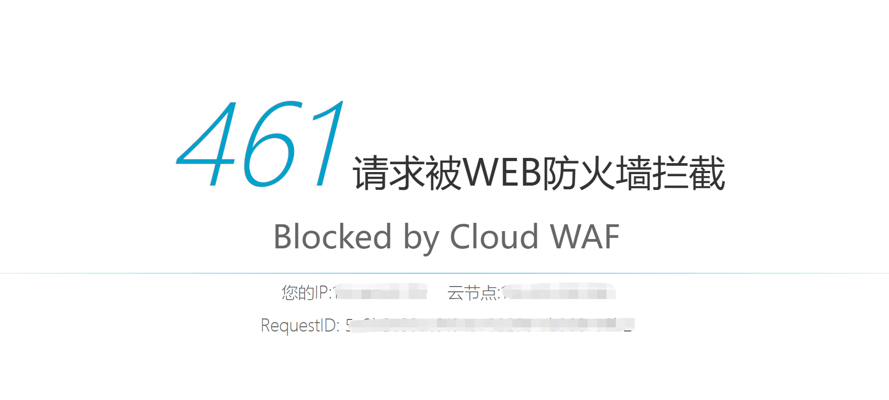

### 腾讯云-腾讯T-Sec Web 应用防火墙

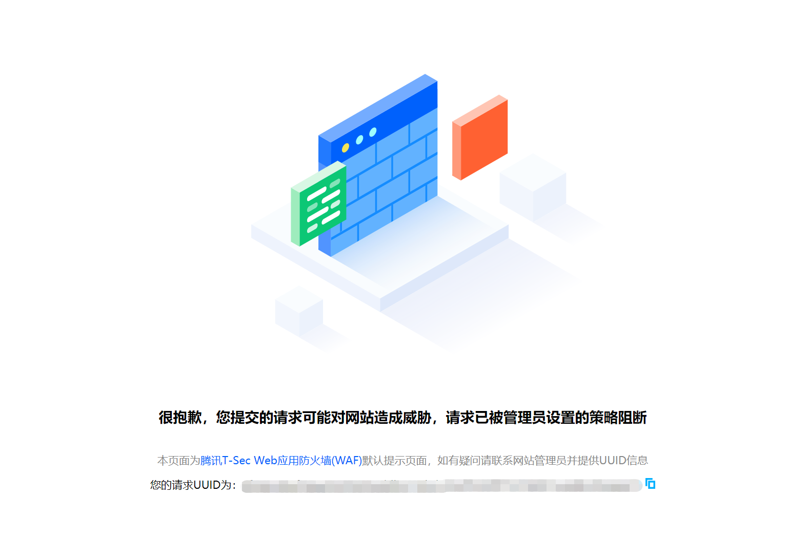

### 华为云-华为Web应用防火墙 WAF 

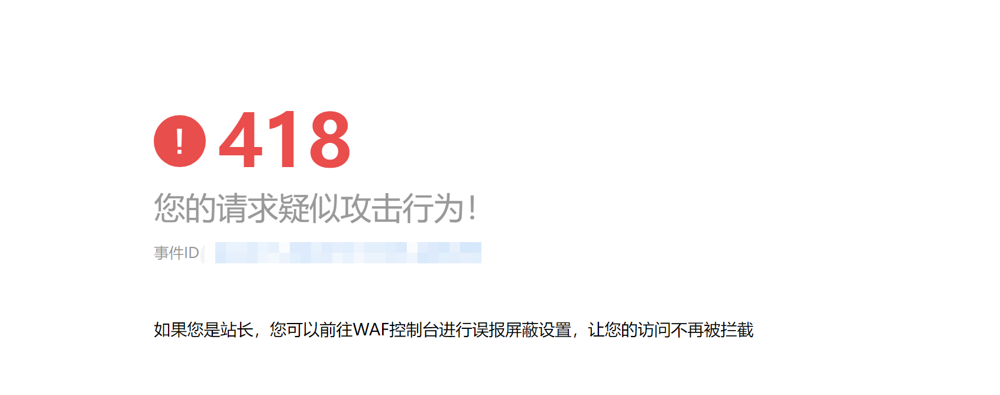

### 安恒云-Web应用防火墙（玄武盾）平台

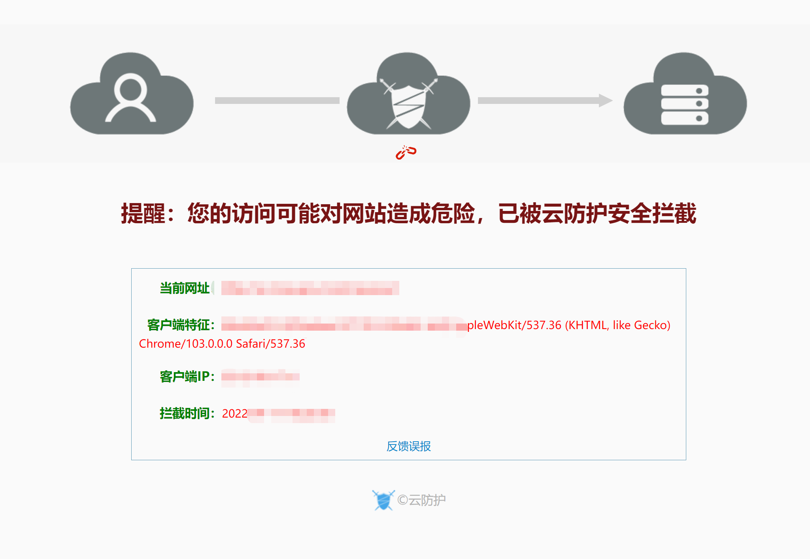

### 安全狗云御WEB应用防护系统

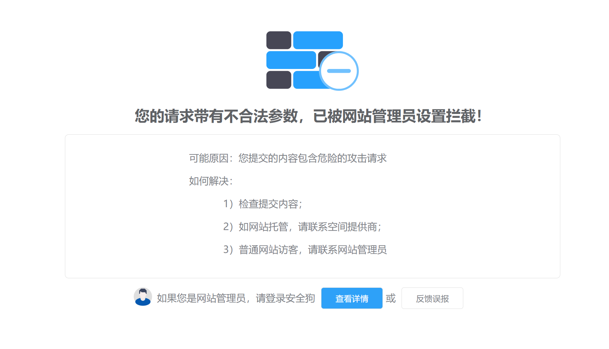

### 知道创宇-创宇盾Web应用防火墙

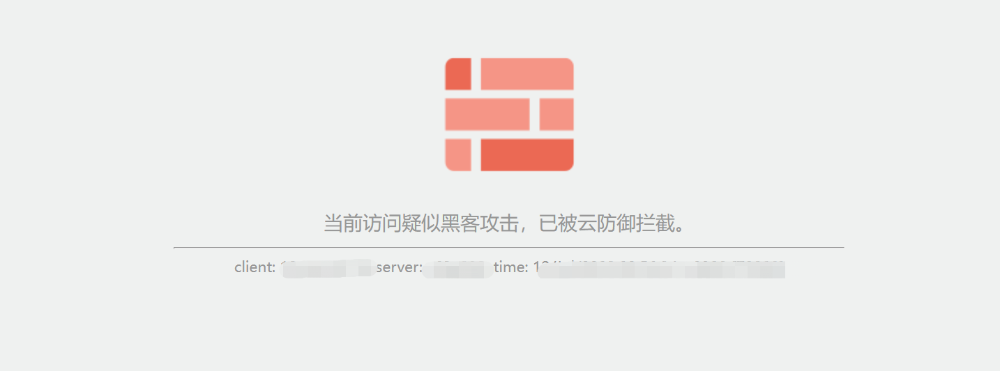

### F5 分布式云 WAF

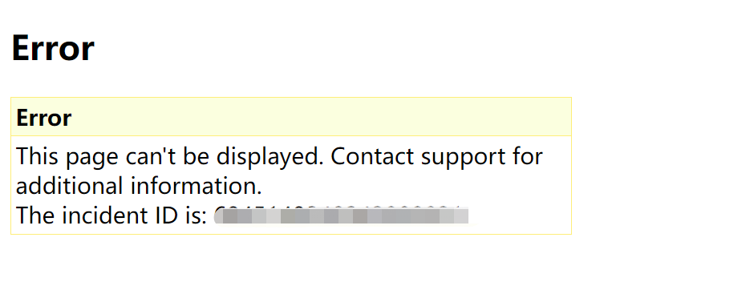

### 奇安信网站卫士

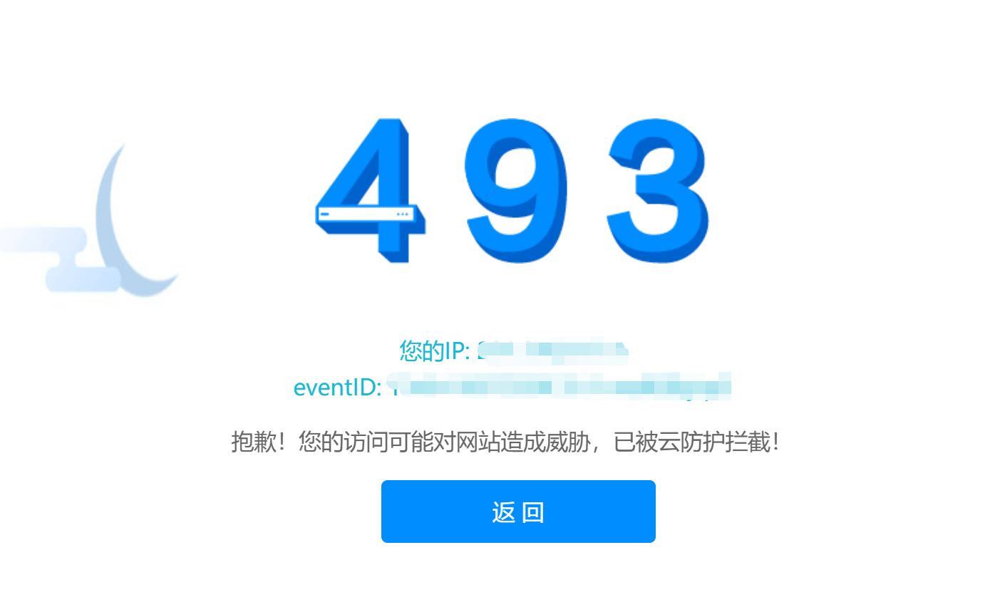

### 360磐云

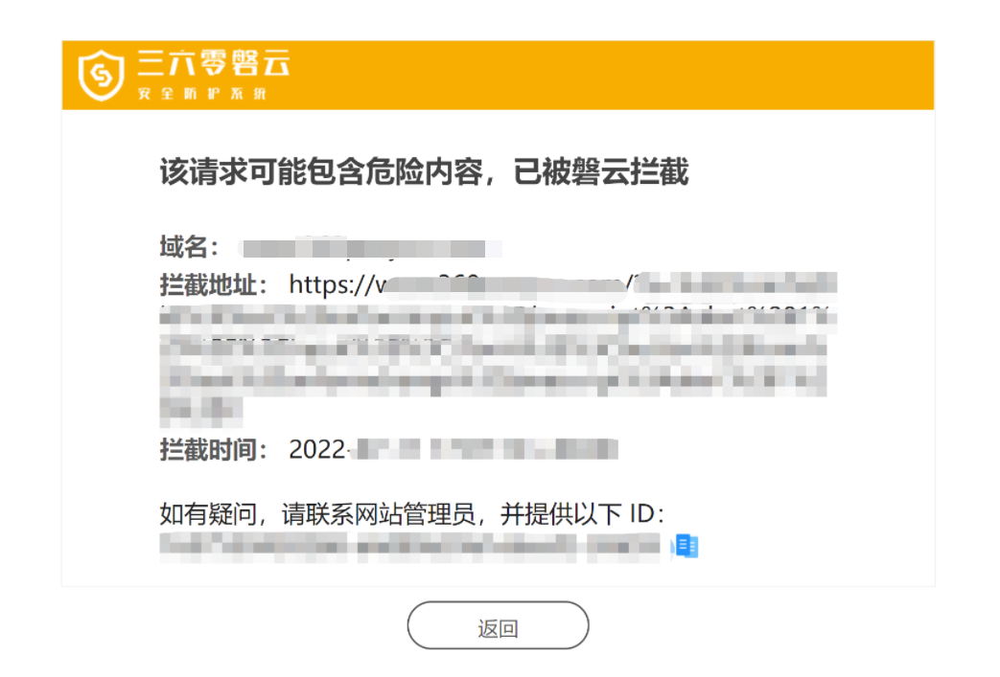

### 网宿Web应用防火墙

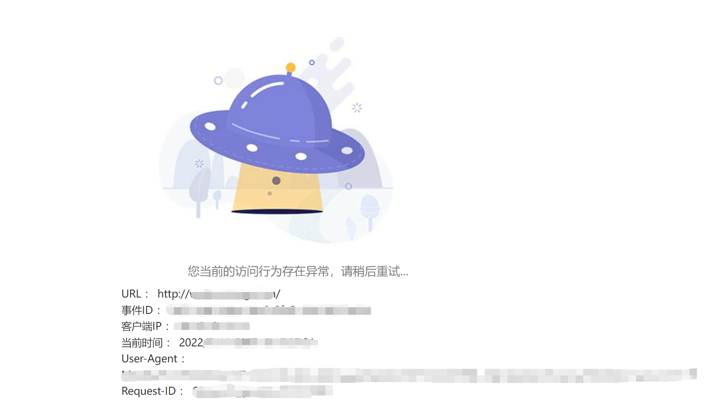

瑞数信息-动态Web应用防火墙（River Safeplus）

百度云应用防火墙 WAF

绿盟网站云防护

启明星辰虚拟化WAF

深信服云Web应用防火墙云WAF

奇安信网神WEB应用安全云防护系统（安域）

## 硬件WAF

硬件WAF通常部署在Web服务器之前，过滤所有外部访问流量，并对请求包进行解析，通过安全规则库的攻击规则进行匹配，识别异常并进行请求阻断。

常见产品：

- [绿盟Web应用防护系统](https://www.nsfocus.com.cn/html/2019/206_0911/6.html)

- [安恒明御Web应用防火墙](https://www.dbappsecurity.com.cn/product/cloud150.html)
- [启明天清Web应用安全网关](https://www.venustech.com.cn/new_type/Webyyfhq/)
- [长亭雷池（SafeLine） 下一代 Web 应用防火墙](https://www.chaitin.cn/zh/safeline)
- [远江盛邦Web应用防护系统（RayWAF）](https://www.webray.com.cn/channel/RayWAF.html)
- [天融信Web应用安全防护系统（TopWAF）](https://www.topsec.com.cn/product/25.html)
- [深信服Web应用防火墙WAF](https://www.sangfor.com.cn/product-and-solution/sangfor-security/waf)
- [铱迅Web应用防护系统](https://www.yxlink.com/index_product_index.html)
- [F5 Advanced WAF（API 安全 - 新一代 WAF）](https://www.f5.com.cn/products/security/advanced-waf)

### 安恒信息-明御Web应用防火墙

### 长亭科技-雷池（SafeLine） 下一代 Web 应用防火墙

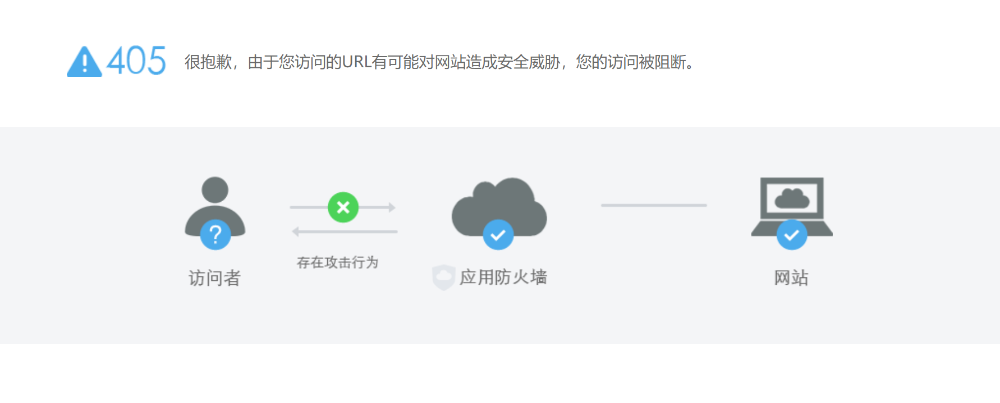

绿盟科技-绿盟Web应用防护系统

启明星辰集团-天清Web应用安全网关

盛邦安全-Web应用防护系统（RayWAF）

## 软件WAF

软件WAF安装在需要防护的服务器上，通过监听端口或以Web容器扩展方式进行请求检测和阻断。

常见产品：

- [安全狗](https://www.safedog.cn/)
- [云锁](https://yunsuo.qianxin.com/)
- [D盾](https://d99net.net/)
- [网防G01](https://www.gov110.cn/)
- [护卫神](https://www.hws.com/)
- [智创](https://www.zcnt.com/)
- [UPUPW](https://www.upupw.net/versions/)
- [宝塔网站防火墙](https://www.bt.cn/)
- [悬镜](https://www.xmirror.cn/)
- [安骑士](https://help.aliyun.com/product/28449.html)

### 网防G01

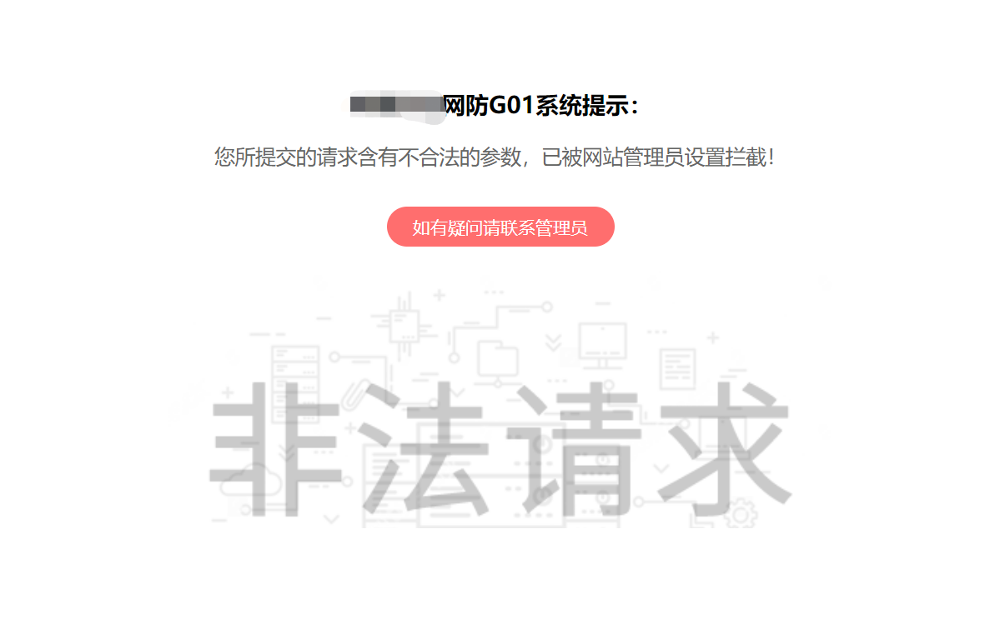
