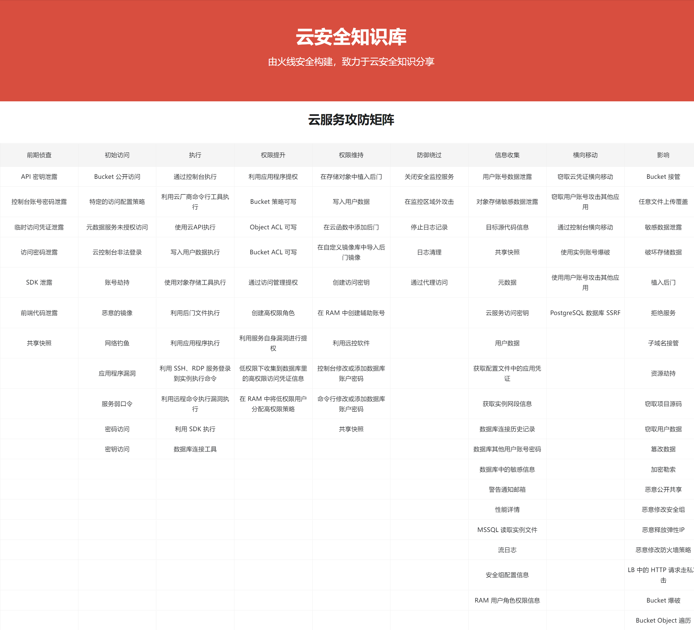
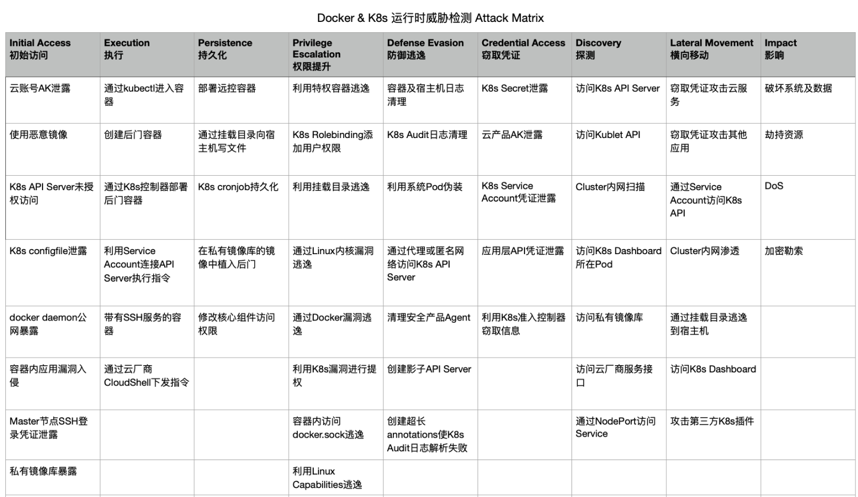
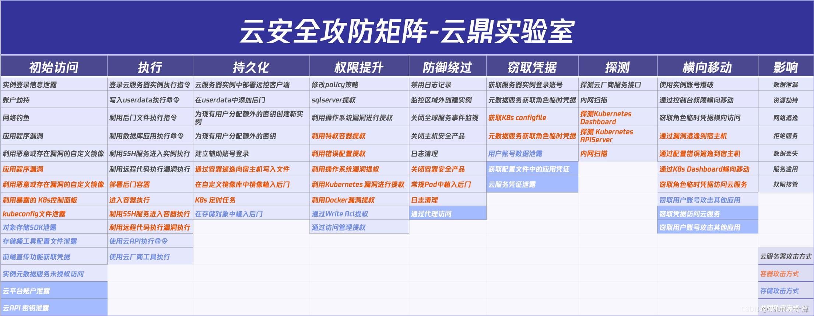
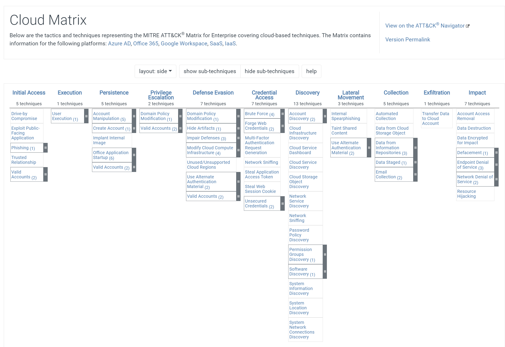

# 云上攻防

## 前置知识

云服务，顾名思义就是云上的服务，简单的来说就是在云厂商（例如 AWS、阿里云）那里买的服务。

目前国内云厂商有阿里云、腾讯云、华为云、天翼云、Ucloud、金山云等等，国外有亚马逊的 AWS（Amazon Web Services）、Google 的 GCP、微软的 Azure 等等。

一些专业概念/术语：

-  S3：Simple Storage Service，简易存储服务。经由Web服务界面，包括REST、SOAP与BitTorrent，用户能够轻易把文件存储到网络服务器上。

> Amazon S3 (Simple Storage Service) 简单存储服务，是 Amazon 的公开云存储服务，与之对应的协议被称为 S3 协议。目前 S3 协议已经被视为公认的行业标准协议，因此目前国内主流的对象存储厂商基本上都会支持 S3 协议。

- EC2：Elastic Compute Cloud，弹性云计算服务。在云上的一台虚拟机，用户将可以在这个虚拟机上运行任何自己想要的软件或应用程序。
- EIP：Elastic IP Address，弹性公网IP。可以独立购买和持有的公网IP地址资源。

> 弹性IP也是公网IP的一种。公网IP是和实例相联的，因此每次启动实例时IP地址都会改变。弹性公网IP是和账号相关联的，而不是和实例关联，不会导致经常变化的问题，还可以在实例之间重新映射弹性IP地址。

- RDS：Relational Database Service，云数据库。在云上的一个数据库。
- IAM：Identity and Access Management，身份和访问管理。云控制台上的一套身份管理服务，可以用来管理每个子账号的权限。
- MFA：Multi Factor Authentication，多因素认证。用户要通过两种以上的认证机制之后，才能得到授权，使用电脑资源。
- GCP：Google Cloud Platform，Google云端平台。
- VPC：Virtaul Private Cloud，虚拟私有云。虚拟私有云是存在于共享或公用云中的私有云，该服务允许用户透过IPsec 虚拟私有网络来连结Amazon EC2。华为云、阿里云等虚拟私有云是用户在云上申请的隔离的、私密的虚拟网络环境。
- SLB：Server Load Balancer，负载均衡。用来在多个计算机、网络连接、CPU、磁盘驱动器或其他资源中分配负载，以达到优化资源使用、最大化吞吐率、最小化响应时间、同时避免过载的目的。 
- ALB：Application Load Balancer，应用型负载均衡。阿里云推出的专门面向HTTP、HTTPS和QUIC等应用层负载场景的负载均衡服务，具备超强弹性及大规模应用层流量处理能力。
- CLB：Classic Load Balancer，传统型负载均衡。将访问流量根据转发策略分发到后端多台云服务器（ECS实例）的流量分发控制服务。

## 云安全攻防矩阵

一些云安全攻防矩阵：

- 火线安全-云服务攻防矩阵 https://cloudsec.huoxian.cn/
- 阿里云-云上容器ATT&CK攻防矩阵 2020.06.18
- 腾讯云鼎实验室-云安全攻防矩阵 2021.09.26 https://cloudsec.tencent.com/home/#/home
- ATT&CK Cloud Matrix 2022.04.01 https://attack.mitre.org/matrices/enterprise/cloud/

### 火线安全-云服务攻防矩阵



### 阿里云-云上容器ATT&CK攻防矩阵



### 腾讯云鼎实验室-云安全攻防矩阵

#### 云安全攻防矩阵1.0



#### 云安全攻防矩阵2.0


### ATT&CK Cloud Matrix



## 云服务

### S3风险点/攻击方法

- S3风险点/攻击方法，简单理解为云存储对应的风险点/攻击方法。

|                                  | Amazon S3 | Google Cloud Storage | MicroSoft Azure Storage | 腾讯云 COS | 阿里云OSS | 华为云OBS |
| -------------------------------- | --------- | -------------------- | ----------------------- | ---------- | --------- | --------- |
| Bucket公开访问                   | √         | √                    | √                       | √          | √         | √         |
| Bucket名称爆破                   | √         | √                    | √                       | √          | √         | √         |
| 特定Bucket策略配置               | √         | √                    | ×                       | √          | √         | √         |
| Bucket Object遍历                | √         | √                    | √                       | √          | √         | √         |
| 任意文件上传                     | √         | √                    | ×                       | √          | √         | ×         |
| 文件覆盖                         | √         | √                    | ×                       | √          | √         | √         |
| AccessKeyId、SecretAccessKey泄露 | √         | √                    | √                       | √          | √         | √         |
| Bucket接管                       | √         | ×                    | √                       | ×          | √         | √         |
| Bucket ACL可写                   | √         | √                    | -                       | √          | √         | -         |
| Object ACL可写                   | √         | √                    | -                       | √          | √         | -         |
| Bucket策略可写                   | √         | -                    | -                       | √          | √         | -         |

### EC2风险点/攻击方法

- EC2风险点/攻击方法，简单理解为云服务面临的风险点/攻击方法。

#### 凭证泄露

云场景下的凭证泄露可以分成以下几种：

- 控制台账号密码泄露，例如登录控制台的账号密码
- 临时凭证泄露
- 访问密钥泄露，即 AccessKeyId、SecretAccessKey 泄露
- 实例登录凭证泄露，例如 AWS 在创建 EC2 生成的证书文件遭到泄露

对于这类凭证信息的收集，一般可以通过以下几种方法进行收集：

- Github 敏感信息搜索
- 反编译目标 APK、小程序
- 目标网站源代码泄露

#### 元数据

元数据服务是一种提供查询运行中的实例内元数据的服务，当实例向元数据服务发起请求时，该请求不会通过网络传输，如果获得了目标 EC2 权限或者目标 EC2 存在 SSRF 漏洞，就可以获得到实例的元数据。

通过元数据，攻击者除了可以获得 EC2 上的一些属性信息之外，有时还可以获得与该实例绑定角色的临时凭证，并通过该临时凭证获得云服务器的控制台权限，进而横向到其他机器。

通过访问元数据的 `/iam/security-credentials/<rolename>` 路径可以获得目标的临时凭证，进而接管目标服务器控制台账号权限，前提是目标需要配置 IAM 角色才行，不然访问会 404。

```
curl http://169.254.169.254/latest/meta-data/iam/security-credentials
```

通过元数据获得目标的临时凭证后，就可以接管目标账号权限了。一些价值较高的元数据：

```
ac    实例 MAC 地址
hostname    实例主机名
iam/info    获取角色名称
local-ipv4    实例本地 IP
public-ipv4    实例公网 IP
instance-id    实例 ID
public-hostname    接口的公有 DNS (IPv4)
placement/region    实例的 AWS 区域
public-keys/0/openssh-key    公有密钥
/iam/security-credentials/<rolename>    获取角色的临时凭证
```

**可以ssrf的常见元数据点：**

```
# packet
https://metadata.packet.net/userdata
```

```
# google
http://metadata.google.internal/computeMetadata/v1beta1/
http://169.254.169.254/computeMetadata/v1/
http://metadata.google.internal/computeMetadata/v1/
http://metadata/computeMetadata/v1/
http://metadata.google.internal/computeMetadata/v1/instance/hostname
http://metadata.google.internal/computeMetadata/v1/instance/id
http://metadata.google.internal/computeMetadata/v1/project/project-id
http://metadata.google.internal/computeMetadata/v1/instance/disks/?recursive=true
```

```
# orcale
http://192.0.0.192/latest/
http://192.0.0.192/latest/user-data/
http://192.0.0.192/latest/meta-data/
http://192.0.0.192/latest/attributes/
```

```
# alibaba
http://100.100.100.200/latest/meta-data/
http://100.100.100.200/latest/meta-data/instance-id
http://100.100.100.200/latest/meta-data/image-id
```

```
#huawei
/latest/meta-data/local-ipv4 #用于查询弹性云服务器的固定IP地址。多网卡情况下，只显示主网卡的地址。
/latest/meta-data/hostname #用于查询弹性云服务器的主机名称，后面会追加.novalocal后缀
/latest/meta-data/instance-type #用于查询弹性云服务器的规格名称。
/latest/meta-data/placement/availability-zone #用于查询弹性云服务器的AZ信息。
/latest/meta-data/public-keys/0/openssh-key #用于查询弹性云服务器的公钥
/openstack/latest/meta_data.json #用于查询弹性云服务器的元数据
/openstack/latest/user_data #用于查询弹性云服务器的自定义数据。
/openstack/latest/network_data.json #查询弹性云服务器的网络信息，支持查询云服务器挂载的全部网卡的信息，包括网卡所在子网的DNS地址、网络带宽、网卡ID、网卡私有IP地址、网卡弹性公网IP地址、网卡的MAC地址。
/openstack/latest/securitykey #获取临时的AK、SK
```

#### 账号劫持

如果云厂商的控制台存在漏洞的话，用户账号也会存在一定的风险。

AWS 的控制台曾经出现过一些 XSS 漏洞。

#### 恶意镜像

AWS 在创建实例的时候，用户可以选择使用公共镜像或者自定义镜像，如果这些镜像中有恶意的镜像，那么目标使用该镜像创建实例就会产生风险。

#### 其他

- 云服务上的应用程序漏洞
- SSH 与 RDP 弱密码
- K8s API Server未授权访问（8080端口无需认证）
- K8s configfile泄露
- 私有镜像库暴露（例如Harbor，一个用于存储和分发Docker镜像的企业级Registry开源服务器）
- Docker daemon公网暴露

```
docker daemon -H tcp://0.0.0.0:2375 -H unix:///var/run/docker.sock
```

### EC2权限维持

#### 用户数据

在创建云服务器时，用户可以通过指定自定义数据，进行配置实例，当云服务器启动时，自定义数据将以文本的方式传递到云服务器中，并执行该文本，而且文本里的命令默认以 root 权限执行。

通过这一功能，攻击者可以修改实例的用户数据并向其中写入待执行的命令（例如反弹Shell），这些代码将会在实例每次启动时自动执行。

#### 后门镜像

当攻击者获取到控制台权限后，可以看看目标的 AMI（Amazon 系统镜像），如果可以对其进行修改或者删除、创建的话，可以将原来的镜像替换成存在后门的镜像。

这样当下次目标用户在选用该镜像创建实例的时候，就会触发我们在镜像中植入的恶意代码了。

#### 创建访问密钥

如果当前环境可以创建新的访问密钥，则可以在 IAM 中创建访问密钥进行权限维持。

#### 创建辅助账号

在 IAM 中创建高权限子账号，通过子账号进行后续的攻击。

#### 其他

在实例中添加隐藏用户、安装远控软件等等传统方法。

## 云原生

云原生（Cloud Native）可以拆分成「云」和「原生」去看。

「云」相对的就是本地，传统应用都跑在本地服务器上，而云则表示跑在云服务器上。

「原生」则可以简单的理解成出生地的意思，放在云环境中所表达的意思就是：在把应用跑到云服务器上时，应该充分的利用云自身的特点，比如弹性和分布式优势。

CNCF 对于云原生的见解为：

云原生技术有利于各组织在公有云、私有云和混合云等新型动态环境中，构建和运行可弹性扩展的应用。云原生的代表技术包括容器、服务网格、微服务、不可变基础设施和声明式 API。

这些技术能够构建容错性好、易于管理和便于观察的松耦合系统。结合可靠的自动化手段，云原生技术使工程师能够轻松地对系统作出频繁和可预测的重大变更。

对于云原生系统一般有以下特征：

- 轻、快、不变的基础设施
- 弹性服务编排
- 开发运营一体化
- 微服务架构
- 无服务模型

根据云原生环境的构成，面向云原生环境的安全体系可以概括为以下三个层面：

- 容器安全
- 编排系统安全
- 云原生应用安全：包括了微服务、无服务、服务网格、零信任体系、API 安全等等

另外除了这些和云原生环境相关的技术之外，云原生安全还包含了一些传统安全的内容，比如宿主机的安全等等。

## 容器逃逸

检测脚本：https://github.com/teamssix/container-escape-check

### 判断当前是否为容器环境

```
cat /proc/1/cgroup | grep -qi docker && echo "Is Docker" || echo "Not Docker"
```

### 不安全的配置

#### 是否为特权模式

```
cat /proc/self/status | grep -qi "0000003fffffffff" && echo "Is privileged mode" || echo "Not privileged mode"
```

#### 是否挂载了Docker Socket

```
ls /var/run/ | grep -qi docker.sock && echo "Docker Socket is mounted." || echo "Docker Socket is not mounted."
```

#### 是否挂载了procfs

```
find / -name core_pattern 2>/dev/null | wc -l | grep -q 2 && echo "Procfs is mounted." || echo "Procfs is not mounted."
```

#### 是否挂载了宿主机根目录

```
find / -name passwd 2>/dev/null | grep /etc/passwd | wc -l | grep -q 7 && echo "Root directory is mounted." || echo "Root directory is not mounted."
```

#### 是否存在Docker Remote API未授权访问

```
IP=`hostname -i | awk -F. '{print $1 "." $2 "." $3 ".1"}' ` && timeout 3 bash -c "echo >/dev/tcp/$IP/2375" > /dev/null 2>&1 && echo "Docker Remote API Is Enabled." || echo "Docker Remote API is Closed."
```

### 内核漏洞

#### CVE-2016-5195 DirtyCow 

```
uname -r
----------------------
2.6.22 <= 版本 <= 4.8.3
```

#### CVE-2020-14386

```
uname -r
----------------------
4.6 <= 版本 < 5.9
```

#### CVE-2022-0847 DirtyPipe

```
uname -r
----------------------
5.8 <= 版本 < 5.10.102 < 版本 < 5.15.25 < 版本 < 5.16.11
```

