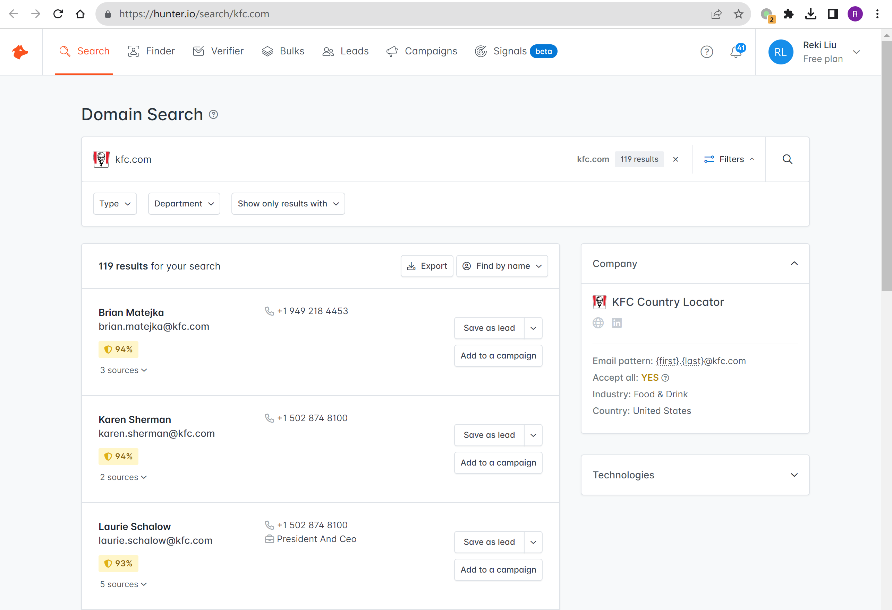
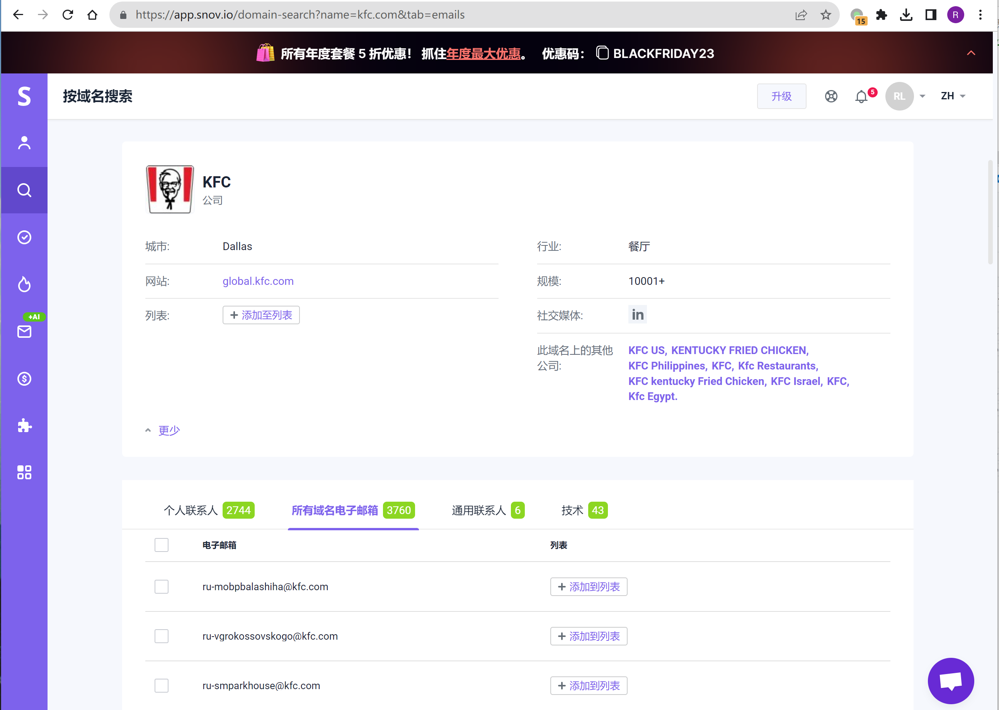
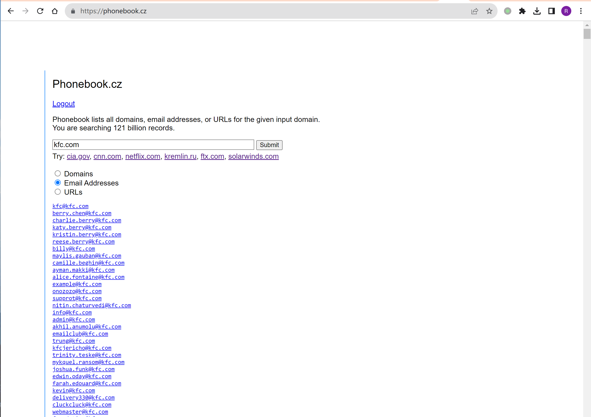
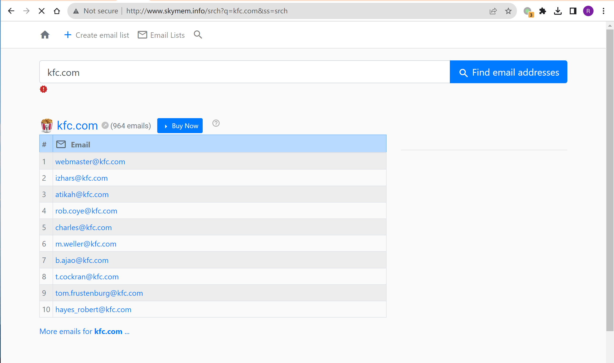
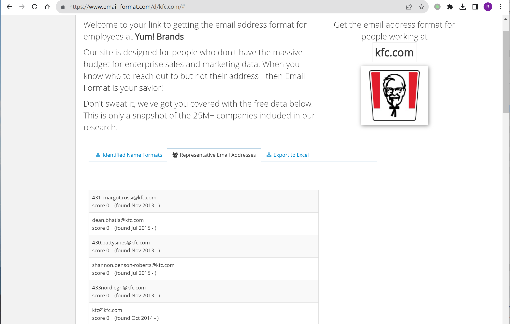
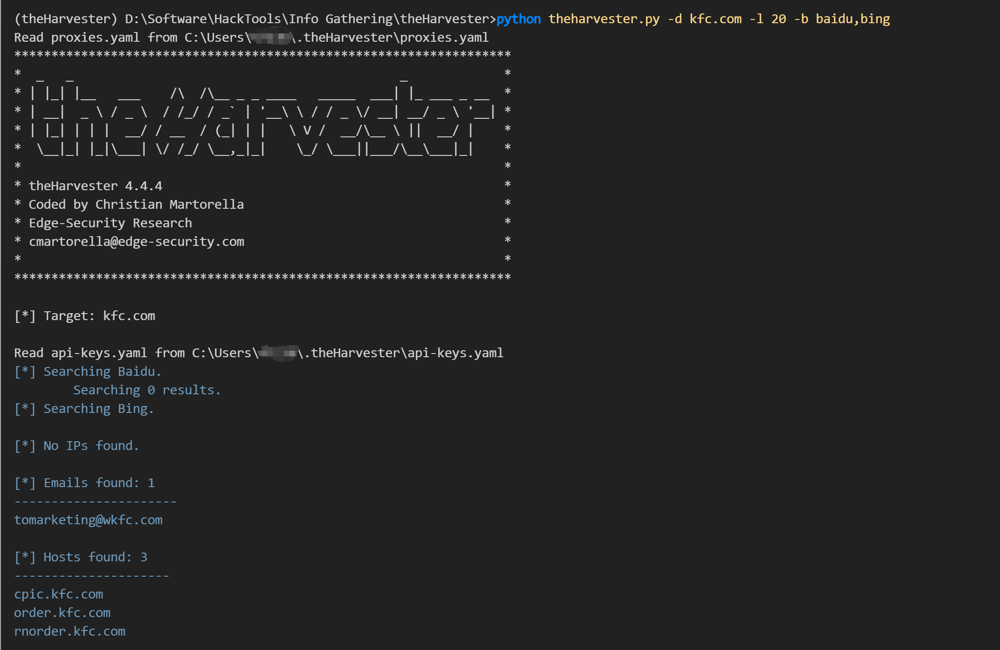

# 信息收集-敏感信息收集

## Google

- Google Hacking Database：https://www.exploit-db.com/google-hacking-database
- Google Hacking：https://pentest-tools.com/information-gathering/google-hacking
- Google Dork：https://cxsecurity.com/dorks/

### 基础语法

#### 管理后台地址

```
site:target.com intext:管理 | 后台 | 后台管理 | 登陆 | 登录 | 用户名 | 密码 | 系统 | 账号 | login | system
site:target.com inurl:login | inurl:admin | inurl:manage | inurl:manager | inurl:admin_login | inurl:system | inurl:backend
site:target.com intitle:管理 | 后台 | 后台管理 | 登陆 | 登录
```

#### 上传类漏洞地址

```
site:target.com inurl:file
site:target.com inurl:upload
```

#### 注入页面

```
site:target.com inurl:?id=
site:target.com inurl:php?id=
```

#### 编辑器页面

```
site:target.com inurl:ewebeditor
```

#### 目录遍历漏洞

```
site:target.com intitle: "index of"
```

#### URL 跳转

```
site:target.com inurl:url= | inurl:return= | inurl:next= | inurl:redir= inurl:http
```

#### SQL错误

```
site:target.com intext:"sql syntax near" | intext:"syntax error has occurred" | intext:"incorrect syntax near" | intext:"unexpected end of SQL command" | intext:"Warning: mysql_connect()" | intext:”Warning: mysql_query()" | intext:"Warning: pg_connect()"
```

#### phpinfo

```
site:target.com ext:php intitle:phpinfo "published by the PHP Group"
```

#### 配置文件泄露

```
site:target.com ext:.xml | .conf | .cnf | .reg | .inf | .rdp | .cfg | .txt | .ora | .ini
```

#### 数据库文件泄露

```
site:target.com ext:.sql | .dbf | .mdb | .db
```

#### 日志文件泄露

```
site:target.com ext:.log
```

#### 备份和历史文件泄露

```
site:target.com ext:.bkf | .bkp | .old | .backup | .bak | .swp | .rar | .txt | .zip | .7z | .sql | .tar.gz | .tgz | .tar
```

#### 公开文件泄露

```
site:target.com filetype:.doc | .docx | .xls | .xlsx | .ppt | .pptx | .odt | .pdf | .rtf | .sxw | .psw | .csv
```

#### 邮箱信息

```
site:target.com intext:@target.com
site:target.com 邮件
site:target.com email
```

#### 社工信息

```
site:target.com intitle:账号 | 密码 | 工号 | 学号 | 身份证
```


### 开源平台

```
# Google Docs
site:docs.google.com inurl:"/d/" "target.com"

# OneDrive
site:onedrive.live.com "target.com"

# Dropbox
site:dropbox.com/s "target.com"

# Box
site:box.com/s "target.com"

# Azure DevOps
site:dev.azure.com "target.com"

# SharePoint
site:http://sharepoint.com "target.com"

# DigitalOcean Spaces
site:digitaloceanspaces.com "target.com"

# Firebase
site:firebaseio.com "target"

# JFrog
site:jfrog.io "target"

# Lesser-known Amazon S3 subdomains
site:http://s3-external-1.amazonaws.com "target.com"
site:http://s3.dualstack.us-east-1.amazonaws.com "target.com"

# Cloud Storage
site:s3.amazonaws.com "target.com"
site:blob.core.windows.net "target.com"
site:googleapis.com "target.com"
site:drive.google.com "target.com"
site:dl.dropbox.com "target.com"
site:s3.amazonaws.com "target.com"
```

## Github

- Github高级搜索：https://github.com/search/advanced
- GitDorker：https://github.com/obheda12/GitDorker
- gitdorks_go：https://github.com/damit5/gitdorks_go

keywords：

```
"token"
"password"
"secret"
"passwd"
"username"
"key"
"apidocs"
"appspot"
"auth"
"aws_access"
"config"
"credentials"
"dbuser"
"ftp"
"login"
"mailchimp"
"mailgun"
"mysql"
"pass"
"pem private"
"prod"
"pwd"
"secure"
"ssh"
"staging"
"stg"
"stripe"
"swagger"
"testuser"
"jdbc"
```

除了 Github 外，还有一些其他的代码平台：

- GitLab: https://about.gitlab.com/
- Gitee: https://gitee.com/

## Stack Overflow

Stackoverflow：https://stackoverflow.com/

Stack Overflow 日志：
- https://archive.org/details/stackexchange
- https://archive.org/download/stackexchange

敏感信息可能包括：
- github key
- 简历/邮箱/手机号

## 社交平台

结合 Google Search

- 语雀：https://www.yuque.com/dashboard
- 印象识堂：https://www.yinxiang.com/everhub/
- wolai：https://www.wolai.com/
- 腾讯文档：https://docs.qq.com
- 飞书文档：https://docs.feishu.cn
- 蓝湖：https://lanhuapp.com/

## 历史页面

- Wayback Machine：https://archive.org/web
- waybackurls：https://github.com/tomnomnom/waybackurls
- gau：https://github.com/lc/gau

## 网盘

- 搜索导航：e.g. https://adzhp.xyz/sites/3983.html
- 聚合搜索：e.g. https://www.chaonengsou.com/
- 蓝奏云：https://www.lanzoux.com
- 天翼云：https://www.ctyun.cn
- 阿里云盘：https://www.aliyundrive.com
- 城通网盘：https://www.ctfile.com
- 夸克网盘：https://pan.quark.cn
- 新浪微盘

## 邮箱

- Hunter：https://hunter.io
- Snov.io：https://app.snov.io
- Phonebook：also works on subdomains and urls https://phonebook.cz
- Skymem：https://www.skymem.info
- email-format：https://www.email-format.com/i/search/
- 搜邮箱：https://souyouxiang.com/find-contact/
- theHarvester：also works on subdomains https://github.com/laramies/theHarvester

### Hunter



### Snov.io



### Phonebook



### Skymem



### email-format




### 搜邮箱


### theHarvester


