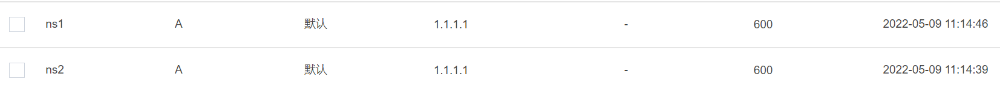
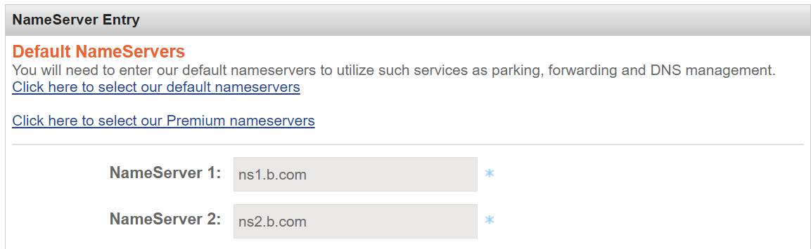
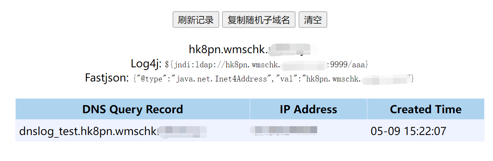

# DNS Log平台搭建

## DNS Log简介

在某些情况下，无法利用漏洞获得回显。但是，如果目标可以发送DNS请求，则可以通过DNS Log方式将想获得的数据外带出来（oob）。

DNS log常用于以下情况：

- SQL盲注
- 无回显的命令执行
- 无回显的SSRF

## 搭建DNS Log平台

### 前期准备

一台VPS：

```
1.1.1.1
```

两个域名：

```
a.com
b.com
```

在`b.com`中添加两个A记录：



修改`a.com`的NS记录为：



### 项目部署

参考开源项目DNSlog-GO：

- https://github.com/lanyi1998/DNSlog-GO

VPS防火墙放行53端口、80端口，修改配置文件`config.ini`：

```
[HTTP]
Port = 80
Token = <API TOKEN 1 HERE>,<API TOKEN 2 HERE>
ConsoleDisable = false

[DNS]
Domain = a.com
```

运行`main`文件：

```
./main
```

### 使用测试

